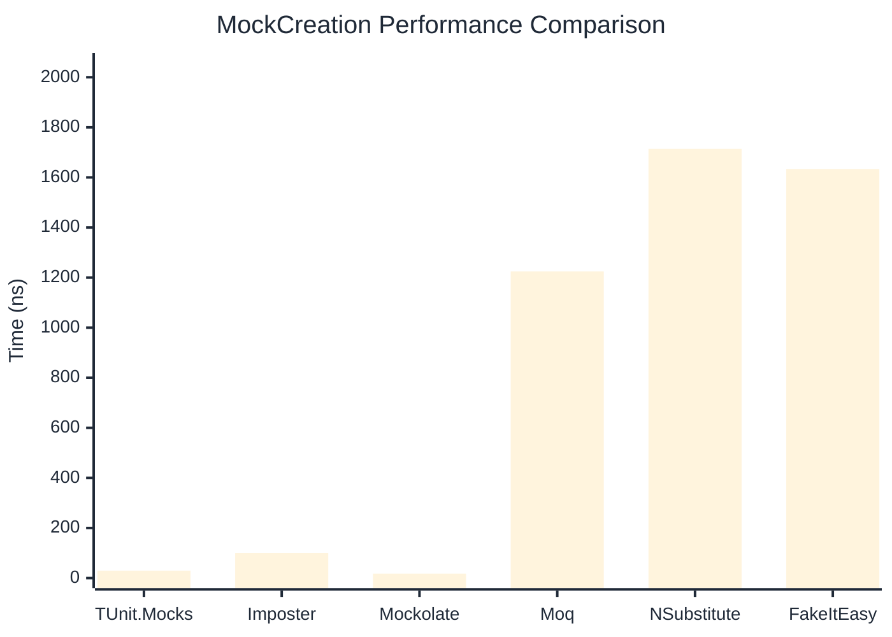

# MockCreation Benchmark

> Mock instance creation performance — comparing **TUnit.Mocks** (source-generated) against runtime proxy-based mocking libraries.

:::info Last Updated
This benchmark was automatically generated on **2026-08-30** from the latest CI run.

**Environment:** Ubuntu Latest • .NET SDK 10.0.400
:::

## 📊 Results

Mock instance creation performance:

| Library | Mean | Error | StdDev | Allocated |
|---------|------|-------|--------|-----------|
| **TUnit.Mocks** | 29.75 ns | 0.109 ns | 0.102 ns | 200 B |
| Imposter | 100.40 ns | 0.210 ns | 0.196 ns | 440 B |
| Mockolate | 17.48 ns | 0.158 ns | 0.148 ns | 160 B |
| Moq | 1,224.45 ns | 22.364 ns | 20.920 ns | 2048 B |
| NSubstitute | 1,713.95 ns | 8.700 ns | 8.138 ns | 5000 B |
| FakeItEasy | 1,633.56 ns | 7.328 ns | 6.496 ns | 2715 B |

```mermaid
%%{init: {
  'theme':'base',
  'themeVariables': {
    'primaryColor': '#2563eb',
    'primaryTextColor': '#1f2937',
    'primaryBorderColor': '#1e40af',
    'lineColor': '#6b7280',
    'secondaryColor': '#7c3aed',
    'tertiaryColor': '#dc2626',
    'background': '#ffffff',
    'pie1': '#2563eb',
    'pie2': '#7c3aed',
    'pie3': '#dc2626',
    'pie4': '#f59e0b',
    'pie5': '#10b981',
    'pie6': '#06b6d4',
    'pie7': '#ec4899',
    'pie8': '#6366f1'
  }
}}%%
xychart-beta
  title "MockCreation Performance Comparison"
  x-axis ["TUnit.Mocks", "Imposter", "Mockolate", "Moq", "NSubstitute", "FakeItEasy"]
  y-axis "Time (ns)" 0 --> 2057
  bar [29.75, 100.4, 17.48, 1224.45, 1713.95, 1633.56]
```

---

### Repository

| Library | Mean | Error | StdDev | Allocated |
|---------|------|-------|--------|-----------|
| **TUnit.Mocks** | 29.25 ns | 0.126 ns | 0.112 ns | 200 B |
| Imposter | 156.29 ns | 0.166 ns | 0.138 ns | 696 B |
| Mockolate | 17.99 ns | 0.031 ns | 0.026 ns | 176 B |
| Moq | 1,250.85 ns | 3.993 ns | 3.334 ns | 1912 B |
| NSubstitute | 1,735.60 ns | 8.544 ns | 7.574 ns | 5000 B |
| FakeItEasy | 1,618.50 ns | 8.384 ns | 7.842 ns | 2715 B |

```mermaid
%%{init: {
  'theme':'base',
  'themeVariables': {
    'primaryColor': '#2563eb',
    'primaryTextColor': '#1f2937',
    'primaryBorderColor': '#1e40af',
    'lineColor': '#6b7280',
    'secondaryColor': '#7c3aed',
    'tertiaryColor': '#dc2626',
    'background': '#ffffff',
    'pie1': '#2563eb',
    'pie2': '#7c3aed',
    'pie3': '#dc2626',
    'pie4': '#f59e0b',
    'pie5': '#10b981',
    'pie6': '#06b6d4',
    'pie7': '#ec4899',
    'pie8': '#6366f1'
  }
}}%%
xychart-beta
  title "MockCreation (Repository) Performance Comparison"
  x-axis ["TUnit.Mocks", "Imposter", "Mockolate", "Moq", "NSubstitute", "FakeItEasy"]
  y-axis "Time (ns)" 0 --> 2083
  bar [29.25, 156.29, 17.99, 1250.85, 1735.6, 1618.5]
```

## 🎯 Key Insights

This benchmark compares **TUnit.Mocks** (source-generated) against runtime proxy-based mocking libraries for mock instance creation performance.

---

:::note Methodology
View the [mock benchmarks overview](/docs/benchmarks/mocks) for methodology details and environment information.
:::

*Last generated: 2026-08-30T02:44:44.759Z*
