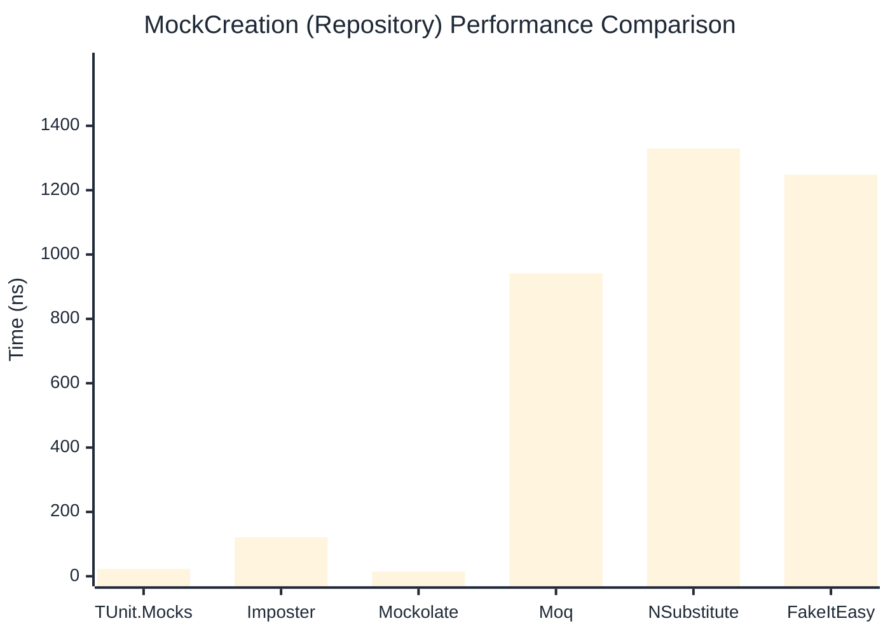

# MockCreation Benchmark

> Mock instance creation performance — comparing **TUnit.Mocks** (source-generated) against runtime proxy-based mocking libraries.

:::info Last Updated
This benchmark was automatically generated on **2026-09-08** from the latest CI run.

**Environment:** Ubuntu Latest • .NET SDK 10.0.400
:::

## 📊 Results

Mock instance creation performance:

| Library | Mean | Error | StdDev | Allocated |
|---------|------|-------|--------|-----------|
| **TUnit.Mocks** | 22.89 ns | 0.116 ns | 0.109 ns | 200 B |
| Imposter | 81.17 ns | 1.673 ns | 2.290 ns | 440 B |
| Mockolate | 13.50 ns | 0.153 ns | 0.136 ns | 160 B |
| Moq | 952.21 ns | 17.987 ns | 16.825 ns | 2048 B |
| NSubstitute | 1,355.45 ns | 21.109 ns | 19.745 ns | 5000 B |
| FakeItEasy | 1,309.89 ns | 24.840 ns | 28.606 ns | 2715 B |

```mermaid
%%{init: {
  'theme':'base',
  'themeVariables': {
    'primaryColor': '#2563eb',
    'primaryTextColor': '#1f2937',
    'primaryBorderColor': '#1e40af',
    'lineColor': '#6b7280',
    'secondaryColor': '#7c3aed',
    'tertiaryColor': '#dc2626',
    'background': '#ffffff',
    'pie1': '#2563eb',
    'pie2': '#7c3aed',
    'pie3': '#dc2626',
    'pie4': '#f59e0b',
    'pie5': '#10b981',
    'pie6': '#06b6d4',
    'pie7': '#ec4899',
    'pie8': '#6366f1'
  }
}}%%
xychart-beta
  title "MockCreation Performance Comparison"
  x-axis ["TUnit.Mocks", "Imposter", "Mockolate", "Moq", "NSubstitute", "FakeItEasy"]
  y-axis "Time (ns)" 0 --> 1627
  bar [22.89, 81.17, 13.5, 952.21, 1355.45, 1309.89]
```

---

### Repository

| Library | Mean | Error | StdDev | Allocated |
|---------|------|-------|--------|-----------|
| **TUnit.Mocks** | 22.85 ns | 0.172 ns | 0.152 ns | 200 B |
| Imposter | 121.68 ns | 0.664 ns | 0.589 ns | 696 B |
| Mockolate | 14.27 ns | 0.050 ns | 0.042 ns | 176 B |
| Moq | 941.66 ns | 3.348 ns | 2.968 ns | 1912 B |
| NSubstitute | 1,329.49 ns | 5.327 ns | 4.722 ns | 5000 B |
| FakeItEasy | 1,247.89 ns | 4.051 ns | 3.591 ns | 2715 B |

```mermaid
%%{init: {
  'theme':'base',
  'themeVariables': {
    'primaryColor': '#2563eb',
    'primaryTextColor': '#1f2937',
    'primaryBorderColor': '#1e40af',
    'lineColor': '#6b7280',
    'secondaryColor': '#7c3aed',
    'tertiaryColor': '#dc2626',
    'background': '#ffffff',
    'pie1': '#2563eb',
    'pie2': '#7c3aed',
    'pie3': '#dc2626',
    'pie4': '#f59e0b',
    'pie5': '#10b981',
    'pie6': '#06b6d4',
    'pie7': '#ec4899',
    'pie8': '#6366f1'
  }
}}%%
xychart-beta
  title "MockCreation (Repository) Performance Comparison"
  x-axis ["TUnit.Mocks", "Imposter", "Mockolate", "Moq", "NSubstitute", "FakeItEasy"]
  y-axis "Time (ns)" 0 --> 1596
  bar [22.85, 121.68, 14.27, 941.66, 1329.49, 1247.89]
```

## 🎯 Key Insights

This benchmark compares **TUnit.Mocks** (source-generated) against runtime proxy-based mocking libraries for mock instance creation performance.

---

:::note Methodology
View the [mock benchmarks overview](/docs/benchmarks/mocks) for methodology details and environment information.
:::

*Last generated: 2026-09-08T02:32:39.573Z*
