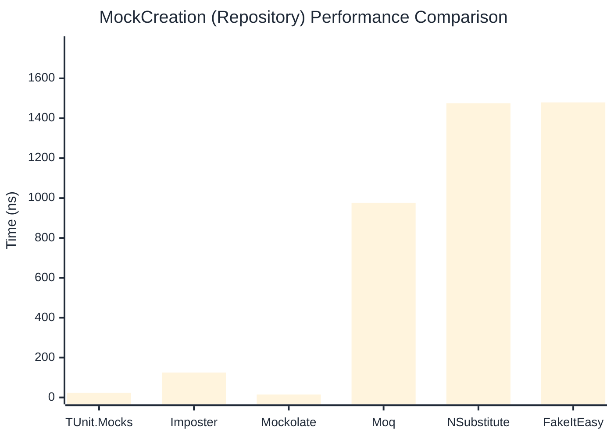

# MockCreation Benchmark

> Mock instance creation performance — comparing **TUnit.Mocks** (source-generated) against runtime proxy-based mocking libraries.

:::info Last Updated
This benchmark was automatically generated on **2026-08-23** from the latest CI run.

**Environment:** Ubuntu Latest • .NET SDK 10.0.400
:::

## 📊 Results

Mock instance creation performance:

| Library | Mean | Error | StdDev | Allocated |
|---------|------|-------|--------|-----------|
| **TUnit.Mocks** | 23.81 ns | 0.137 ns | 0.121 ns | 200 B |
| Imposter | 79.31 ns | 0.257 ns | 0.228 ns | 440 B |
| Mockolate | 13.96 ns | 0.046 ns | 0.038 ns | 160 B |
| Moq | 1,034.52 ns | 18.127 ns | 20.148 ns | 2048 B |
| NSubstitute | 1,490.67 ns | 15.450 ns | 13.696 ns | 5000 B |
| FakeItEasy | 1,469.84 ns | 28.401 ns | 29.166 ns | 2715 B |

```mermaid
%%{init: {
  'theme':'base',
  'themeVariables': {
    'primaryColor': '#2563eb',
    'primaryTextColor': '#1f2937',
    'primaryBorderColor': '#1e40af',
    'lineColor': '#6b7280',
    'secondaryColor': '#7c3aed',
    'tertiaryColor': '#dc2626',
    'background': '#ffffff',
    'pie1': '#2563eb',
    'pie2': '#7c3aed',
    'pie3': '#dc2626',
    'pie4': '#f59e0b',
    'pie5': '#10b981',
    'pie6': '#06b6d4',
    'pie7': '#ec4899',
    'pie8': '#6366f1'
  }
}}%%
xychart-beta
  title "MockCreation Performance Comparison"
  x-axis ["TUnit.Mocks", "Imposter", "Mockolate", "Moq", "NSubstitute", "FakeItEasy"]
  y-axis "Time (ns)" 0 --> 1789
  bar [23.81, 79.31, 13.96, 1034.52, 1490.67, 1469.84]
```

---

### Repository

| Library | Mean | Error | StdDev | Allocated |
|---------|------|-------|--------|-----------|
| **TUnit.Mocks** | 23.42 ns | 0.049 ns | 0.046 ns | 200 B |
| Imposter | 125.04 ns | 0.330 ns | 0.293 ns | 696 B |
| Mockolate | 15.10 ns | 0.220 ns | 0.206 ns | 176 B |
| Moq | 976.43 ns | 9.204 ns | 8.610 ns | 1912 B |
| NSubstitute | 1,475.17 ns | 12.125 ns | 11.342 ns | 5000 B |
| FakeItEasy | 1,479.55 ns | 27.337 ns | 26.849 ns | 2715 B |

```mermaid
%%{init: {
  'theme':'base',
  'themeVariables': {
    'primaryColor': '#2563eb',
    'primaryTextColor': '#1f2937',
    'primaryBorderColor': '#1e40af',
    'lineColor': '#6b7280',
    'secondaryColor': '#7c3aed',
    'tertiaryColor': '#dc2626',
    'background': '#ffffff',
    'pie1': '#2563eb',
    'pie2': '#7c3aed',
    'pie3': '#dc2626',
    'pie4': '#f59e0b',
    'pie5': '#10b981',
    'pie6': '#06b6d4',
    'pie7': '#ec4899',
    'pie8': '#6366f1'
  }
}}%%
xychart-beta
  title "MockCreation (Repository) Performance Comparison"
  x-axis ["TUnit.Mocks", "Imposter", "Mockolate", "Moq", "NSubstitute", "FakeItEasy"]
  y-axis "Time (ns)" 0 --> 1776
  bar [23.42, 125.04, 15.1, 976.43, 1475.17, 1479.55]
```

## 🎯 Key Insights

This benchmark compares **TUnit.Mocks** (source-generated) against runtime proxy-based mocking libraries for mock instance creation performance.

---

:::note Methodology
View the [mock benchmarks overview](/docs/benchmarks/mocks) for methodology details and environment information.
:::

*Last generated: 2026-08-23T02:45:27.613Z*
