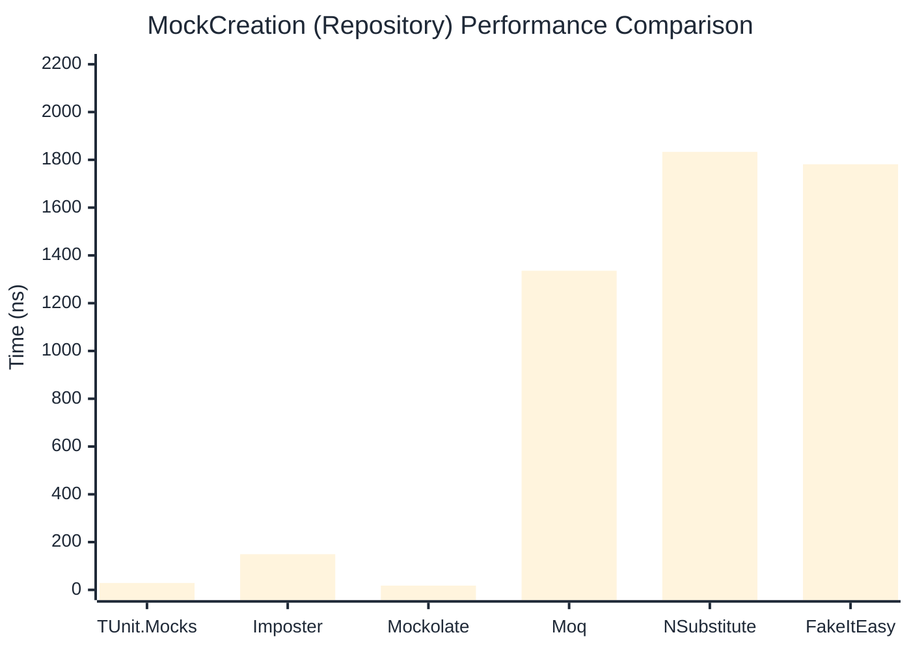

# MockCreation Benchmark

> Mock instance creation performance — comparing **TUnit.Mocks** (source-generated) against runtime proxy-based mocking libraries.

:::info Last Updated
This benchmark was automatically generated on **2026-08-13** from the latest CI run.

**Environment:** Ubuntu Latest • .NET SDK 10.0.400
:::

## 📊 Results

Mock instance creation performance:

| Library | Mean | Error | StdDev | Allocated |
|---------|------|-------|--------|-----------|
| **TUnit.Mocks** | 29.47 ns | 0.464 ns | 0.434 ns | 200 B |
| Imposter | 93.36 ns | 0.833 ns | 0.779 ns | 440 B |
| Mockolate | 18.54 ns | 0.432 ns | 0.853 ns | 160 B |
| Moq | 1,343.30 ns | 13.552 ns | 12.676 ns | 2048 B |
| NSubstitute | 1,843.55 ns | 15.124 ns | 14.147 ns | 5000 B |
| FakeItEasy | 1,723.54 ns | 25.921 ns | 22.978 ns | 2715 B |

```mermaid
%%{init: {
  'theme':'base',
  'themeVariables': {
    'primaryColor': '#2563eb',
    'primaryTextColor': '#1f2937',
    'primaryBorderColor': '#1e40af',
    'lineColor': '#6b7280',
    'secondaryColor': '#7c3aed',
    'tertiaryColor': '#dc2626',
    'background': '#ffffff',
    'pie1': '#2563eb',
    'pie2': '#7c3aed',
    'pie3': '#dc2626',
    'pie4': '#f59e0b',
    'pie5': '#10b981',
    'pie6': '#06b6d4',
    'pie7': '#ec4899',
    'pie8': '#6366f1'
  }
}}%%
xychart-beta
  title "MockCreation Performance Comparison"
  x-axis ["TUnit.Mocks", "Imposter", "Mockolate", "Moq", "NSubstitute", "FakeItEasy"]
  y-axis "Time (ns)" 0 --> 2213
  bar [29.47, 93.36, 18.54, 1343.3, 1843.55, 1723.54]
```

---

### Repository

| Library | Mean | Error | StdDev | Allocated |
|---------|------|-------|--------|-----------|
| **TUnit.Mocks** | 28.98 ns | 0.559 ns | 0.496 ns | 200 B |
| Imposter | 149.43 ns | 2.858 ns | 2.807 ns | 696 B |
| Mockolate | 17.94 ns | 0.242 ns | 0.226 ns | 176 B |
| Moq | 1,335.78 ns | 6.784 ns | 6.346 ns | 1912 B |
| NSubstitute | 1,833.25 ns | 11.983 ns | 11.209 ns | 5000 B |
| FakeItEasy | 1,781.45 ns | 34.471 ns | 32.245 ns | 2715 B |

```mermaid
%%{init: {
  'theme':'base',
  'themeVariables': {
    'primaryColor': '#2563eb',
    'primaryTextColor': '#1f2937',
    'primaryBorderColor': '#1e40af',
    'lineColor': '#6b7280',
    'secondaryColor': '#7c3aed',
    'tertiaryColor': '#dc2626',
    'background': '#ffffff',
    'pie1': '#2563eb',
    'pie2': '#7c3aed',
    'pie3': '#dc2626',
    'pie4': '#f59e0b',
    'pie5': '#10b981',
    'pie6': '#06b6d4',
    'pie7': '#ec4899',
    'pie8': '#6366f1'
  }
}}%%
xychart-beta
  title "MockCreation (Repository) Performance Comparison"
  x-axis ["TUnit.Mocks", "Imposter", "Mockolate", "Moq", "NSubstitute", "FakeItEasy"]
  y-axis "Time (ns)" 0 --> 2200
  bar [28.98, 149.43, 17.94, 1335.78, 1833.25, 1781.45]
```

## 🎯 Key Insights

This benchmark compares **TUnit.Mocks** (source-generated) against runtime proxy-based mocking libraries for mock instance creation performance.

---

:::note Methodology
View the [mock benchmarks overview](/docs/benchmarks/mocks) for methodology details and environment information.
:::

*Last generated: 2026-08-13T03:11:34.997Z*
