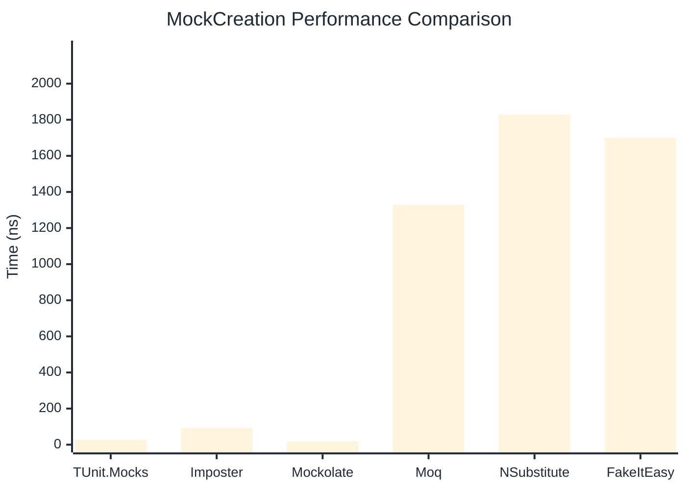
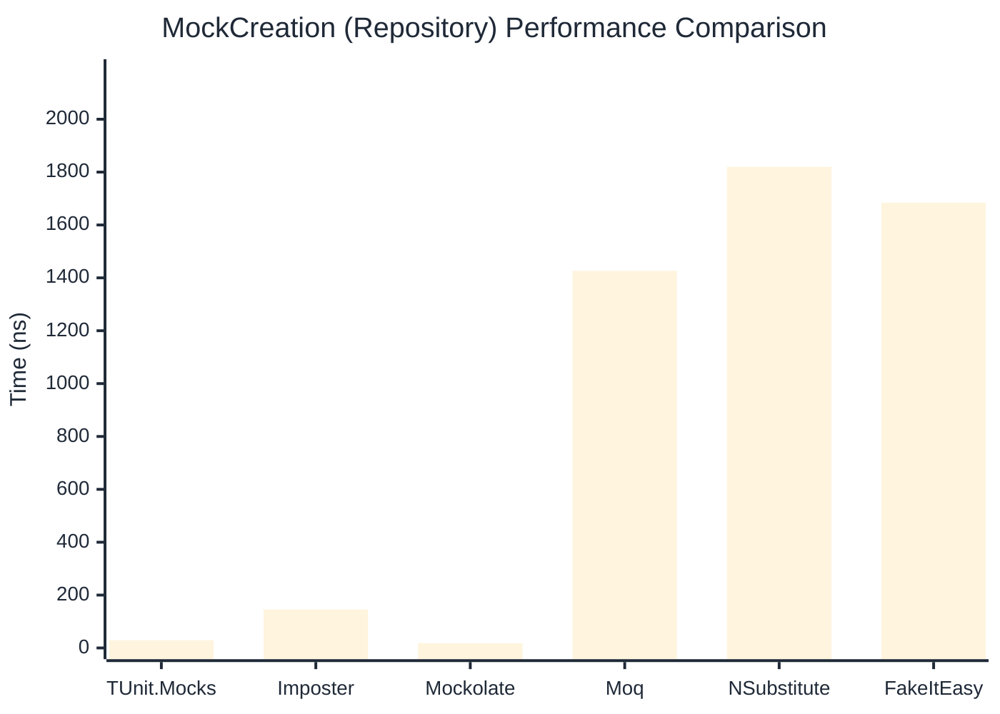

# MockCreation Benchmark

> Mock instance creation performance — comparing **TUnit.Mocks** (source-generated) against runtime proxy-based mocking libraries.

:::info Last Updated
This benchmark was automatically generated on **2026-09-07** from the latest CI run.

**Environment:** Ubuntu Latest • .NET SDK 10.0.400
:::

## 📊 Results

Mock instance creation performance:

| Library | Mean | Error | StdDev | Allocated |
|---------|------|-------|--------|-----------|
| **TUnit.Mocks** | 28.45 ns | 0.616 ns | 0.659 ns | 200 B |
| Imposter | 93.01 ns | 1.344 ns | 1.257 ns | 440 B |
| Mockolate | 16.89 ns | 0.340 ns | 0.318 ns | 160 B |
| Moq | 1,328.45 ns | 24.807 ns | 26.543 ns | 2048 B |
| NSubstitute | 1,828.48 ns | 20.882 ns | 19.533 ns | 5000 B |
| FakeItEasy | 1,700.27 ns | 33.925 ns | 59.416 ns | 2715 B |

```mermaid
%%{init: {
  'theme':'base',
  'themeVariables': {
    'primaryColor': '#2563eb',
    'primaryTextColor': '#1f2937',
    'primaryBorderColor': '#1e40af',
    'lineColor': '#6b7280',
    'secondaryColor': '#7c3aed',
    'tertiaryColor': '#dc2626',
    'background': '#ffffff',
    'pie1': '#2563eb',
    'pie2': '#7c3aed',
    'pie3': '#dc2626',
    'pie4': '#f59e0b',
    'pie5': '#10b981',
    'pie6': '#06b6d4',
    'pie7': '#ec4899',
    'pie8': '#6366f1'
  }
}}%%
xychart-beta
  title "MockCreation Performance Comparison"
  x-axis ["TUnit.Mocks", "Imposter", "Mockolate", "Moq", "NSubstitute", "FakeItEasy"]
  y-axis "Time (ns)" 0 --> 2195
  bar [28.45, 93.01, 16.89, 1328.45, 1828.48, 1700.27]
```

---

### Repository

| Library | Mean | Error | StdDev | Allocated |
|---------|------|-------|--------|-----------|
| **TUnit.Mocks** | 29.18 ns | 0.429 ns | 0.380 ns | 200 B |
| Imposter | 145.02 ns | 1.750 ns | 1.637 ns | 696 B |
| Mockolate | 18.04 ns | 0.422 ns | 0.762 ns | 176 B |
| Moq | 1,426.39 ns | 12.790 ns | 11.964 ns | 1912 B |
| NSubstitute | 1,819.69 ns | 26.926 ns | 25.187 ns | 5000 B |
| FakeItEasy | 1,684.19 ns | 15.170 ns | 14.190 ns | 2715 B |

```mermaid
%%{init: {
  'theme':'base',
  'themeVariables': {
    'primaryColor': '#2563eb',
    'primaryTextColor': '#1f2937',
    'primaryBorderColor': '#1e40af',
    'lineColor': '#6b7280',
    'secondaryColor': '#7c3aed',
    'tertiaryColor': '#dc2626',
    'background': '#ffffff',
    'pie1': '#2563eb',
    'pie2': '#7c3aed',
    'pie3': '#dc2626',
    'pie4': '#f59e0b',
    'pie5': '#10b981',
    'pie6': '#06b6d4',
    'pie7': '#ec4899',
    'pie8': '#6366f1'
  }
}}%%
xychart-beta
  title "MockCreation (Repository) Performance Comparison"
  x-axis ["TUnit.Mocks", "Imposter", "Mockolate", "Moq", "NSubstitute", "FakeItEasy"]
  y-axis "Time (ns)" 0 --> 2184
  bar [29.18, 145.02, 18.04, 1426.39, 1819.69, 1684.19]
```

## 🎯 Key Insights

This benchmark compares **TUnit.Mocks** (source-generated) against runtime proxy-based mocking libraries for mock instance creation performance.

---

:::note Methodology
View the [mock benchmarks overview](/docs/benchmarks/mocks) for methodology details and environment information.
:::

*Last generated: 2026-09-07T02:34:20.667Z*
