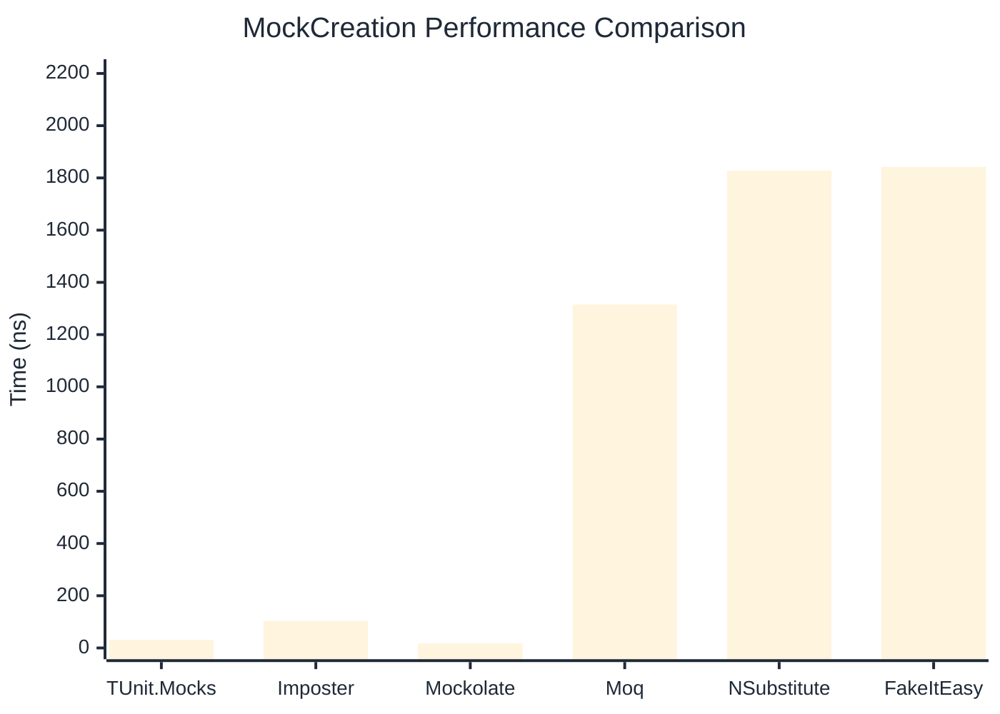

# MockCreation Benchmark

> Mock instance creation performance — comparing **TUnit.Mocks** (source-generated) against runtime proxy-based mocking libraries.

:::info Last Updated
This benchmark was automatically generated on **2026-08-12** from the latest CI run.

**Environment:** Ubuntu Latest • .NET SDK 10.0.400
:::

## 📊 Results

Mock instance creation performance:

| Library | Mean | Error | StdDev | Allocated |
|---------|------|-------|--------|-----------|
| **TUnit.Mocks** | 30.56 ns | 0.274 ns | 0.256 ns | 200 B |
| Imposter | 103.34 ns | 1.311 ns | 1.227 ns | 440 B |
| Mockolate | 17.99 ns | 0.322 ns | 0.286 ns | 160 B |
| Moq | 1,314.97 ns | 16.912 ns | 15.819 ns | 2048 B |
| NSubstitute | 1,827.51 ns | 36.010 ns | 38.530 ns | 5000 B |
| FakeItEasy | 1,842.15 ns | 35.770 ns | 39.759 ns | 2715 B |

```mermaid
%%{init: {
  'theme':'base',
  'themeVariables': {
    'primaryColor': '#2563eb',
    'primaryTextColor': '#1f2937',
    'primaryBorderColor': '#1e40af',
    'lineColor': '#6b7280',
    'secondaryColor': '#7c3aed',
    'tertiaryColor': '#dc2626',
    'background': '#ffffff',
    'pie1': '#2563eb',
    'pie2': '#7c3aed',
    'pie3': '#dc2626',
    'pie4': '#f59e0b',
    'pie5': '#10b981',
    'pie6': '#06b6d4',
    'pie7': '#ec4899',
    'pie8': '#6366f1'
  }
}}%%
xychart-beta
  title "MockCreation Performance Comparison"
  x-axis ["TUnit.Mocks", "Imposter", "Mockolate", "Moq", "NSubstitute", "FakeItEasy"]
  y-axis "Time (ns)" 0 --> 2211
  bar [30.56, 103.34, 17.99, 1314.97, 1827.51, 1842.15]
```

---

### Repository

| Library | Mean | Error | StdDev | Allocated |
|---------|------|-------|--------|-----------|
| **TUnit.Mocks** | 29.81 ns | 0.272 ns | 0.254 ns | 200 B |
| Imposter | 160.07 ns | 1.181 ns | 1.104 ns | 696 B |
| Mockolate | 18.49 ns | 0.235 ns | 0.220 ns | 176 B |
| Moq | 1,310.35 ns | 4.084 ns | 3.620 ns | 1912 B |
| NSubstitute | 1,777.89 ns | 34.941 ns | 46.646 ns | 5000 B |
| FakeItEasy | 1,770.07 ns | 23.594 ns | 18.421 ns | 2715 B |

```mermaid
%%{init: {
  'theme':'base',
  'themeVariables': {
    'primaryColor': '#2563eb',
    'primaryTextColor': '#1f2937',
    'primaryBorderColor': '#1e40af',
    'lineColor': '#6b7280',
    'secondaryColor': '#7c3aed',
    'tertiaryColor': '#dc2626',
    'background': '#ffffff',
    'pie1': '#2563eb',
    'pie2': '#7c3aed',
    'pie3': '#dc2626',
    'pie4': '#f59e0b',
    'pie5': '#10b981',
    'pie6': '#06b6d4',
    'pie7': '#ec4899',
    'pie8': '#6366f1'
  }
}}%%
xychart-beta
  title "MockCreation (Repository) Performance Comparison"
  x-axis ["TUnit.Mocks", "Imposter", "Mockolate", "Moq", "NSubstitute", "FakeItEasy"]
  y-axis "Time (ns)" 0 --> 2134
  bar [29.81, 160.07, 18.49, 1310.35, 1777.89, 1770.07]
```

## 🎯 Key Insights

This benchmark compares **TUnit.Mocks** (source-generated) against runtime proxy-based mocking libraries for mock instance creation performance.

---

:::note Methodology
View the [mock benchmarks overview](/docs/benchmarks/mocks) for methodology details and environment information.
:::

*Last generated: 2026-08-12T03:10:08.627Z*
