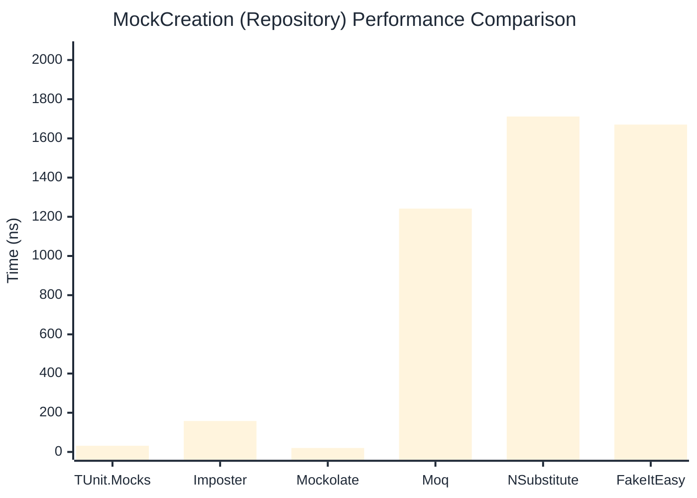

# MockCreation Benchmark

> Mock instance creation performance — comparing **TUnit.Mocks** (source-generated) against runtime proxy-based mocking libraries.

:::info Last Updated
This benchmark was automatically generated on **2026-07-30** from the latest CI run.

**Environment:** Ubuntu Latest • .NET SDK 10.0.302
:::

## 📊 Results

Mock instance creation performance:

| Library | Mean | Error | StdDev | Allocated |
|---------|------|-------|--------|-----------|
| **TUnit.Mocks** | 29.72 ns | 0.373 ns | 0.349 ns | 200 B |
| Imposter | 99.96 ns | 0.185 ns | 0.154 ns | 440 B |
| Mockolate | 17.78 ns | 0.052 ns | 0.044 ns | 160 B |
| Moq | 1,234.08 ns | 19.281 ns | 18.035 ns | 2048 B |
| NSubstitute | 1,771.66 ns | 7.603 ns | 7.112 ns | 5000 B |
| FakeItEasy | 1,661.55 ns | 3.180 ns | 2.819 ns | 2715 B |

```mermaid
%%{init: {
  'theme':'base',
  'themeVariables': {
    'primaryColor': '#2563eb',
    'primaryTextColor': '#1f2937',
    'primaryBorderColor': '#1e40af',
    'lineColor': '#6b7280',
    'secondaryColor': '#7c3aed',
    'tertiaryColor': '#dc2626',
    'background': '#ffffff',
    'pie1': '#2563eb',
    'pie2': '#7c3aed',
    'pie3': '#dc2626',
    'pie4': '#f59e0b',
    'pie5': '#10b981',
    'pie6': '#06b6d4',
    'pie7': '#ec4899',
    'pie8': '#6366f1'
  }
}}%%
xychart-beta
  title "MockCreation Performance Comparison"
  x-axis ["TUnit.Mocks", "Imposter", "Mockolate", "Moq", "NSubstitute", "FakeItEasy"]
  y-axis "Time (ns)" 0 --> 2126
  bar [29.72, 99.96, 17.78, 1234.08, 1771.66, 1661.55]
```

---

### Repository

| Library | Mean | Error | StdDev | Allocated |
|---------|------|-------|--------|-----------|
| **TUnit.Mocks** | 31.58 ns | 0.128 ns | 0.119 ns | 200 B |
| Imposter | 158.06 ns | 0.267 ns | 0.249 ns | 696 B |
| Mockolate | 20.14 ns | 0.194 ns | 0.172 ns | 176 B |
| Moq | 1,241.83 ns | 3.807 ns | 3.375 ns | 1912 B |
| NSubstitute | 1,711.72 ns | 4.290 ns | 3.582 ns | 5000 B |
| FakeItEasy | 1,670.59 ns | 3.463 ns | 3.070 ns | 2715 B |

```mermaid
%%{init: {
  'theme':'base',
  'themeVariables': {
    'primaryColor': '#2563eb',
    'primaryTextColor': '#1f2937',
    'primaryBorderColor': '#1e40af',
    'lineColor': '#6b7280',
    'secondaryColor': '#7c3aed',
    'tertiaryColor': '#dc2626',
    'background': '#ffffff',
    'pie1': '#2563eb',
    'pie2': '#7c3aed',
    'pie3': '#dc2626',
    'pie4': '#f59e0b',
    'pie5': '#10b981',
    'pie6': '#06b6d4',
    'pie7': '#ec4899',
    'pie8': '#6366f1'
  }
}}%%
xychart-beta
  title "MockCreation (Repository) Performance Comparison"
  x-axis ["TUnit.Mocks", "Imposter", "Mockolate", "Moq", "NSubstitute", "FakeItEasy"]
  y-axis "Time (ns)" 0 --> 2055
  bar [31.58, 158.06, 20.14, 1241.83, 1711.72, 1670.59]
```

## 🎯 Key Insights

This benchmark compares **TUnit.Mocks** (source-generated) against runtime proxy-based mocking libraries for mock instance creation performance.

---

:::note Methodology
View the [mock benchmarks overview](/docs/benchmarks/mocks) for methodology details and environment information.
:::

*Last generated: 2026-07-30T03:21:07.533Z*
