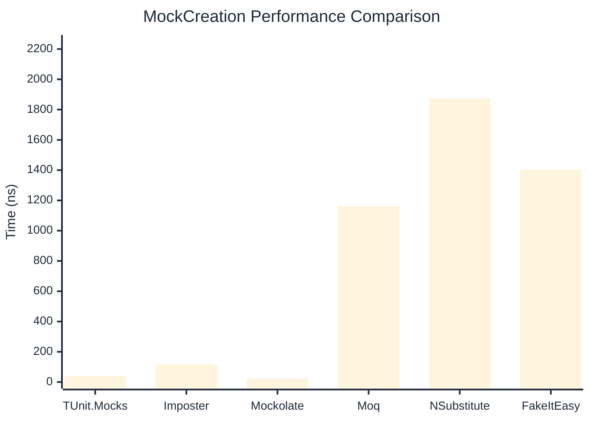
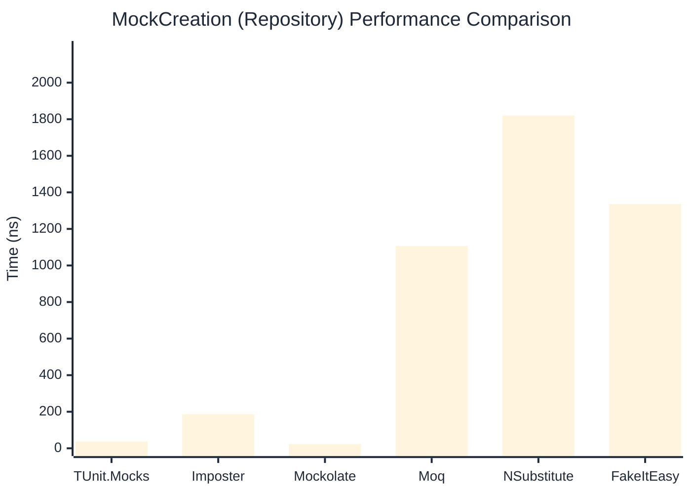

# MockCreation Benchmark

> Mock instance creation performance — comparing **TUnit.Mocks** (source-generated) against runtime proxy-based mocking libraries.

:::info Last Updated
This benchmark was automatically generated on **2026-07-31** from the latest CI run.

**Environment:** Ubuntu Latest • .NET SDK 10.0.302
:::

## 📊 Results

Mock instance creation performance:

| Library | Mean | Error | StdDev | Allocated |
|---------|------|-------|--------|-----------|
| **TUnit.Mocks** | 37.97 ns | 0.774 ns | 0.724 ns | 200 B |
| Imposter | 117.42 ns | 1.501 ns | 1.404 ns | 440 B |
| Mockolate | 22.91 ns | 0.377 ns | 0.335 ns | 160 B |
| Moq | 1,162.39 ns | 16.789 ns | 15.704 ns | 2048 B |
| NSubstitute | 1,873.74 ns | 16.962 ns | 15.866 ns | 5000 B |
| FakeItEasy | 1,402.73 ns | 11.124 ns | 9.861 ns | 2709 B |

```mermaid
%%{init: {
  'theme':'base',
  'themeVariables': {
    'primaryColor': '#2563eb',
    'primaryTextColor': '#1f2937',
    'primaryBorderColor': '#1e40af',
    'lineColor': '#6b7280',
    'secondaryColor': '#7c3aed',
    'tertiaryColor': '#dc2626',
    'background': '#ffffff',
    'pie1': '#2563eb',
    'pie2': '#7c3aed',
    'pie3': '#dc2626',
    'pie4': '#f59e0b',
    'pie5': '#10b981',
    'pie6': '#06b6d4',
    'pie7': '#ec4899',
    'pie8': '#6366f1'
  }
}}%%
xychart-beta
  title "MockCreation Performance Comparison"
  x-axis ["TUnit.Mocks", "Imposter", "Mockolate", "Moq", "NSubstitute", "FakeItEasy"]
  y-axis "Time (ns)" 0 --> 2249
  bar [37.97, 117.42, 22.91, 1162.39, 1873.74, 1402.73]
```

---

### Repository

| Library | Mean | Error | StdDev | Allocated |
|---------|------|-------|--------|-----------|
| **TUnit.Mocks** | 36.88 ns | 0.827 ns | 0.885 ns | 200 B |
| Imposter | 185.85 ns | 2.609 ns | 2.440 ns | 696 B |
| Mockolate | 22.83 ns | 0.248 ns | 0.232 ns | 176 B |
| Moq | 1,106.32 ns | 6.540 ns | 6.118 ns | 1912 B |
| NSubstitute | 1,820.19 ns | 12.150 ns | 11.365 ns | 5000 B |
| FakeItEasy | 1,336.15 ns | 17.562 ns | 16.428 ns | 2709 B |

```mermaid
%%{init: {
  'theme':'base',
  'themeVariables': {
    'primaryColor': '#2563eb',
    'primaryTextColor': '#1f2937',
    'primaryBorderColor': '#1e40af',
    'lineColor': '#6b7280',
    'secondaryColor': '#7c3aed',
    'tertiaryColor': '#dc2626',
    'background': '#ffffff',
    'pie1': '#2563eb',
    'pie2': '#7c3aed',
    'pie3': '#dc2626',
    'pie4': '#f59e0b',
    'pie5': '#10b981',
    'pie6': '#06b6d4',
    'pie7': '#ec4899',
    'pie8': '#6366f1'
  }
}}%%
xychart-beta
  title "MockCreation (Repository) Performance Comparison"
  x-axis ["TUnit.Mocks", "Imposter", "Mockolate", "Moq", "NSubstitute", "FakeItEasy"]
  y-axis "Time (ns)" 0 --> 2185
  bar [36.88, 185.85, 22.83, 1106.32, 1820.19, 1336.15]
```

## 🎯 Key Insights

This benchmark compares **TUnit.Mocks** (source-generated) against runtime proxy-based mocking libraries for mock instance creation performance.

---

:::note Methodology
View the [mock benchmarks overview](/docs/benchmarks/mocks) for methodology details and environment information.
:::

*Last generated: 2026-07-31T03:21:39.823Z*
