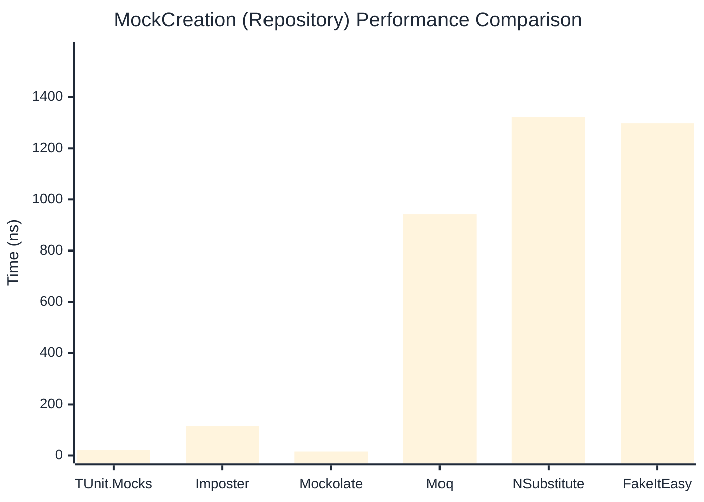

# MockCreation Benchmark

> Mock instance creation performance — comparing **TUnit.Mocks** (source-generated) against runtime proxy-based mocking libraries.

:::info Last Updated
This benchmark was automatically generated on **2026-09-22** from the latest CI run.

**Environment:** Ubuntu Latest • .NET SDK 10.0.401
:::

## 📊 Results

Mock instance creation performance:

| Library | Mean | Error | StdDev | Allocated |
|---------|------|-------|--------|-----------|
| **TUnit.Mocks** | 22.39 ns | 0.127 ns | 0.119 ns | 200 B |
| Imposter | 74.38 ns | 0.134 ns | 0.125 ns | 440 B |
| Mockolate | 13.05 ns | 0.084 ns | 0.075 ns | 160 B |
| Moq | 963.74 ns | 16.220 ns | 12.664 ns | 2048 B |
| NSubstitute | 1,342.48 ns | 8.668 ns | 7.684 ns | 5000 B |
| FakeItEasy | 1,282.32 ns | 10.148 ns | 8.995 ns | 2715 B |

```mermaid
%%{init: {
  'theme':'base',
  'themeVariables': {
    'primaryColor': '#2563eb',
    'primaryTextColor': '#1f2937',
    'primaryBorderColor': '#1e40af',
    'lineColor': '#6b7280',
    'secondaryColor': '#7c3aed',
    'tertiaryColor': '#dc2626',
    'background': '#ffffff',
    'pie1': '#2563eb',
    'pie2': '#7c3aed',
    'pie3': '#dc2626',
    'pie4': '#f59e0b',
    'pie5': '#10b981',
    'pie6': '#06b6d4',
    'pie7': '#ec4899',
    'pie8': '#6366f1'
  }
}}%%
xychart-beta
  title "MockCreation Performance Comparison"
  x-axis ["TUnit.Mocks", "Imposter", "Mockolate", "Moq", "NSubstitute", "FakeItEasy"]
  y-axis "Time (ns)" 0 --> 1611
  bar [22.39, 74.38, 13.05, 963.74, 1342.48, 1282.32]
```

---

### Repository

| Library | Mean | Error | StdDev | Allocated |
|---------|------|-------|--------|-----------|
| **TUnit.Mocks** | 22.11 ns | 0.061 ns | 0.054 ns | 200 B |
| Imposter | 116.24 ns | 0.858 ns | 0.716 ns | 696 B |
| Mockolate | 15.61 ns | 0.191 ns | 0.169 ns | 176 B |
| Moq | 941.66 ns | 5.128 ns | 4.003 ns | 1912 B |
| NSubstitute | 1,320.29 ns | 9.061 ns | 8.475 ns | 5000 B |
| FakeItEasy | 1,296.39 ns | 14.097 ns | 13.186 ns | 2715 B |

```mermaid
%%{init: {
  'theme':'base',
  'themeVariables': {
    'primaryColor': '#2563eb',
    'primaryTextColor': '#1f2937',
    'primaryBorderColor': '#1e40af',
    'lineColor': '#6b7280',
    'secondaryColor': '#7c3aed',
    'tertiaryColor': '#dc2626',
    'background': '#ffffff',
    'pie1': '#2563eb',
    'pie2': '#7c3aed',
    'pie3': '#dc2626',
    'pie4': '#f59e0b',
    'pie5': '#10b981',
    'pie6': '#06b6d4',
    'pie7': '#ec4899',
    'pie8': '#6366f1'
  }
}}%%
xychart-beta
  title "MockCreation (Repository) Performance Comparison"
  x-axis ["TUnit.Mocks", "Imposter", "Mockolate", "Moq", "NSubstitute", "FakeItEasy"]
  y-axis "Time (ns)" 0 --> 1585
  bar [22.11, 116.24, 15.61, 941.66, 1320.29, 1296.39]
```

## 🎯 Key Insights

This benchmark compares **TUnit.Mocks** (source-generated) against runtime proxy-based mocking libraries for mock instance creation performance.

---

:::note Methodology
View the [mock benchmarks overview](/docs/benchmarks/mocks) for methodology details and environment information.
:::

*Last generated: 2026-09-22T02:33:33.738Z*
