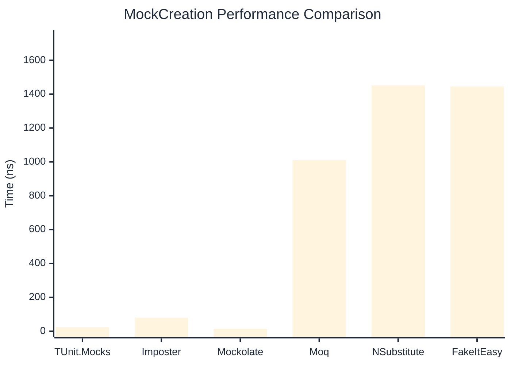
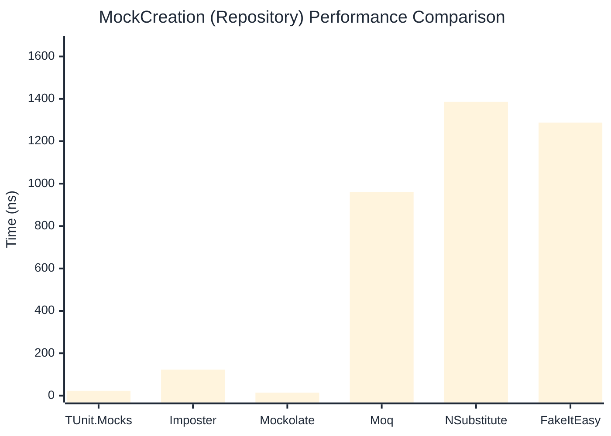

# MockCreation Benchmark

> Mock instance creation performance — comparing **TUnit.Mocks** (source-generated) against runtime proxy-based mocking libraries.

:::info Last Updated
This benchmark was automatically generated on **2026-09-04** from the latest CI run.

**Environment:** Ubuntu Latest • .NET SDK 10.0.400
:::

## 📊 Results

Mock instance creation performance:

| Library | Mean | Error | StdDev | Allocated |
|---------|------|-------|--------|-----------|
| **TUnit.Mocks** | 23.40 ns | 0.224 ns | 0.199 ns | 200 B |
| Imposter | 79.96 ns | 0.386 ns | 0.342 ns | 440 B |
| Mockolate | 13.99 ns | 0.094 ns | 0.088 ns | 160 B |
| Moq | 1,010.23 ns | 15.006 ns | 14.036 ns | 2048 B |
| NSubstitute | 1,452.00 ns | 14.914 ns | 13.950 ns | 5000 B |
| FakeItEasy | 1,445.48 ns | 28.528 ns | 51.442 ns | 2715 B |

```mermaid
%%{init: {
  'theme':'base',
  'themeVariables': {
    'primaryColor': '#2563eb',
    'primaryTextColor': '#1f2937',
    'primaryBorderColor': '#1e40af',
    'lineColor': '#6b7280',
    'secondaryColor': '#7c3aed',
    'tertiaryColor': '#dc2626',
    'background': '#ffffff',
    'pie1': '#2563eb',
    'pie2': '#7c3aed',
    'pie3': '#dc2626',
    'pie4': '#f59e0b',
    'pie5': '#10b981',
    'pie6': '#06b6d4',
    'pie7': '#ec4899',
    'pie8': '#6366f1'
  }
}}%%
xychart-beta
  title "MockCreation Performance Comparison"
  x-axis ["TUnit.Mocks", "Imposter", "Mockolate", "Moq", "NSubstitute", "FakeItEasy"]
  y-axis "Time (ns)" 0 --> 1743
  bar [23.4, 79.96, 13.99, 1010.23, 1452, 1445.48]
```

---

### Repository

| Library | Mean | Error | StdDev | Allocated |
|---------|------|-------|--------|-----------|
| **TUnit.Mocks** | 23.46 ns | 0.239 ns | 0.223 ns | 200 B |
| Imposter | 123.02 ns | 0.805 ns | 0.753 ns | 696 B |
| Mockolate | 14.15 ns | 0.129 ns | 0.115 ns | 176 B |
| Moq | 959.91 ns | 9.791 ns | 9.159 ns | 1912 B |
| NSubstitute | 1,385.63 ns | 27.592 ns | 35.877 ns | 5000 B |
| FakeItEasy | 1,287.78 ns | 23.041 ns | 20.425 ns | 2715 B |

```mermaid
%%{init: {
  'theme':'base',
  'themeVariables': {
    'primaryColor': '#2563eb',
    'primaryTextColor': '#1f2937',
    'primaryBorderColor': '#1e40af',
    'lineColor': '#6b7280',
    'secondaryColor': '#7c3aed',
    'tertiaryColor': '#dc2626',
    'background': '#ffffff',
    'pie1': '#2563eb',
    'pie2': '#7c3aed',
    'pie3': '#dc2626',
    'pie4': '#f59e0b',
    'pie5': '#10b981',
    'pie6': '#06b6d4',
    'pie7': '#ec4899',
    'pie8': '#6366f1'
  }
}}%%
xychart-beta
  title "MockCreation (Repository) Performance Comparison"
  x-axis ["TUnit.Mocks", "Imposter", "Mockolate", "Moq", "NSubstitute", "FakeItEasy"]
  y-axis "Time (ns)" 0 --> 1663
  bar [23.46, 123.02, 14.15, 959.91, 1385.63, 1287.78]
```

## 🎯 Key Insights

This benchmark compares **TUnit.Mocks** (source-generated) against runtime proxy-based mocking libraries for mock instance creation performance.

---

:::note Methodology
View the [mock benchmarks overview](/docs/benchmarks/mocks) for methodology details and environment information.
:::

*Last generated: 2026-09-04T02:33:16.366Z*
