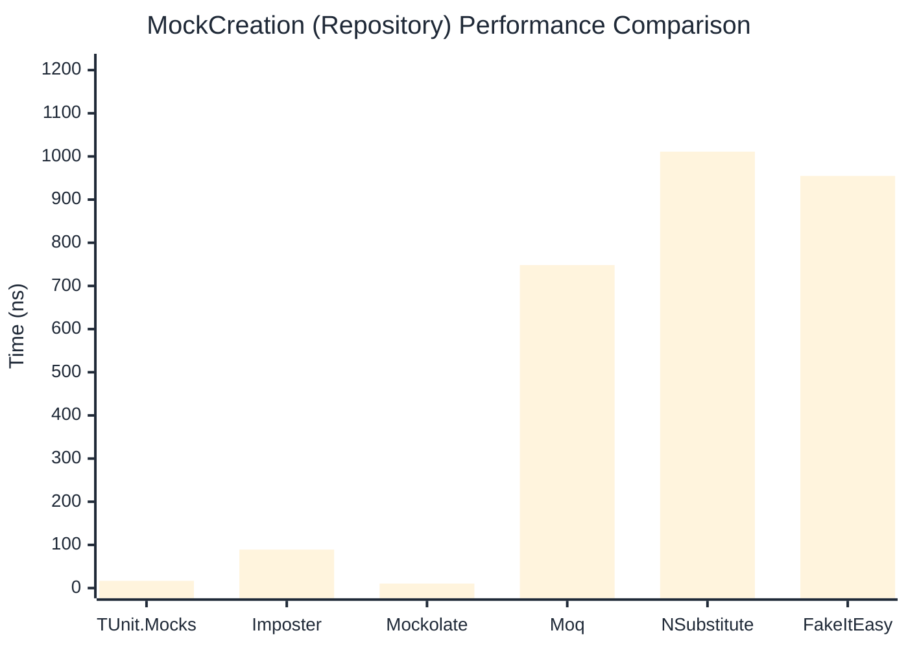

# MockCreation Benchmark

> Mock instance creation performance — comparing **TUnit.Mocks** (source-generated) against runtime proxy-based mocking libraries.

:::info Last Updated
This benchmark was automatically generated on **2026-08-03** from the latest CI run.

**Environment:** Ubuntu Latest • .NET SDK 10.0.302
:::

## 📊 Results

Mock instance creation performance:

| Library | Mean | Error | StdDev | Allocated |
|---------|------|-------|--------|-----------|
| **TUnit.Mocks** | 16.90 ns | 0.187 ns | 0.166 ns | 200 B |
| Imposter | 57.38 ns | 0.847 ns | 0.751 ns | 440 B |
| Mockolate | 10.41 ns | 0.212 ns | 0.188 ns | 160 B |
| Moq | 739.61 ns | 6.651 ns | 5.896 ns | 2048 B |
| NSubstitute | 990.42 ns | 19.254 ns | 17.068 ns | 5000 B |
| FakeItEasy | 968.25 ns | 18.732 ns | 19.237 ns | 2715 B |

```mermaid
%%{init: {
  'theme':'base',
  'themeVariables': {
    'primaryColor': '#2563eb',
    'primaryTextColor': '#1f2937',
    'primaryBorderColor': '#1e40af',
    'lineColor': '#6b7280',
    'secondaryColor': '#7c3aed',
    'tertiaryColor': '#dc2626',
    'background': '#ffffff',
    'pie1': '#2563eb',
    'pie2': '#7c3aed',
    'pie3': '#dc2626',
    'pie4': '#f59e0b',
    'pie5': '#10b981',
    'pie6': '#06b6d4',
    'pie7': '#ec4899',
    'pie8': '#6366f1'
  }
}}%%
xychart-beta
  title "MockCreation Performance Comparison"
  x-axis ["TUnit.Mocks", "Imposter", "Mockolate", "Moq", "NSubstitute", "FakeItEasy"]
  y-axis "Time (ns)" 0 --> 1189
  bar [16.9, 57.38, 10.41, 739.61, 990.42, 968.25]
```

---

### Repository

| Library | Mean | Error | StdDev | Allocated |
|---------|------|-------|--------|-----------|
| **TUnit.Mocks** | 16.80 ns | 0.247 ns | 0.231 ns | 200 B |
| Imposter | 89.13 ns | 0.640 ns | 0.568 ns | 696 B |
| Mockolate | 10.41 ns | 0.233 ns | 0.218 ns | 176 B |
| Moq | 748.28 ns | 5.252 ns | 4.655 ns | 1912 B |
| NSubstitute | 1,011.10 ns | 19.971 ns | 19.614 ns | 5000 B |
| FakeItEasy | 954.91 ns | 17.339 ns | 15.371 ns | 2715 B |

```mermaid
%%{init: {
  'theme':'base',
  'themeVariables': {
    'primaryColor': '#2563eb',
    'primaryTextColor': '#1f2937',
    'primaryBorderColor': '#1e40af',
    'lineColor': '#6b7280',
    'secondaryColor': '#7c3aed',
    'tertiaryColor': '#dc2626',
    'background': '#ffffff',
    'pie1': '#2563eb',
    'pie2': '#7c3aed',
    'pie3': '#dc2626',
    'pie4': '#f59e0b',
    'pie5': '#10b981',
    'pie6': '#06b6d4',
    'pie7': '#ec4899',
    'pie8': '#6366f1'
  }
}}%%
xychart-beta
  title "MockCreation (Repository) Performance Comparison"
  x-axis ["TUnit.Mocks", "Imposter", "Mockolate", "Moq", "NSubstitute", "FakeItEasy"]
  y-axis "Time (ns)" 0 --> 1214
  bar [16.8, 89.13, 10.41, 748.28, 1011.1, 954.91]
```

## 🎯 Key Insights

This benchmark compares **TUnit.Mocks** (source-generated) against runtime proxy-based mocking libraries for mock instance creation performance.

---

:::note Methodology
View the [mock benchmarks overview](/docs/benchmarks/mocks) for methodology details and environment information.
:::

*Last generated: 2026-08-03T03:22:34.236Z*
