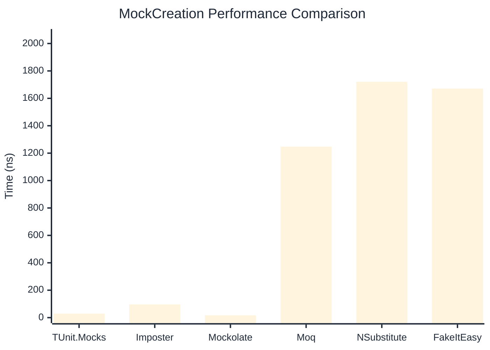
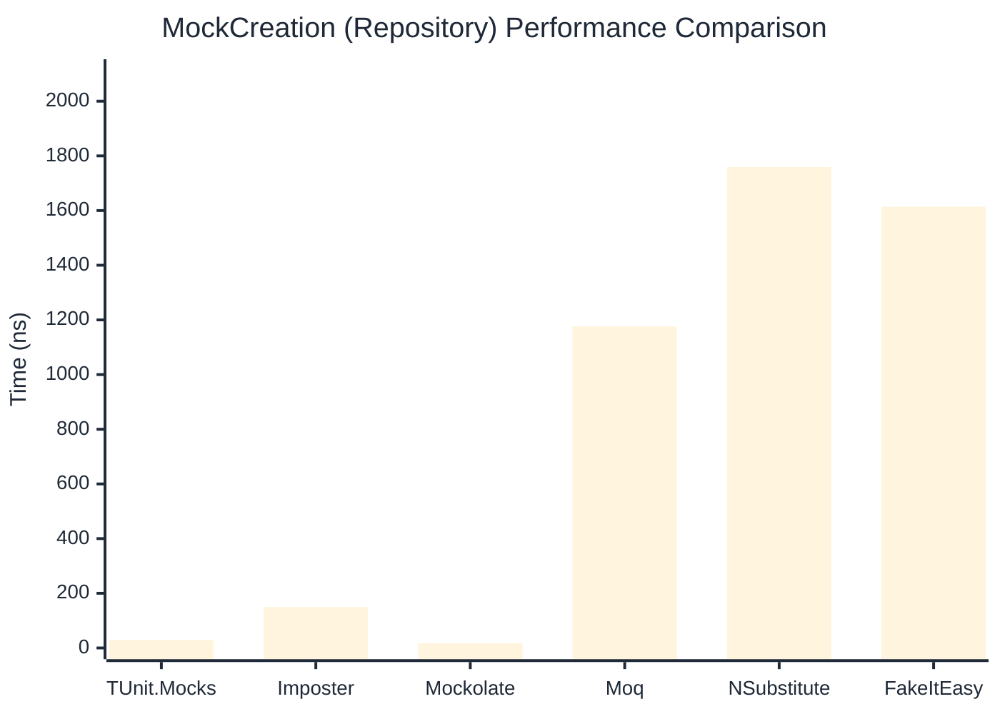

# MockCreation Benchmark

> Mock instance creation performance — comparing **TUnit.Mocks** (source-generated) against runtime proxy-based mocking libraries.

:::info Last Updated
This benchmark was automatically generated on **2026-09-16** from the latest CI run.

**Environment:** Ubuntu Latest • .NET SDK 10.0.401
:::

## 📊 Results

Mock instance creation performance:

| Library | Mean | Error | StdDev | Allocated |
|---------|------|-------|--------|-----------|
| **TUnit.Mocks** | 29.10 ns | 0.448 ns | 0.419 ns | 200 B |
| Imposter | 96.49 ns | 0.548 ns | 0.458 ns | 440 B |
| Mockolate | 17.08 ns | 0.125 ns | 0.111 ns | 160 B |
| Moq | 1,247.57 ns | 24.476 ns | 29.137 ns | 2048 B |
| NSubstitute | 1,720.75 ns | 28.286 ns | 26.459 ns | 5000 B |
| FakeItEasy | 1,671.12 ns | 32.894 ns | 33.780 ns | 2715 B |

```mermaid
%%{init: {
  'theme':'base',
  'themeVariables': {
    'primaryColor': '#2563eb',
    'primaryTextColor': '#1f2937',
    'primaryBorderColor': '#1e40af',
    'lineColor': '#6b7280',
    'secondaryColor': '#7c3aed',
    'tertiaryColor': '#dc2626',
    'background': '#ffffff',
    'pie1': '#2563eb',
    'pie2': '#7c3aed',
    'pie3': '#dc2626',
    'pie4': '#f59e0b',
    'pie5': '#10b981',
    'pie6': '#06b6d4',
    'pie7': '#ec4899',
    'pie8': '#6366f1'
  }
}}%%
xychart-beta
  title "MockCreation Performance Comparison"
  x-axis ["TUnit.Mocks", "Imposter", "Mockolate", "Moq", "NSubstitute", "FakeItEasy"]
  y-axis "Time (ns)" 0 --> 2065
  bar [29.1, 96.49, 17.08, 1247.57, 1720.75, 1671.12]
```

---

### Repository

| Library | Mean | Error | StdDev | Allocated |
|---------|------|-------|--------|-----------|
| **TUnit.Mocks** | 28.72 ns | 0.184 ns | 0.172 ns | 200 B |
| Imposter | 149.22 ns | 0.392 ns | 0.347 ns | 696 B |
| Mockolate | 17.66 ns | 0.040 ns | 0.035 ns | 176 B |
| Moq | 1,176.27 ns | 4.177 ns | 3.703 ns | 1912 B |
| NSubstitute | 1,759.27 ns | 9.800 ns | 8.184 ns | 5000 B |
| FakeItEasy | 1,614.03 ns | 11.433 ns | 10.695 ns | 2715 B |

```mermaid
%%{init: {
  'theme':'base',
  'themeVariables': {
    'primaryColor': '#2563eb',
    'primaryTextColor': '#1f2937',
    'primaryBorderColor': '#1e40af',
    'lineColor': '#6b7280',
    'secondaryColor': '#7c3aed',
    'tertiaryColor': '#dc2626',
    'background': '#ffffff',
    'pie1': '#2563eb',
    'pie2': '#7c3aed',
    'pie3': '#dc2626',
    'pie4': '#f59e0b',
    'pie5': '#10b981',
    'pie6': '#06b6d4',
    'pie7': '#ec4899',
    'pie8': '#6366f1'
  }
}}%%
xychart-beta
  title "MockCreation (Repository) Performance Comparison"
  x-axis ["TUnit.Mocks", "Imposter", "Mockolate", "Moq", "NSubstitute", "FakeItEasy"]
  y-axis "Time (ns)" 0 --> 2112
  bar [28.72, 149.22, 17.66, 1176.27, 1759.27, 1614.03]
```

## 🎯 Key Insights

This benchmark compares **TUnit.Mocks** (source-generated) against runtime proxy-based mocking libraries for mock instance creation performance.

---

:::note Methodology
View the [mock benchmarks overview](/docs/benchmarks/mocks) for methodology details and environment information.
:::

*Last generated: 2026-09-16T02:32:43.042Z*
