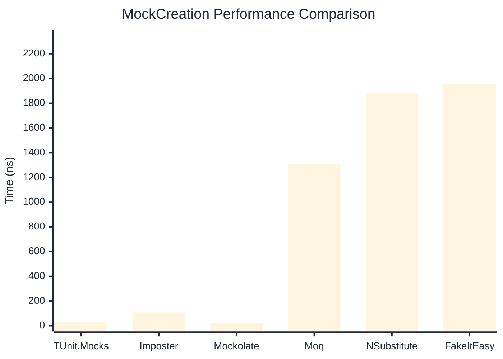
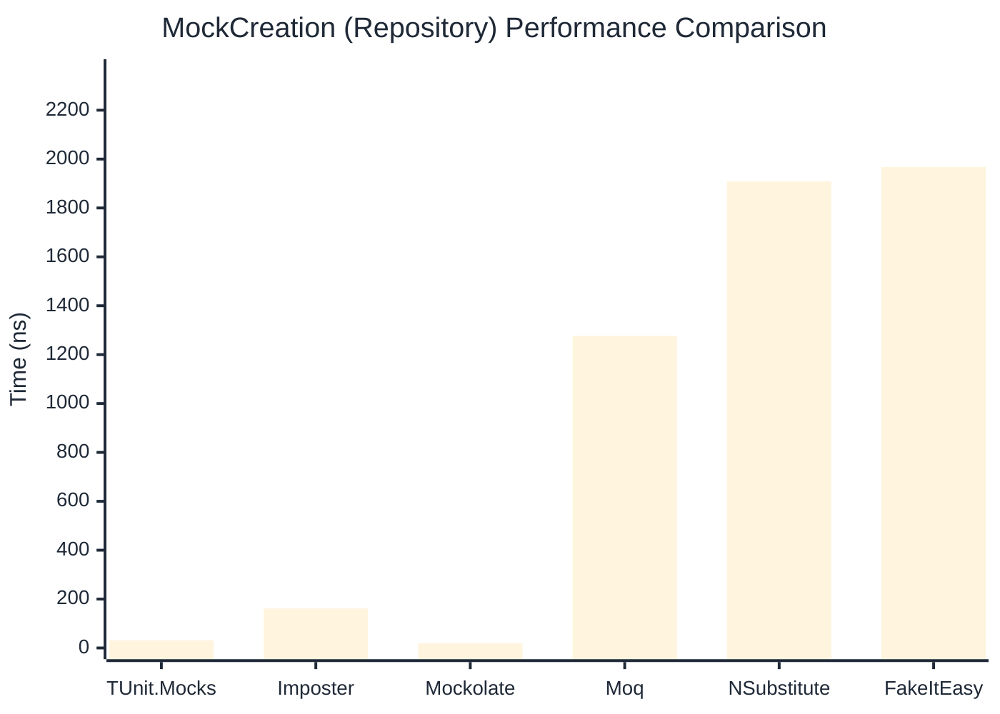

# MockCreation Benchmark

> Mock instance creation performance — comparing **TUnit.Mocks** (source-generated) against runtime proxy-based mocking libraries.

:::info Last Updated
This benchmark was automatically generated on **2026-08-02** from the latest CI run.

**Environment:** Ubuntu Latest • .NET SDK 10.0.302
:::

## 📊 Results

Mock instance creation performance:

| Library | Mean | Error | StdDev | Allocated |
|---------|------|-------|--------|-----------|
| **TUnit.Mocks** | 30.88 ns | 0.509 ns | 0.425 ns | 200 B |
| Imposter | 107.84 ns | 0.881 ns | 0.824 ns | 440 B |
| Mockolate | 18.91 ns | 0.180 ns | 0.168 ns | 160 B |
| Moq | 1,310.23 ns | 22.623 ns | 21.162 ns | 2048 B |
| NSubstitute | 1,886.02 ns | 6.675 ns | 5.917 ns | 5000 B |
| FakeItEasy | 1,955.92 ns | 38.098 ns | 46.788 ns | 2715 B |

```mermaid
%%{init: {
  'theme':'base',
  'themeVariables': {
    'primaryColor': '#2563eb',
    'primaryTextColor': '#1f2937',
    'primaryBorderColor': '#1e40af',
    'lineColor': '#6b7280',
    'secondaryColor': '#7c3aed',
    'tertiaryColor': '#dc2626',
    'background': '#ffffff',
    'pie1': '#2563eb',
    'pie2': '#7c3aed',
    'pie3': '#dc2626',
    'pie4': '#f59e0b',
    'pie5': '#10b981',
    'pie6': '#06b6d4',
    'pie7': '#ec4899',
    'pie8': '#6366f1'
  }
}}%%
xychart-beta
  title "MockCreation Performance Comparison"
  x-axis ["TUnit.Mocks", "Imposter", "Mockolate", "Moq", "NSubstitute", "FakeItEasy"]
  y-axis "Time (ns)" 0 --> 2348
  bar [30.88, 107.84, 18.91, 1310.23, 1886.02, 1955.92]
```

---

### Repository

| Library | Mean | Error | StdDev | Allocated |
|---------|------|-------|--------|-----------|
| **TUnit.Mocks** | 31.09 ns | 0.337 ns | 0.315 ns | 200 B |
| Imposter | 161.81 ns | 1.018 ns | 0.903 ns | 696 B |
| Mockolate | 19.05 ns | 0.164 ns | 0.153 ns | 176 B |
| Moq | 1,276.85 ns | 10.774 ns | 9.551 ns | 1912 B |
| NSubstitute | 1,908.53 ns | 15.469 ns | 13.713 ns | 5000 B |
| FakeItEasy | 1,967.60 ns | 32.004 ns | 29.936 ns | 2715 B |

```mermaid
%%{init: {
  'theme':'base',
  'themeVariables': {
    'primaryColor': '#2563eb',
    'primaryTextColor': '#1f2937',
    'primaryBorderColor': '#1e40af',
    'lineColor': '#6b7280',
    'secondaryColor': '#7c3aed',
    'tertiaryColor': '#dc2626',
    'background': '#ffffff',
    'pie1': '#2563eb',
    'pie2': '#7c3aed',
    'pie3': '#dc2626',
    'pie4': '#f59e0b',
    'pie5': '#10b981',
    'pie6': '#06b6d4',
    'pie7': '#ec4899',
    'pie8': '#6366f1'
  }
}}%%
xychart-beta
  title "MockCreation (Repository) Performance Comparison"
  x-axis ["TUnit.Mocks", "Imposter", "Mockolate", "Moq", "NSubstitute", "FakeItEasy"]
  y-axis "Time (ns)" 0 --> 2362
  bar [31.09, 161.81, 19.05, 1276.85, 1908.53, 1967.6]
```

## 🎯 Key Insights

This benchmark compares **TUnit.Mocks** (source-generated) against runtime proxy-based mocking libraries for mock instance creation performance.

---

:::note Methodology
View the [mock benchmarks overview](/docs/benchmarks/mocks) for methodology details and environment information.
:::

*Last generated: 2026-08-02T03:23:38.806Z*
