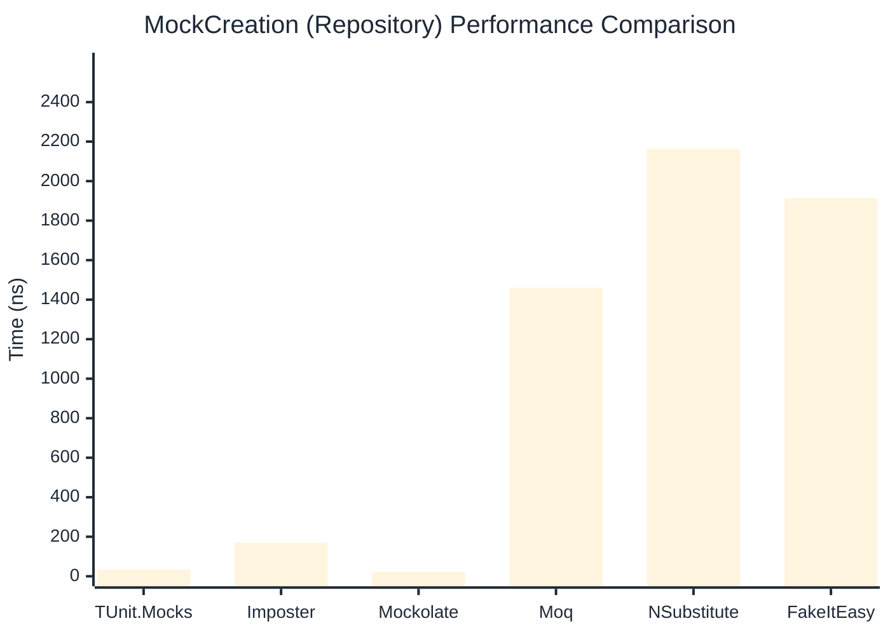

# MockCreation Benchmark

> Mock instance creation performance — comparing **TUnit.Mocks** (source-generated) against runtime proxy-based mocking libraries.

:::info Last Updated
This benchmark was automatically generated on **2026-08-28** from the latest CI run.

**Environment:** Ubuntu Latest • .NET SDK 10.0.400
:::

## 📊 Results

Mock instance creation performance:

| Library | Mean | Error | StdDev | Allocated |
|---------|------|-------|--------|-----------|
| **TUnit.Mocks** | 35.23 ns | 0.788 ns | 2.102 ns | 200 B |
| Imposter | 105.43 ns | 2.189 ns | 4.058 ns | 440 B |
| Mockolate | 23.03 ns | 0.706 ns | 2.081 ns | 160 B |
| Moq | 1,357.98 ns | 25.478 ns | 25.023 ns | 2048 B |
| NSubstitute | 1,895.78 ns | 37.093 ns | 36.431 ns | 5000 B |
| FakeItEasy | 1,926.44 ns | 37.416 ns | 43.089 ns | 2723 B |

```mermaid
%%{init: {
  'theme':'base',
  'themeVariables': {
    'primaryColor': '#2563eb',
    'primaryTextColor': '#1f2937',
    'primaryBorderColor': '#1e40af',
    'lineColor': '#6b7280',
    'secondaryColor': '#7c3aed',
    'tertiaryColor': '#dc2626',
    'background': '#ffffff',
    'pie1': '#2563eb',
    'pie2': '#7c3aed',
    'pie3': '#dc2626',
    'pie4': '#f59e0b',
    'pie5': '#10b981',
    'pie6': '#06b6d4',
    'pie7': '#ec4899',
    'pie8': '#6366f1'
  }
}}%%
xychart-beta
  title "MockCreation Performance Comparison"
  x-axis ["TUnit.Mocks", "Imposter", "Mockolate", "Moq", "NSubstitute", "FakeItEasy"]
  y-axis "Time (ns)" 0 --> 2312
  bar [35.23, 105.43, 23.03, 1357.98, 1895.78, 1926.44]
```

---

### Repository

| Library | Mean | Error | StdDev | Allocated |
|---------|------|-------|--------|-----------|
| **TUnit.Mocks** | 34.21 ns | 0.803 ns | 2.355 ns | 200 B |
| Imposter | 169.80 ns | 3.490 ns | 8.626 ns | 696 B |
| Mockolate | 22.34 ns | 0.631 ns | 1.840 ns | 176 B |
| Moq | 1,459.49 ns | 9.258 ns | 8.207 ns | 1912 B |
| NSubstitute | 2,165.10 ns | 25.549 ns | 23.899 ns | 5000 B |
| FakeItEasy | 1,913.10 ns | 22.821 ns | 21.347 ns | 2723 B |

```mermaid
%%{init: {
  'theme':'base',
  'themeVariables': {
    'primaryColor': '#2563eb',
    'primaryTextColor': '#1f2937',
    'primaryBorderColor': '#1e40af',
    'lineColor': '#6b7280',
    'secondaryColor': '#7c3aed',
    'tertiaryColor': '#dc2626',
    'background': '#ffffff',
    'pie1': '#2563eb',
    'pie2': '#7c3aed',
    'pie3': '#dc2626',
    'pie4': '#f59e0b',
    'pie5': '#10b981',
    'pie6': '#06b6d4',
    'pie7': '#ec4899',
    'pie8': '#6366f1'
  }
}}%%
xychart-beta
  title "MockCreation (Repository) Performance Comparison"
  x-axis ["TUnit.Mocks", "Imposter", "Mockolate", "Moq", "NSubstitute", "FakeItEasy"]
  y-axis "Time (ns)" 0 --> 2599
  bar [34.21, 169.8, 22.34, 1459.49, 2165.1, 1913.1]
```

## 🎯 Key Insights

This benchmark compares **TUnit.Mocks** (source-generated) against runtime proxy-based mocking libraries for mock instance creation performance.

---

:::note Methodology
View the [mock benchmarks overview](/docs/benchmarks/mocks) for methodology details and environment information.
:::

*Last generated: 2026-08-28T05:02:48.374Z*
