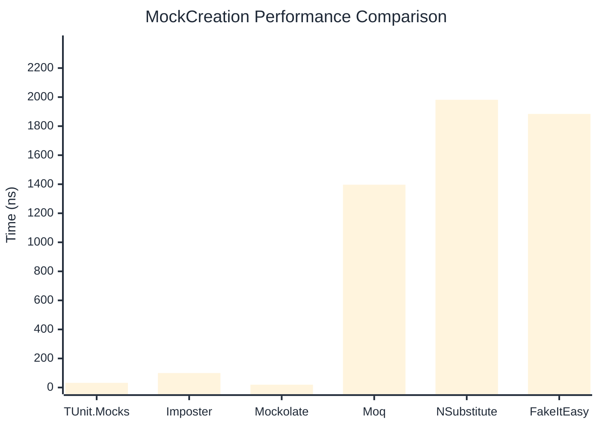
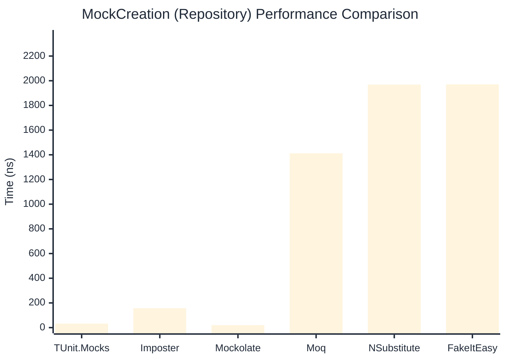

# MockCreation Benchmark

> Mock instance creation performance — comparing **TUnit.Mocks** (source-generated) against runtime proxy-based mocking libraries.

:::info Last Updated
This benchmark was automatically generated on **2026-08-09** from the latest CI run.

**Environment:** Ubuntu Latest • .NET SDK 10.0.302
:::

## 📊 Results

Mock instance creation performance:

| Library | Mean | Error | StdDev | Allocated |
|---------|------|-------|--------|-----------|
| **TUnit.Mocks** | 32.00 ns | 0.697 ns | 0.716 ns | 200 B |
| Imposter | 99.84 ns | 0.804 ns | 0.752 ns | 440 B |
| Mockolate | 19.45 ns | 0.355 ns | 0.332 ns | 160 B |
| Moq | 1,396.66 ns | 27.840 ns | 26.042 ns | 2048 B |
| NSubstitute | 1,981.38 ns | 21.556 ns | 19.109 ns | 5000 B |
| FakeItEasy | 1,884.17 ns | 27.232 ns | 24.140 ns | 2715 B |

```mermaid
%%{init: {
  'theme':'base',
  'themeVariables': {
    'primaryColor': '#2563eb',
    'primaryTextColor': '#1f2937',
    'primaryBorderColor': '#1e40af',
    'lineColor': '#6b7280',
    'secondaryColor': '#7c3aed',
    'tertiaryColor': '#dc2626',
    'background': '#ffffff',
    'pie1': '#2563eb',
    'pie2': '#7c3aed',
    'pie3': '#dc2626',
    'pie4': '#f59e0b',
    'pie5': '#10b981',
    'pie6': '#06b6d4',
    'pie7': '#ec4899',
    'pie8': '#6366f1'
  }
}}%%
xychart-beta
  title "MockCreation Performance Comparison"
  x-axis ["TUnit.Mocks", "Imposter", "Mockolate", "Moq", "NSubstitute", "FakeItEasy"]
  y-axis "Time (ns)" 0 --> 2378
  bar [32, 99.84, 19.45, 1396.66, 1981.38, 1884.17]
```

---

### Repository

| Library | Mean | Error | StdDev | Allocated |
|---------|------|-------|--------|-----------|
| **TUnit.Mocks** | 31.89 ns | 0.677 ns | 0.600 ns | 200 B |
| Imposter | 156.80 ns | 1.616 ns | 1.512 ns | 696 B |
| Mockolate | 20.22 ns | 0.451 ns | 0.586 ns | 176 B |
| Moq | 1,411.97 ns | 5.741 ns | 5.090 ns | 1912 B |
| NSubstitute | 1,968.82 ns | 29.645 ns | 27.730 ns | 5000 B |
| FakeItEasy | 1,970.15 ns | 27.717 ns | 25.926 ns | 2715 B |

```mermaid
%%{init: {
  'theme':'base',
  'themeVariables': {
    'primaryColor': '#2563eb',
    'primaryTextColor': '#1f2937',
    'primaryBorderColor': '#1e40af',
    'lineColor': '#6b7280',
    'secondaryColor': '#7c3aed',
    'tertiaryColor': '#dc2626',
    'background': '#ffffff',
    'pie1': '#2563eb',
    'pie2': '#7c3aed',
    'pie3': '#dc2626',
    'pie4': '#f59e0b',
    'pie5': '#10b981',
    'pie6': '#06b6d4',
    'pie7': '#ec4899',
    'pie8': '#6366f1'
  }
}}%%
xychart-beta
  title "MockCreation (Repository) Performance Comparison"
  x-axis ["TUnit.Mocks", "Imposter", "Mockolate", "Moq", "NSubstitute", "FakeItEasy"]
  y-axis "Time (ns)" 0 --> 2365
  bar [31.89, 156.8, 20.22, 1411.97, 1968.82, 1970.15]
```

## 🎯 Key Insights

This benchmark compares **TUnit.Mocks** (source-generated) against runtime proxy-based mocking libraries for mock instance creation performance.

---

:::note Methodology
View the [mock benchmarks overview](/docs/benchmarks/mocks) for methodology details and environment information.
:::

*Last generated: 2026-08-09T03:02:07.270Z*
