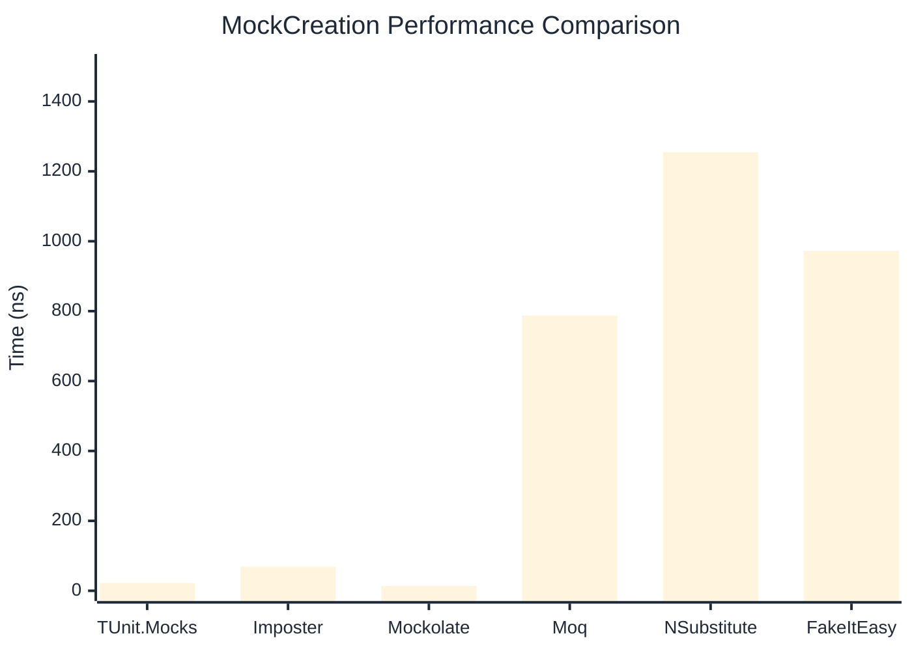
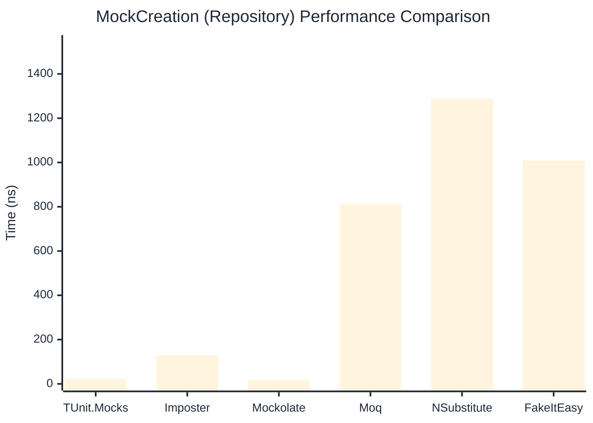

# MockCreation Benchmark

> Mock instance creation performance — comparing **TUnit.Mocks** (source-generated) against runtime proxy-based mocking libraries.

:::info Last Updated
This benchmark was automatically generated on **2026-09-15** from the latest CI run.

**Environment:** Ubuntu Latest • .NET SDK 10.0.401
:::

## 📊 Results

Mock instance creation performance:

| Library | Mean | Error | StdDev | Allocated |
|---------|------|-------|--------|-----------|
| **TUnit.Mocks** | 22.22 ns | 0.468 ns | 0.539 ns | 200 B |
| Imposter | 68.93 ns | 0.735 ns | 0.687 ns | 440 B |
| Mockolate | 13.55 ns | 0.237 ns | 0.222 ns | 160 B |
| Moq | 787.34 ns | 15.268 ns | 21.403 ns | 2048 B |
| NSubstitute | 1,254.31 ns | 23.060 ns | 20.442 ns | 5000 B |
| FakeItEasy | 972.25 ns | 17.191 ns | 14.355 ns | 2709 B |

```mermaid
%%{init: {
  'theme':'base',
  'themeVariables': {
    'primaryColor': '#2563eb',
    'primaryTextColor': '#1f2937',
    'primaryBorderColor': '#1e40af',
    'lineColor': '#6b7280',
    'secondaryColor': '#7c3aed',
    'tertiaryColor': '#dc2626',
    'background': '#ffffff',
    'pie1': '#2563eb',
    'pie2': '#7c3aed',
    'pie3': '#dc2626',
    'pie4': '#f59e0b',
    'pie5': '#10b981',
    'pie6': '#06b6d4',
    'pie7': '#ec4899',
    'pie8': '#6366f1'
  }
}}%%
xychart-beta
  title "MockCreation Performance Comparison"
  x-axis ["TUnit.Mocks", "Imposter", "Mockolate", "Moq", "NSubstitute", "FakeItEasy"]
  y-axis "Time (ns)" 0 --> 1506
  bar [22.22, 68.93, 13.55, 787.34, 1254.31, 972.25]
```

---

### Repository

| Library | Mean | Error | StdDev | Allocated |
|---------|------|-------|--------|-----------|
| **TUnit.Mocks** | 22.56 ns | 0.407 ns | 0.340 ns | 200 B |
| Imposter | 128.93 ns | 2.303 ns | 2.261 ns | 696 B |
| Mockolate | 17.30 ns | 0.388 ns | 0.757 ns | 176 B |
| Moq | 814.26 ns | 16.164 ns | 27.882 ns | 1912 B |
| NSubstitute | 1,287.40 ns | 24.050 ns | 40.183 ns | 5000 B |
| FakeItEasy | 1,008.98 ns | 15.700 ns | 15.420 ns | 2709 B |

```mermaid
%%{init: {
  'theme':'base',
  'themeVariables': {
    'primaryColor': '#2563eb',
    'primaryTextColor': '#1f2937',
    'primaryBorderColor': '#1e40af',
    'lineColor': '#6b7280',
    'secondaryColor': '#7c3aed',
    'tertiaryColor': '#dc2626',
    'background': '#ffffff',
    'pie1': '#2563eb',
    'pie2': '#7c3aed',
    'pie3': '#dc2626',
    'pie4': '#f59e0b',
    'pie5': '#10b981',
    'pie6': '#06b6d4',
    'pie7': '#ec4899',
    'pie8': '#6366f1'
  }
}}%%
xychart-beta
  title "MockCreation (Repository) Performance Comparison"
  x-axis ["TUnit.Mocks", "Imposter", "Mockolate", "Moq", "NSubstitute", "FakeItEasy"]
  y-axis "Time (ns)" 0 --> 1545
  bar [22.56, 128.93, 17.3, 814.26, 1287.4, 1008.98]
```

## 🎯 Key Insights

This benchmark compares **TUnit.Mocks** (source-generated) against runtime proxy-based mocking libraries for mock instance creation performance.

---

:::note Methodology
View the [mock benchmarks overview](/docs/benchmarks/mocks) for methodology details and environment information.
:::

*Last generated: 2026-09-15T02:33:23.208Z*
