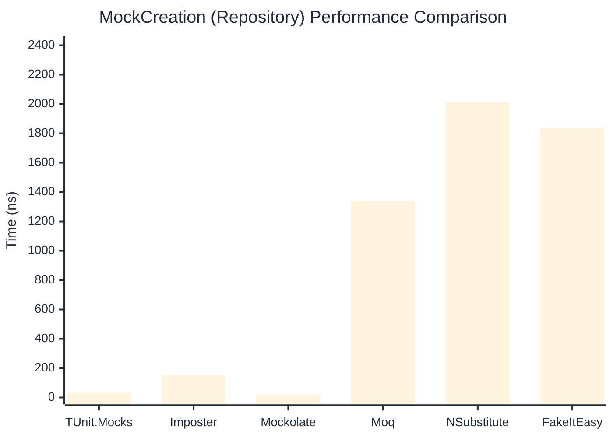

# MockCreation Benchmark

> Mock instance creation performance — comparing **TUnit.Mocks** (source-generated) against runtime proxy-based mocking libraries.

:::info Last Updated
This benchmark was automatically generated on **2026-09-21** from the latest CI run.

**Environment:** Ubuntu Latest • .NET SDK 10.0.401
:::

## 📊 Results

Mock instance creation performance:

| Library | Mean | Error | StdDev | Allocated |
|---------|------|-------|--------|-----------|
| **TUnit.Mocks** | 31.76 ns | 0.427 ns | 0.379 ns | 200 B |
| Imposter | 100.96 ns | 0.431 ns | 0.382 ns | 440 B |
| Mockolate | 23.21 ns | 0.348 ns | 0.325 ns | 160 B |
| Moq | 1,446.86 ns | 20.264 ns | 18.955 ns | 2048 B |
| NSubstitute | 2,033.47 ns | 22.279 ns | 20.840 ns | 5000 B |
| FakeItEasy | 1,872.78 ns | 22.003 ns | 20.581 ns | 2714 B |

```mermaid
%%{init: {
  'theme':'base',
  'themeVariables': {
    'primaryColor': '#2563eb',
    'primaryTextColor': '#1f2937',
    'primaryBorderColor': '#1e40af',
    'lineColor': '#6b7280',
    'secondaryColor': '#7c3aed',
    'tertiaryColor': '#dc2626',
    'background': '#ffffff',
    'pie1': '#2563eb',
    'pie2': '#7c3aed',
    'pie3': '#dc2626',
    'pie4': '#f59e0b',
    'pie5': '#10b981',
    'pie6': '#06b6d4',
    'pie7': '#ec4899',
    'pie8': '#6366f1'
  }
}}%%
xychart-beta
  title "MockCreation Performance Comparison"
  x-axis ["TUnit.Mocks", "Imposter", "Mockolate", "Moq", "NSubstitute", "FakeItEasy"]
  y-axis "Time (ns)" 0 --> 2441
  bar [31.76, 100.96, 23.21, 1446.86, 2033.47, 1872.78]
```

---

### Repository

| Library | Mean | Error | StdDev | Allocated |
|---------|------|-------|--------|-----------|
| **TUnit.Mocks** | 32.22 ns | 0.308 ns | 0.288 ns | 200 B |
| Imposter | 152.60 ns | 2.246 ns | 2.101 ns | 696 B |
| Mockolate | 19.23 ns | 0.336 ns | 0.298 ns | 176 B |
| Moq | 1,340.21 ns | 8.911 ns | 8.336 ns | 1912 B |
| NSubstitute | 2,011.38 ns | 16.544 ns | 15.476 ns | 5000 B |
| FakeItEasy | 1,838.05 ns | 36.530 ns | 42.068 ns | 2715 B |

```mermaid
%%{init: {
  'theme':'base',
  'themeVariables': {
    'primaryColor': '#2563eb',
    'primaryTextColor': '#1f2937',
    'primaryBorderColor': '#1e40af',
    'lineColor': '#6b7280',
    'secondaryColor': '#7c3aed',
    'tertiaryColor': '#dc2626',
    'background': '#ffffff',
    'pie1': '#2563eb',
    'pie2': '#7c3aed',
    'pie3': '#dc2626',
    'pie4': '#f59e0b',
    'pie5': '#10b981',
    'pie6': '#06b6d4',
    'pie7': '#ec4899',
    'pie8': '#6366f1'
  }
}}%%
xychart-beta
  title "MockCreation (Repository) Performance Comparison"
  x-axis ["TUnit.Mocks", "Imposter", "Mockolate", "Moq", "NSubstitute", "FakeItEasy"]
  y-axis "Time (ns)" 0 --> 2414
  bar [32.22, 152.6, 19.23, 1340.21, 2011.38, 1838.05]
```

## 🎯 Key Insights

This benchmark compares **TUnit.Mocks** (source-generated) against runtime proxy-based mocking libraries for mock instance creation performance.

---

:::note Methodology
View the [mock benchmarks overview](/docs/benchmarks/mocks) for methodology details and environment information.
:::

*Last generated: 2026-09-21T02:37:24.392Z*
