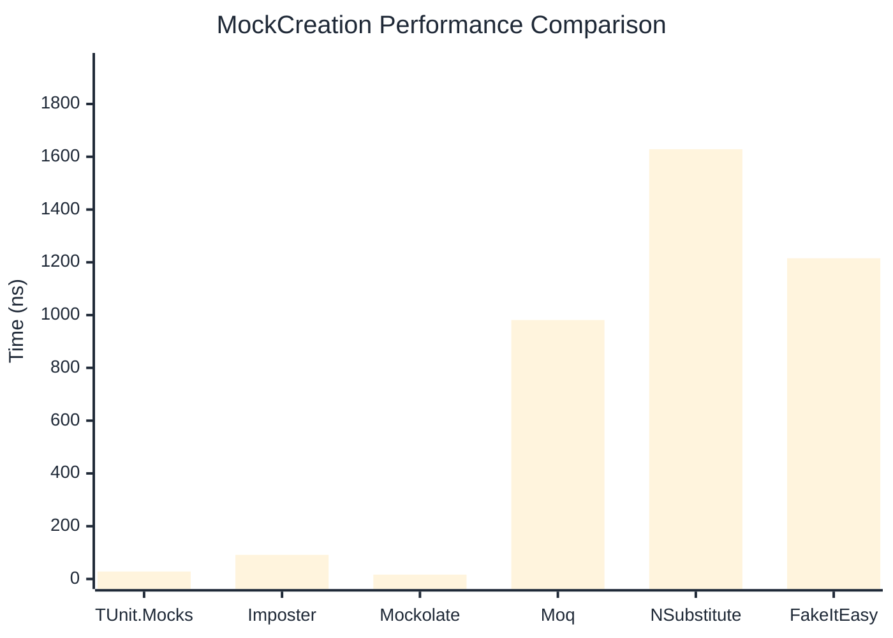
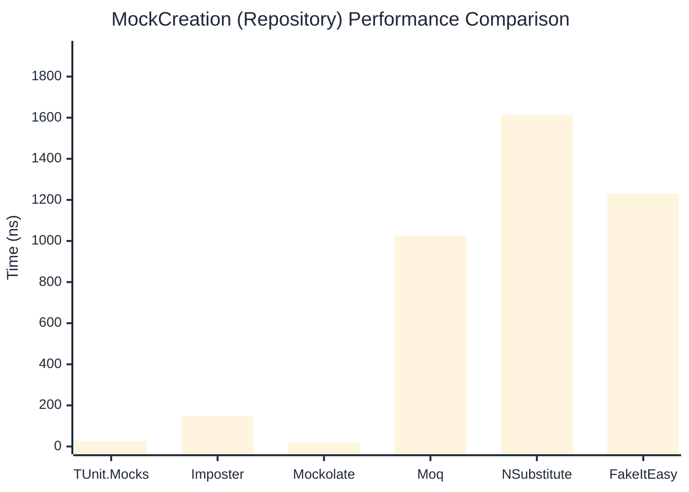

# MockCreation Benchmark

> Mock instance creation performance — comparing **TUnit.Mocks** (source-generated) against runtime proxy-based mocking libraries.

:::info Last Updated
This benchmark was automatically generated on **2026-07-27** from the latest CI run.

**Environment:** Ubuntu Latest • .NET SDK 10.0.302
:::

## 📊 Results

Mock instance creation performance:

| Library | Mean | Error | StdDev | Allocated |
|---------|------|-------|--------|-----------|
| **TUnit.Mocks** | 28.47 ns | 0.444 ns | 0.416 ns | 200 B |
| Imposter | 91.44 ns | 1.906 ns | 2.269 ns | 440 B |
| Mockolate | 16.48 ns | 0.282 ns | 0.264 ns | 160 B |
| Moq | 981.27 ns | 9.498 ns | 8.420 ns | 2048 B |
| NSubstitute | 1,628.43 ns | 27.087 ns | 24.012 ns | 5000 B |
| FakeItEasy | 1,215.29 ns | 24.078 ns | 28.663 ns | 2709 B |

```mermaid
%%{init: {
  'theme':'base',
  'themeVariables': {
    'primaryColor': '#2563eb',
    'primaryTextColor': '#1f2937',
    'primaryBorderColor': '#1e40af',
    'lineColor': '#6b7280',
    'secondaryColor': '#7c3aed',
    'tertiaryColor': '#dc2626',
    'background': '#ffffff',
    'pie1': '#2563eb',
    'pie2': '#7c3aed',
    'pie3': '#dc2626',
    'pie4': '#f59e0b',
    'pie5': '#10b981',
    'pie6': '#06b6d4',
    'pie7': '#ec4899',
    'pie8': '#6366f1'
  }
}}%%
xychart-beta
  title "MockCreation Performance Comparison"
  x-axis ["TUnit.Mocks", "Imposter", "Mockolate", "Moq", "NSubstitute", "FakeItEasy"]
  y-axis "Time (ns)" 0 --> 1955
  bar [28.47, 91.44, 16.48, 981.27, 1628.43, 1215.29]
```

---

### Repository

| Library | Mean | Error | StdDev | Allocated |
|---------|------|-------|--------|-----------|
| **TUnit.Mocks** | 28.13 ns | 0.351 ns | 0.328 ns | 200 B |
| Imposter | 148.37 ns | 3.016 ns | 3.227 ns | 696 B |
| Mockolate | 16.29 ns | 0.214 ns | 0.200 ns | 176 B |
| Moq | 1,025.39 ns | 9.464 ns | 7.903 ns | 1912 B |
| NSubstitute | 1,612.79 ns | 32.105 ns | 32.969 ns | 5000 B |
| FakeItEasy | 1,229.71 ns | 24.077 ns | 26.762 ns | 2709 B |

```mermaid
%%{init: {
  'theme':'base',
  'themeVariables': {
    'primaryColor': '#2563eb',
    'primaryTextColor': '#1f2937',
    'primaryBorderColor': '#1e40af',
    'lineColor': '#6b7280',
    'secondaryColor': '#7c3aed',
    'tertiaryColor': '#dc2626',
    'background': '#ffffff',
    'pie1': '#2563eb',
    'pie2': '#7c3aed',
    'pie3': '#dc2626',
    'pie4': '#f59e0b',
    'pie5': '#10b981',
    'pie6': '#06b6d4',
    'pie7': '#ec4899',
    'pie8': '#6366f1'
  }
}}%%
xychart-beta
  title "MockCreation (Repository) Performance Comparison"
  x-axis ["TUnit.Mocks", "Imposter", "Mockolate", "Moq", "NSubstitute", "FakeItEasy"]
  y-axis "Time (ns)" 0 --> 1936
  bar [28.13, 148.37, 16.29, 1025.39, 1612.79, 1229.71]
```

## 🎯 Key Insights

This benchmark compares **TUnit.Mocks** (source-generated) against runtime proxy-based mocking libraries for mock instance creation performance.

---

:::note Methodology
View the [mock benchmarks overview](/docs/benchmarks/mocks) for methodology details and environment information.
:::

*Last generated: 2026-07-27T03:23:36.716Z*
