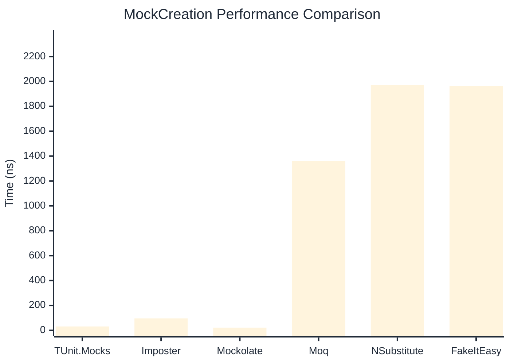

# MockCreation Benchmark

> Mock instance creation performance — comparing **TUnit.Mocks** (source-generated) against runtime proxy-based mocking libraries.

:::info Last Updated
This benchmark was automatically generated on **2026-09-18** from the latest CI run.

**Environment:** Ubuntu Latest • .NET SDK 10.0.401
:::

## 📊 Results

Mock instance creation performance:

| Library | Mean | Error | StdDev | Allocated |
|---------|------|-------|--------|-----------|
| **TUnit.Mocks** | 30.95 ns | 0.669 ns | 1.022 ns | 200 B |
| Imposter | 96.10 ns | 1.959 ns | 1.924 ns | 440 B |
| Mockolate | 21.34 ns | 0.330 ns | 0.292 ns | 160 B |
| Moq | 1,358.70 ns | 20.315 ns | 19.002 ns | 2048 B |
| NSubstitute | 1,970.70 ns | 16.316 ns | 15.262 ns | 5000 B |
| FakeItEasy | 1,961.83 ns | 27.317 ns | 22.811 ns | 2715 B |

```mermaid
%%{init: {
  'theme':'base',
  'themeVariables': {
    'primaryColor': '#2563eb',
    'primaryTextColor': '#1f2937',
    'primaryBorderColor': '#1e40af',
    'lineColor': '#6b7280',
    'secondaryColor': '#7c3aed',
    'tertiaryColor': '#dc2626',
    'background': '#ffffff',
    'pie1': '#2563eb',
    'pie2': '#7c3aed',
    'pie3': '#dc2626',
    'pie4': '#f59e0b',
    'pie5': '#10b981',
    'pie6': '#06b6d4',
    'pie7': '#ec4899',
    'pie8': '#6366f1'
  }
}}%%
xychart-beta
  title "MockCreation Performance Comparison"
  x-axis ["TUnit.Mocks", "Imposter", "Mockolate", "Moq", "NSubstitute", "FakeItEasy"]
  y-axis "Time (ns)" 0 --> 2365
  bar [30.95, 96.1, 21.34, 1358.7, 1970.7, 1961.83]
```

---

### Repository

| Library | Mean | Error | StdDev | Allocated |
|---------|------|-------|--------|-----------|
| **TUnit.Mocks** | 30.46 ns | 0.659 ns | 0.759 ns | 200 B |
| Imposter | 148.65 ns | 3.022 ns | 3.359 ns | 696 B |
| Mockolate | 19.78 ns | 0.445 ns | 0.437 ns | 176 B |
| Moq | 1,410.04 ns | 12.184 ns | 10.801 ns | 1912 B |
| NSubstitute | 1,939.61 ns | 25.774 ns | 24.109 ns | 5000 B |
| FakeItEasy | 1,947.04 ns | 36.484 ns | 34.127 ns | 2715 B |

```mermaid
%%{init: {
  'theme':'base',
  'themeVariables': {
    'primaryColor': '#2563eb',
    'primaryTextColor': '#1f2937',
    'primaryBorderColor': '#1e40af',
    'lineColor': '#6b7280',
    'secondaryColor': '#7c3aed',
    'tertiaryColor': '#dc2626',
    'background': '#ffffff',
    'pie1': '#2563eb',
    'pie2': '#7c3aed',
    'pie3': '#dc2626',
    'pie4': '#f59e0b',
    'pie5': '#10b981',
    'pie6': '#06b6d4',
    'pie7': '#ec4899',
    'pie8': '#6366f1'
  }
}}%%
xychart-beta
  title "MockCreation (Repository) Performance Comparison"
  x-axis ["TUnit.Mocks", "Imposter", "Mockolate", "Moq", "NSubstitute", "FakeItEasy"]
  y-axis "Time (ns)" 0 --> 2337
  bar [30.46, 148.65, 19.78, 1410.04, 1939.61, 1947.04]
```

## 🎯 Key Insights

This benchmark compares **TUnit.Mocks** (source-generated) against runtime proxy-based mocking libraries for mock instance creation performance.

---

:::note Methodology
View the [mock benchmarks overview](/docs/benchmarks/mocks) for methodology details and environment information.
:::

*Last generated: 2026-09-18T02:32:22.133Z*
