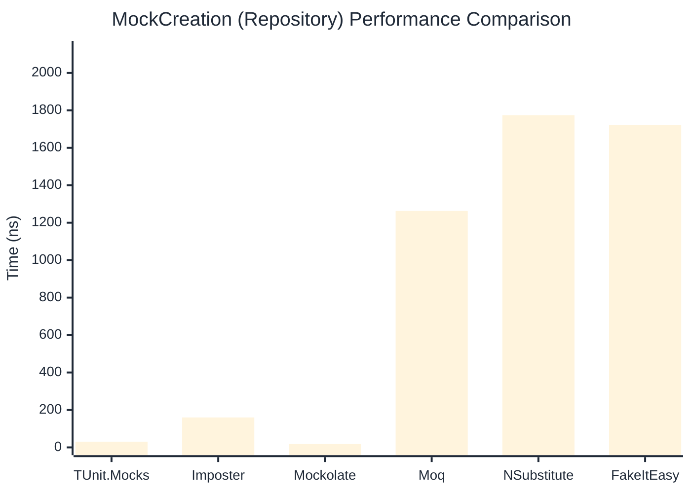

# MockCreation Benchmark

> Mock instance creation performance — comparing **TUnit.Mocks** (source-generated) against runtime proxy-based mocking libraries.

:::info Last Updated
This benchmark was automatically generated on **2026-08-22** from the latest CI run.

**Environment:** Ubuntu Latest • .NET SDK 10.0.400
:::

## 📊 Results

Mock instance creation performance:

| Library | Mean | Error | StdDev | Allocated |
|---------|------|-------|--------|-----------|
| **TUnit.Mocks** | 30.15 ns | 0.170 ns | 0.151 ns | 200 B |
| Imposter | 102.27 ns | 0.636 ns | 0.564 ns | 440 B |
| Mockolate | 18.79 ns | 0.263 ns | 0.246 ns | 160 B |
| Moq | 1,241.83 ns | 20.763 ns | 18.406 ns | 2048 B |
| NSubstitute | 1,779.47 ns | 21.653 ns | 20.254 ns | 5000 B |
| FakeItEasy | 1,737.66 ns | 24.540 ns | 19.159 ns | 2715 B |

```mermaid
%%{init: {
  'theme':'base',
  'themeVariables': {
    'primaryColor': '#2563eb',
    'primaryTextColor': '#1f2937',
    'primaryBorderColor': '#1e40af',
    'lineColor': '#6b7280',
    'secondaryColor': '#7c3aed',
    'tertiaryColor': '#dc2626',
    'background': '#ffffff',
    'pie1': '#2563eb',
    'pie2': '#7c3aed',
    'pie3': '#dc2626',
    'pie4': '#f59e0b',
    'pie5': '#10b981',
    'pie6': '#06b6d4',
    'pie7': '#ec4899',
    'pie8': '#6366f1'
  }
}}%%
xychart-beta
  title "MockCreation Performance Comparison"
  x-axis ["TUnit.Mocks", "Imposter", "Mockolate", "Moq", "NSubstitute", "FakeItEasy"]
  y-axis "Time (ns)" 0 --> 2136
  bar [30.15, 102.27, 18.79, 1241.83, 1779.47, 1737.66]
```

---

### Repository

| Library | Mean | Error | StdDev | Allocated |
|---------|------|-------|--------|-----------|
| **TUnit.Mocks** | 30.61 ns | 0.244 ns | 0.216 ns | 200 B |
| Imposter | 160.01 ns | 1.111 ns | 1.039 ns | 696 B |
| Mockolate | 18.18 ns | 0.166 ns | 0.139 ns | 176 B |
| Moq | 1,262.87 ns | 13.088 ns | 11.602 ns | 1912 B |
| NSubstitute | 1,774.00 ns | 28.982 ns | 27.109 ns | 5000 B |
| FakeItEasy | 1,720.61 ns | 25.293 ns | 22.422 ns | 2715 B |

```mermaid
%%{init: {
  'theme':'base',
  'themeVariables': {
    'primaryColor': '#2563eb',
    'primaryTextColor': '#1f2937',
    'primaryBorderColor': '#1e40af',
    'lineColor': '#6b7280',
    'secondaryColor': '#7c3aed',
    'tertiaryColor': '#dc2626',
    'background': '#ffffff',
    'pie1': '#2563eb',
    'pie2': '#7c3aed',
    'pie3': '#dc2626',
    'pie4': '#f59e0b',
    'pie5': '#10b981',
    'pie6': '#06b6d4',
    'pie7': '#ec4899',
    'pie8': '#6366f1'
  }
}}%%
xychart-beta
  title "MockCreation (Repository) Performance Comparison"
  x-axis ["TUnit.Mocks", "Imposter", "Mockolate", "Moq", "NSubstitute", "FakeItEasy"]
  y-axis "Time (ns)" 0 --> 2129
  bar [30.61, 160.01, 18.18, 1262.87, 1774, 1720.61]
```

## 🎯 Key Insights

This benchmark compares **TUnit.Mocks** (source-generated) against runtime proxy-based mocking libraries for mock instance creation performance.

---

:::note Methodology
View the [mock benchmarks overview](/docs/benchmarks/mocks) for methodology details and environment information.
:::

*Last generated: 2026-08-22T02:40:44.558Z*
