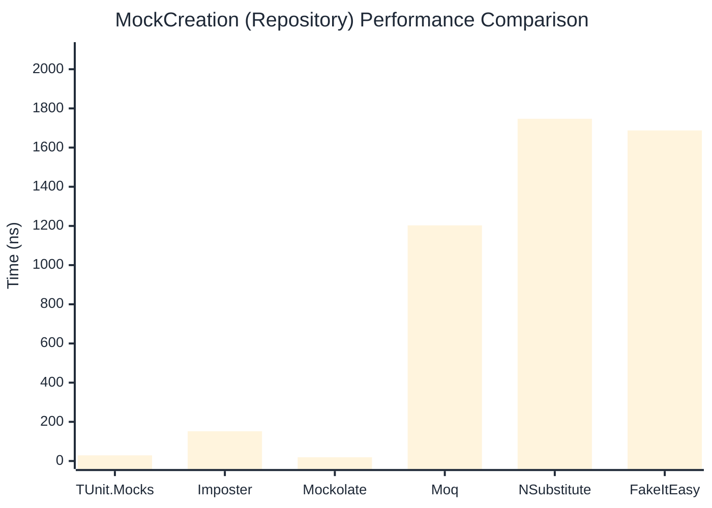

# MockCreation Benchmark

> Mock instance creation performance — comparing **TUnit.Mocks** (source-generated) against runtime proxy-based mocking libraries.

:::info Last Updated
This benchmark was automatically generated on **2026-09-11** from the latest CI run.

**Environment:** Ubuntu Latest • .NET SDK 10.0.401
:::

## 📊 Results

Mock instance creation performance:

| Library | Mean | Error | StdDev | Allocated |
|---------|------|-------|--------|-----------|
| **TUnit.Mocks** | 28.98 ns | 0.247 ns | 0.231 ns | 200 B |
| Imposter | 97.00 ns | 0.586 ns | 0.548 ns | 440 B |
| Mockolate | 17.46 ns | 0.118 ns | 0.110 ns | 160 B |
| Moq | 1,274.24 ns | 24.764 ns | 29.480 ns | 2048 B |
| NSubstitute | 1,721.85 ns | 6.887 ns | 5.751 ns | 5000 B |
| FakeItEasy | 1,660.22 ns | 27.641 ns | 25.856 ns | 2715 B |

```mermaid
%%{init: {
  'theme':'base',
  'themeVariables': {
    'primaryColor': '#2563eb',
    'primaryTextColor': '#1f2937',
    'primaryBorderColor': '#1e40af',
    'lineColor': '#6b7280',
    'secondaryColor': '#7c3aed',
    'tertiaryColor': '#dc2626',
    'background': '#ffffff',
    'pie1': '#2563eb',
    'pie2': '#7c3aed',
    'pie3': '#dc2626',
    'pie4': '#f59e0b',
    'pie5': '#10b981',
    'pie6': '#06b6d4',
    'pie7': '#ec4899',
    'pie8': '#6366f1'
  }
}}%%
xychart-beta
  title "MockCreation Performance Comparison"
  x-axis ["TUnit.Mocks", "Imposter", "Mockolate", "Moq", "NSubstitute", "FakeItEasy"]
  y-axis "Time (ns)" 0 --> 2067
  bar [28.98, 97, 17.46, 1274.24, 1721.85, 1660.22]
```

---

### Repository

| Library | Mean | Error | StdDev | Allocated |
|---------|------|-------|--------|-----------|
| **TUnit.Mocks** | 28.97 ns | 0.191 ns | 0.160 ns | 200 B |
| Imposter | 151.86 ns | 0.297 ns | 0.248 ns | 696 B |
| Mockolate | 19.13 ns | 0.209 ns | 0.163 ns | 176 B |
| Moq | 1,202.97 ns | 9.842 ns | 8.219 ns | 1912 B |
| NSubstitute | 1,747.02 ns | 13.408 ns | 10.468 ns | 5000 B |
| FakeItEasy | 1,687.61 ns | 15.527 ns | 14.524 ns | 2715 B |

```mermaid
%%{init: {
  'theme':'base',
  'themeVariables': {
    'primaryColor': '#2563eb',
    'primaryTextColor': '#1f2937',
    'primaryBorderColor': '#1e40af',
    'lineColor': '#6b7280',
    'secondaryColor': '#7c3aed',
    'tertiaryColor': '#dc2626',
    'background': '#ffffff',
    'pie1': '#2563eb',
    'pie2': '#7c3aed',
    'pie3': '#dc2626',
    'pie4': '#f59e0b',
    'pie5': '#10b981',
    'pie6': '#06b6d4',
    'pie7': '#ec4899',
    'pie8': '#6366f1'
  }
}}%%
xychart-beta
  title "MockCreation (Repository) Performance Comparison"
  x-axis ["TUnit.Mocks", "Imposter", "Mockolate", "Moq", "NSubstitute", "FakeItEasy"]
  y-axis "Time (ns)" 0 --> 2097
  bar [28.97, 151.86, 19.13, 1202.97, 1747.02, 1687.61]
```

## 🎯 Key Insights

This benchmark compares **TUnit.Mocks** (source-generated) against runtime proxy-based mocking libraries for mock instance creation performance.

---

:::note Methodology
View the [mock benchmarks overview](/docs/benchmarks/mocks) for methodology details and environment information.
:::

*Last generated: 2026-09-11T02:38:48.126Z*
