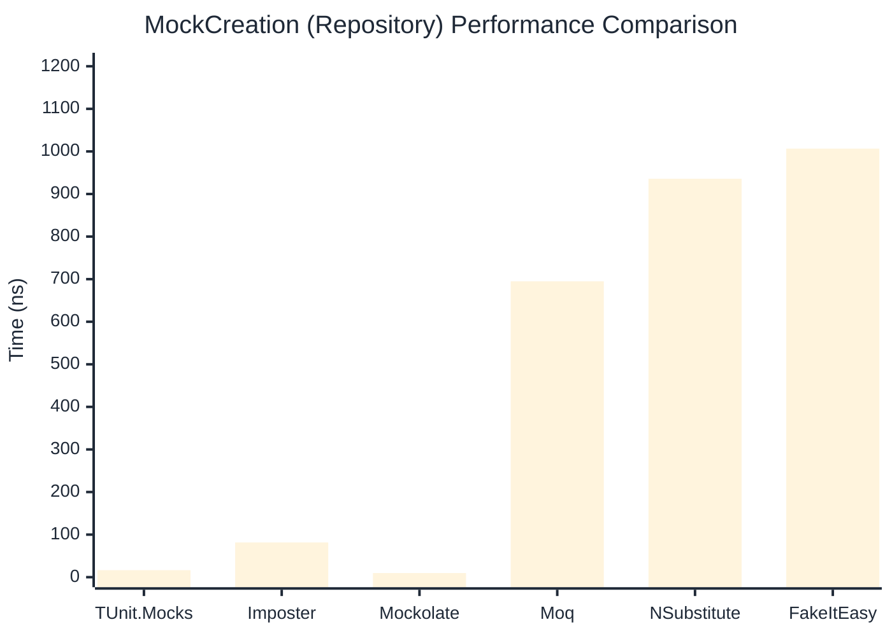

# MockCreation Benchmark

> Mock instance creation performance — comparing **TUnit.Mocks** (source-generated) against runtime proxy-based mocking libraries.

:::info Last Updated
This benchmark was automatically generated on **2026-08-26** from the latest CI run.

**Environment:** Ubuntu Latest • .NET SDK 10.0.400
:::

## 📊 Results

Mock instance creation performance:

| Library | Mean | Error | StdDev | Allocated |
|---------|------|-------|--------|-----------|
| **TUnit.Mocks** | 15.770 ns | 0.2187 ns | 0.2045 ns | 200 B |
| Imposter | 52.184 ns | 0.4922 ns | 0.4363 ns | 440 B |
| Mockolate | 9.503 ns | 0.2236 ns | 0.2486 ns | 160 B |
| Moq | 745.059 ns | 10.3641 ns | 9.6946 ns | 2048 B |
| NSubstitute | 937.076 ns | 11.4854 ns | 10.7434 ns | 5000 B |
| FakeItEasy | 995.678 ns | 13.9343 ns | 13.0341 ns | 2714 B |

```mermaid
%%{init: {
  'theme':'base',
  'themeVariables': {
    'primaryColor': '#2563eb',
    'primaryTextColor': '#1f2937',
    'primaryBorderColor': '#1e40af',
    'lineColor': '#6b7280',
    'secondaryColor': '#7c3aed',
    'tertiaryColor': '#dc2626',
    'background': '#ffffff',
    'pie1': '#2563eb',
    'pie2': '#7c3aed',
    'pie3': '#dc2626',
    'pie4': '#f59e0b',
    'pie5': '#10b981',
    'pie6': '#06b6d4',
    'pie7': '#ec4899',
    'pie8': '#6366f1'
  }
}}%%
xychart-beta
  title "MockCreation Performance Comparison"
  x-axis ["TUnit.Mocks", "Imposter", "Mockolate", "Moq", "NSubstitute", "FakeItEasy"]
  y-axis "Time (ns)" 0 --> 1195
  bar [15.77, 52.184, 9.503, 745.059, 937.076, 995.678]
```

---

### Repository

| Library | Mean | Error | StdDev | Allocated |
|---------|------|-------|--------|-----------|
| **TUnit.Mocks** | 16.442 ns | 0.2587 ns | 0.2420 ns | 200 B |
| Imposter | 81.616 ns | 0.7949 ns | 0.7046 ns | 696 B |
| Mockolate | 9.639 ns | 0.1504 ns | 0.1407 ns | 176 B |
| Moq | 694.943 ns | 13.4170 ns | 13.7783 ns | 1912 B |
| NSubstitute | 935.775 ns | 7.6325 ns | 7.1394 ns | 5000 B |
| FakeItEasy | 1,006.596 ns | 7.6581 ns | 6.3949 ns | 2714 B |

```mermaid
%%{init: {
  'theme':'base',
  'themeVariables': {
    'primaryColor': '#2563eb',
    'primaryTextColor': '#1f2937',
    'primaryBorderColor': '#1e40af',
    'lineColor': '#6b7280',
    'secondaryColor': '#7c3aed',
    'tertiaryColor': '#dc2626',
    'background': '#ffffff',
    'pie1': '#2563eb',
    'pie2': '#7c3aed',
    'pie3': '#dc2626',
    'pie4': '#f59e0b',
    'pie5': '#10b981',
    'pie6': '#06b6d4',
    'pie7': '#ec4899',
    'pie8': '#6366f1'
  }
}}%%
xychart-beta
  title "MockCreation (Repository) Performance Comparison"
  x-axis ["TUnit.Mocks", "Imposter", "Mockolate", "Moq", "NSubstitute", "FakeItEasy"]
  y-axis "Time (ns)" 0 --> 1208
  bar [16.442, 81.616, 9.639, 694.943, 935.775, 1006.596]
```

## 🎯 Key Insights

This benchmark compares **TUnit.Mocks** (source-generated) against runtime proxy-based mocking libraries for mock instance creation performance.

---

:::note Methodology
View the [mock benchmarks overview](/docs/benchmarks/mocks) for methodology details and environment information.
:::

*Last generated: 2026-08-26T02:57:20.474Z*
