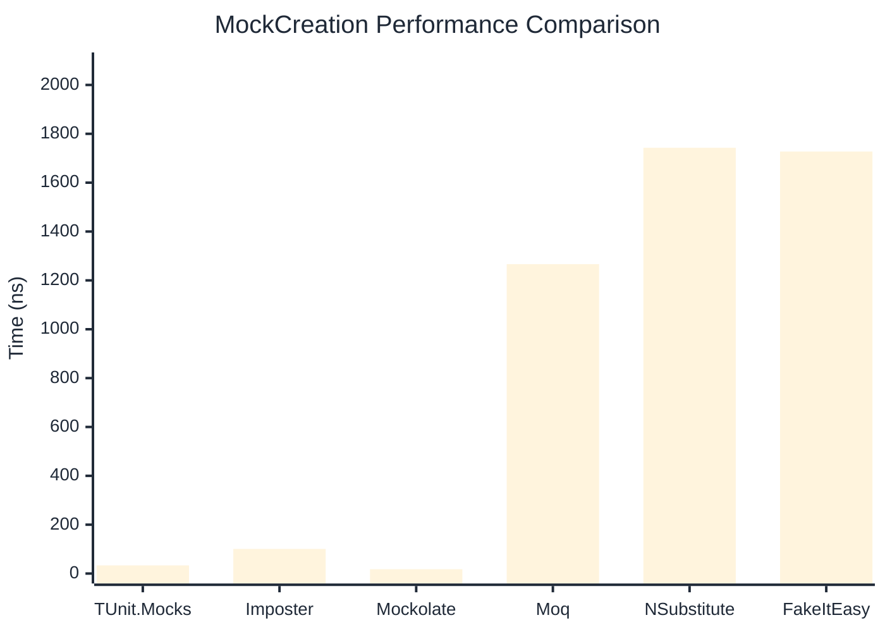

# MockCreation Benchmark

> Mock instance creation performance — comparing **TUnit.Mocks** (source-generated) against runtime proxy-based mocking libraries.

:::info Last Updated
This benchmark was automatically generated on **2026-08-07** from the latest CI run.

**Environment:** Ubuntu Latest • .NET SDK 10.0.302
:::

## 📊 Results

Mock instance creation performance:

| Library | Mean | Error | StdDev | Allocated |
|---------|------|-------|--------|-----------|
| **TUnit.Mocks** | 33.43 ns | 0.723 ns | 1.187 ns | 200 B |
| Imposter | 100.81 ns | 0.147 ns | 0.130 ns | 440 B |
| Mockolate | 17.82 ns | 0.136 ns | 0.128 ns | 160 B |
| Moq | 1,266.56 ns | 20.172 ns | 18.869 ns | 2048 B |
| NSubstitute | 1,742.91 ns | 12.147 ns | 11.362 ns | 5000 B |
| FakeItEasy | 1,727.53 ns | 27.879 ns | 26.078 ns | 2715 B |

```mermaid
%%{init: {
  'theme':'base',
  'themeVariables': {
    'primaryColor': '#2563eb',
    'primaryTextColor': '#1f2937',
    'primaryBorderColor': '#1e40af',
    'lineColor': '#6b7280',
    'secondaryColor': '#7c3aed',
    'tertiaryColor': '#dc2626',
    'background': '#ffffff',
    'pie1': '#2563eb',
    'pie2': '#7c3aed',
    'pie3': '#dc2626',
    'pie4': '#f59e0b',
    'pie5': '#10b981',
    'pie6': '#06b6d4',
    'pie7': '#ec4899',
    'pie8': '#6366f1'
  }
}}%%
xychart-beta
  title "MockCreation Performance Comparison"
  x-axis ["TUnit.Mocks", "Imposter", "Mockolate", "Moq", "NSubstitute", "FakeItEasy"]
  y-axis "Time (ns)" 0 --> 2092
  bar [33.43, 100.81, 17.82, 1266.56, 1742.91, 1727.53]
```

---

### Repository

| Library | Mean | Error | StdDev | Allocated |
|---------|------|-------|--------|-----------|
| **TUnit.Mocks** | 29.54 ns | 0.362 ns | 0.339 ns | 200 B |
| Imposter | 158.39 ns | 0.970 ns | 0.810 ns | 696 B |
| Mockolate | 21.31 ns | 0.434 ns | 0.406 ns | 176 B |
| Moq | 1,247.71 ns | 6.975 ns | 6.183 ns | 1912 B |
| NSubstitute | 1,746.47 ns | 13.631 ns | 11.382 ns | 5000 B |
| FakeItEasy | 1,693.17 ns | 26.481 ns | 23.474 ns | 2715 B |

```mermaid
%%{init: {
  'theme':'base',
  'themeVariables': {
    'primaryColor': '#2563eb',
    'primaryTextColor': '#1f2937',
    'primaryBorderColor': '#1e40af',
    'lineColor': '#6b7280',
    'secondaryColor': '#7c3aed',
    'tertiaryColor': '#dc2626',
    'background': '#ffffff',
    'pie1': '#2563eb',
    'pie2': '#7c3aed',
    'pie3': '#dc2626',
    'pie4': '#f59e0b',
    'pie5': '#10b981',
    'pie6': '#06b6d4',
    'pie7': '#ec4899',
    'pie8': '#6366f1'
  }
}}%%
xychart-beta
  title "MockCreation (Repository) Performance Comparison"
  x-axis ["TUnit.Mocks", "Imposter", "Mockolate", "Moq", "NSubstitute", "FakeItEasy"]
  y-axis "Time (ns)" 0 --> 2096
  bar [29.54, 158.39, 21.31, 1247.71, 1746.47, 1693.17]
```

## 🎯 Key Insights

This benchmark compares **TUnit.Mocks** (source-generated) against runtime proxy-based mocking libraries for mock instance creation performance.

---

:::note Methodology
View the [mock benchmarks overview](/docs/benchmarks/mocks) for methodology details and environment information.
:::

*Last generated: 2026-08-07T03:18:12.757Z*
