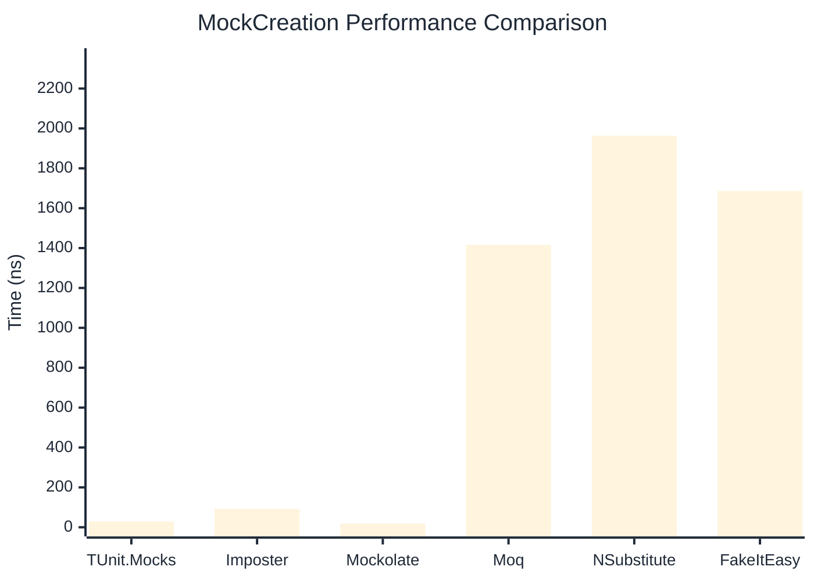

# MockCreation Benchmark

> Mock instance creation performance — comparing **TUnit.Mocks** (source-generated) against runtime proxy-based mocking libraries.

:::info Last Updated
This benchmark was automatically generated on **2026-08-25** from the latest CI run.

**Environment:** Ubuntu Latest • .NET SDK 10.0.400
:::

## 📊 Results

Mock instance creation performance:

| Library | Mean | Error | StdDev | Allocated |
|---------|------|-------|--------|-----------|
| **TUnit.Mocks** | 28.94 ns | 0.623 ns | 0.742 ns | 200 B |
| Imposter | 92.32 ns | 1.851 ns | 1.732 ns | 440 B |
| Mockolate | 18.27 ns | 0.430 ns | 0.512 ns | 160 B |
| Moq | 1,416.03 ns | 27.980 ns | 26.172 ns | 2048 B |
| NSubstitute | 1,963.33 ns | 29.868 ns | 27.938 ns | 5000 B |
| FakeItEasy | 1,686.21 ns | 33.633 ns | 31.460 ns | 2715 B |

```mermaid
%%{init: {
  'theme':'base',
  'themeVariables': {
    'primaryColor': '#2563eb',
    'primaryTextColor': '#1f2937',
    'primaryBorderColor': '#1e40af',
    'lineColor': '#6b7280',
    'secondaryColor': '#7c3aed',
    'tertiaryColor': '#dc2626',
    'background': '#ffffff',
    'pie1': '#2563eb',
    'pie2': '#7c3aed',
    'pie3': '#dc2626',
    'pie4': '#f59e0b',
    'pie5': '#10b981',
    'pie6': '#06b6d4',
    'pie7': '#ec4899',
    'pie8': '#6366f1'
  }
}}%%
xychart-beta
  title "MockCreation Performance Comparison"
  x-axis ["TUnit.Mocks", "Imposter", "Mockolate", "Moq", "NSubstitute", "FakeItEasy"]
  y-axis "Time (ns)" 0 --> 2356
  bar [28.94, 92.32, 18.27, 1416.03, 1963.33, 1686.21]
```

---

### Repository

| Library | Mean | Error | StdDev | Allocated |
|---------|------|-------|--------|-----------|
| **TUnit.Mocks** | 28.58 ns | 0.624 ns | 0.854 ns | 200 B |
| Imposter | 144.43 ns | 1.993 ns | 2.047 ns | 696 B |
| Mockolate | 17.43 ns | 0.168 ns | 0.157 ns | 176 B |
| Moq | 1,280.84 ns | 11.108 ns | 9.847 ns | 1912 B |
| NSubstitute | 1,792.76 ns | 32.933 ns | 30.806 ns | 5000 B |
| FakeItEasy | 1,681.87 ns | 24.971 ns | 20.852 ns | 2715 B |

```mermaid
%%{init: {
  'theme':'base',
  'themeVariables': {
    'primaryColor': '#2563eb',
    'primaryTextColor': '#1f2937',
    'primaryBorderColor': '#1e40af',
    'lineColor': '#6b7280',
    'secondaryColor': '#7c3aed',
    'tertiaryColor': '#dc2626',
    'background': '#ffffff',
    'pie1': '#2563eb',
    'pie2': '#7c3aed',
    'pie3': '#dc2626',
    'pie4': '#f59e0b',
    'pie5': '#10b981',
    'pie6': '#06b6d4',
    'pie7': '#ec4899',
    'pie8': '#6366f1'
  }
}}%%
xychart-beta
  title "MockCreation (Repository) Performance Comparison"
  x-axis ["TUnit.Mocks", "Imposter", "Mockolate", "Moq", "NSubstitute", "FakeItEasy"]
  y-axis "Time (ns)" 0 --> 2152
  bar [28.58, 144.43, 17.43, 1280.84, 1792.76, 1681.87]
```

## 🎯 Key Insights

This benchmark compares **TUnit.Mocks** (source-generated) against runtime proxy-based mocking libraries for mock instance creation performance.

---

:::note Methodology
View the [mock benchmarks overview](/docs/benchmarks/mocks) for methodology details and environment information.
:::

*Last generated: 2026-08-25T02:41:00.074Z*
