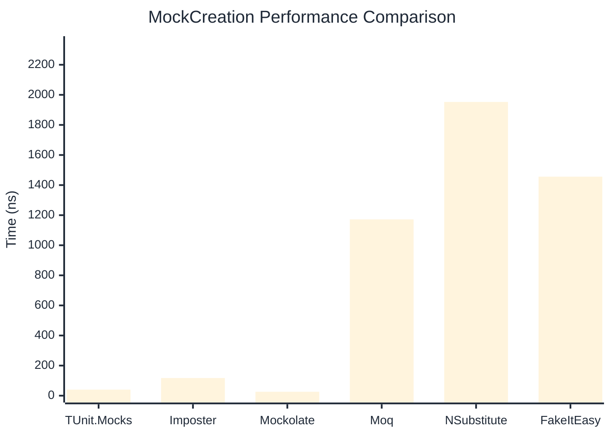

# MockCreation Benchmark

> Mock instance creation performance — comparing **TUnit.Mocks** (source-generated) against runtime proxy-based mocking libraries.

:::info Last Updated
This benchmark was automatically generated on **2026-08-24** from the latest CI run.

**Environment:** Ubuntu Latest • .NET SDK 10.0.400
:::

## 📊 Results

Mock instance creation performance:

| Library | Mean | Error | StdDev | Allocated |
|---------|------|-------|--------|-----------|
| **TUnit.Mocks** | 40.18 ns | 0.181 ns | 0.169 ns | 200 B |
| Imposter | 117.43 ns | 0.791 ns | 0.740 ns | 440 B |
| Mockolate | 26.03 ns | 0.196 ns | 0.183 ns | 160 B |
| Moq | 1,172.03 ns | 14.452 ns | 13.518 ns | 2048 B |
| NSubstitute | 1,952.80 ns | 27.873 ns | 26.073 ns | 5000 B |
| FakeItEasy | 1,455.93 ns | 6.947 ns | 6.159 ns | 2709 B |

```mermaid
%%{init: {
  'theme':'base',
  'themeVariables': {
    'primaryColor': '#2563eb',
    'primaryTextColor': '#1f2937',
    'primaryBorderColor': '#1e40af',
    'lineColor': '#6b7280',
    'secondaryColor': '#7c3aed',
    'tertiaryColor': '#dc2626',
    'background': '#ffffff',
    'pie1': '#2563eb',
    'pie2': '#7c3aed',
    'pie3': '#dc2626',
    'pie4': '#f59e0b',
    'pie5': '#10b981',
    'pie6': '#06b6d4',
    'pie7': '#ec4899',
    'pie8': '#6366f1'
  }
}}%%
xychart-beta
  title "MockCreation Performance Comparison"
  x-axis ["TUnit.Mocks", "Imposter", "Mockolate", "Moq", "NSubstitute", "FakeItEasy"]
  y-axis "Time (ns)" 0 --> 2344
  bar [40.18, 117.43, 26.03, 1172.03, 1952.8, 1455.93]
```

---

### Repository

| Library | Mean | Error | StdDev | Allocated |
|---------|------|-------|--------|-----------|
| **TUnit.Mocks** | 40.28 ns | 0.256 ns | 0.239 ns | 200 B |
| Imposter | 189.69 ns | 0.615 ns | 0.480 ns | 696 B |
| Mockolate | 27.89 ns | 0.226 ns | 0.212 ns | 176 B |
| Moq | 1,171.73 ns | 9.102 ns | 8.069 ns | 1912 B |
| NSubstitute | 1,932.91 ns | 20.354 ns | 18.043 ns | 5000 B |
| FakeItEasy | 1,448.26 ns | 5.399 ns | 4.786 ns | 2709 B |

```mermaid
%%{init: {
  'theme':'base',
  'themeVariables': {
    'primaryColor': '#2563eb',
    'primaryTextColor': '#1f2937',
    'primaryBorderColor': '#1e40af',
    'lineColor': '#6b7280',
    'secondaryColor': '#7c3aed',
    'tertiaryColor': '#dc2626',
    'background': '#ffffff',
    'pie1': '#2563eb',
    'pie2': '#7c3aed',
    'pie3': '#dc2626',
    'pie4': '#f59e0b',
    'pie5': '#10b981',
    'pie6': '#06b6d4',
    'pie7': '#ec4899',
    'pie8': '#6366f1'
  }
}}%%
xychart-beta
  title "MockCreation (Repository) Performance Comparison"
  x-axis ["TUnit.Mocks", "Imposter", "Mockolate", "Moq", "NSubstitute", "FakeItEasy"]
  y-axis "Time (ns)" 0 --> 2320
  bar [40.28, 189.69, 27.89, 1171.73, 1932.91, 1448.26]
```

## 🎯 Key Insights

This benchmark compares **TUnit.Mocks** (source-generated) against runtime proxy-based mocking libraries for mock instance creation performance.

---

:::note Methodology
View the [mock benchmarks overview](/docs/benchmarks/mocks) for methodology details and environment information.
:::

*Last generated: 2026-08-24T02:46:06.016Z*
