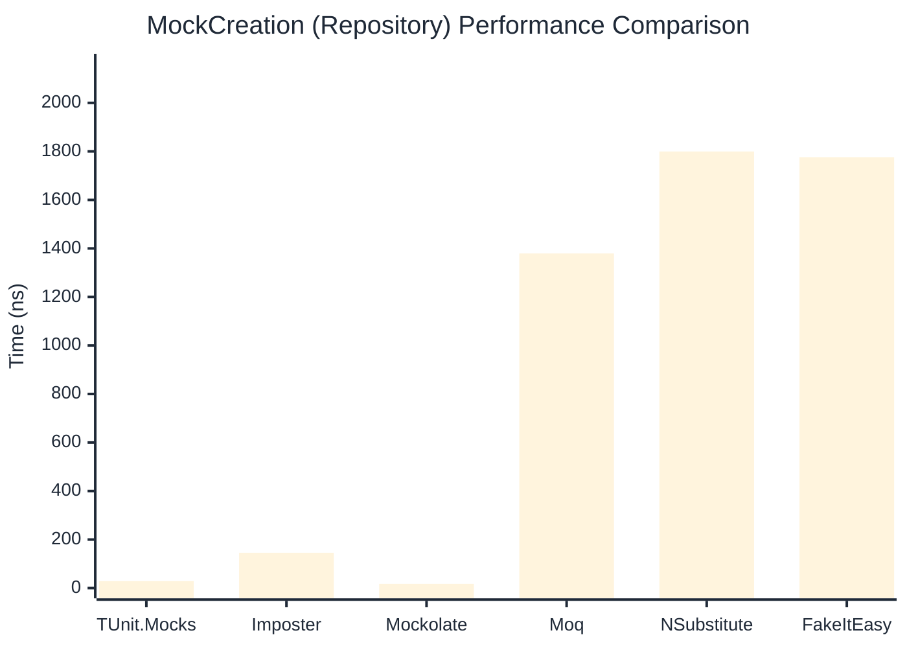

# MockCreation Benchmark

> Mock instance creation performance — comparing **TUnit.Mocks** (source-generated) against runtime proxy-based mocking libraries.

:::info Last Updated
This benchmark was automatically generated on **2026-08-04** from the latest CI run.

**Environment:** Ubuntu Latest • .NET SDK 10.0.302
:::

## 📊 Results

Mock instance creation performance:

| Library | Mean | Error | StdDev | Allocated |
|---------|------|-------|--------|-----------|
| **TUnit.Mocks** | 29.17 ns | 0.286 ns | 0.267 ns | 200 B |
| Imposter | 93.61 ns | 1.244 ns | 1.164 ns | 440 B |
| Mockolate | 17.94 ns | 0.419 ns | 0.392 ns | 160 B |
| Moq | 1,339.91 ns | 19.801 ns | 18.522 ns | 2048 B |
| NSubstitute | 1,862.12 ns | 11.734 ns | 10.976 ns | 5000 B |
| FakeItEasy | 1,750.91 ns | 18.228 ns | 15.221 ns | 2715 B |

```mermaid
%%{init: {
  'theme':'base',
  'themeVariables': {
    'primaryColor': '#2563eb',
    'primaryTextColor': '#1f2937',
    'primaryBorderColor': '#1e40af',
    'lineColor': '#6b7280',
    'secondaryColor': '#7c3aed',
    'tertiaryColor': '#dc2626',
    'background': '#ffffff',
    'pie1': '#2563eb',
    'pie2': '#7c3aed',
    'pie3': '#dc2626',
    'pie4': '#f59e0b',
    'pie5': '#10b981',
    'pie6': '#06b6d4',
    'pie7': '#ec4899',
    'pie8': '#6366f1'
  }
}}%%
xychart-beta
  title "MockCreation Performance Comparison"
  x-axis ["TUnit.Mocks", "Imposter", "Mockolate", "Moq", "NSubstitute", "FakeItEasy"]
  y-axis "Time (ns)" 0 --> 2235
  bar [29.17, 93.61, 17.94, 1339.91, 1862.12, 1750.91]
```

---

### Repository

| Library | Mean | Error | StdDev | Allocated |
|---------|------|-------|--------|-----------|
| **TUnit.Mocks** | 28.62 ns | 0.468 ns | 0.391 ns | 200 B |
| Imposter | 145.56 ns | 2.020 ns | 1.889 ns | 696 B |
| Mockolate | 17.67 ns | 0.133 ns | 0.111 ns | 176 B |
| Moq | 1,379.28 ns | 17.021 ns | 15.089 ns | 1912 B |
| NSubstitute | 1,799.71 ns | 15.821 ns | 14.799 ns | 5000 B |
| FakeItEasy | 1,776.30 ns | 33.485 ns | 34.387 ns | 2715 B |

```mermaid
%%{init: {
  'theme':'base',
  'themeVariables': {
    'primaryColor': '#2563eb',
    'primaryTextColor': '#1f2937',
    'primaryBorderColor': '#1e40af',
    'lineColor': '#6b7280',
    'secondaryColor': '#7c3aed',
    'tertiaryColor': '#dc2626',
    'background': '#ffffff',
    'pie1': '#2563eb',
    'pie2': '#7c3aed',
    'pie3': '#dc2626',
    'pie4': '#f59e0b',
    'pie5': '#10b981',
    'pie6': '#06b6d4',
    'pie7': '#ec4899',
    'pie8': '#6366f1'
  }
}}%%
xychart-beta
  title "MockCreation (Repository) Performance Comparison"
  x-axis ["TUnit.Mocks", "Imposter", "Mockolate", "Moq", "NSubstitute", "FakeItEasy"]
  y-axis "Time (ns)" 0 --> 2160
  bar [28.62, 145.56, 17.67, 1379.28, 1799.71, 1776.3]
```

## 🎯 Key Insights

This benchmark compares **TUnit.Mocks** (source-generated) against runtime proxy-based mocking libraries for mock instance creation performance.

---

:::note Methodology
View the [mock benchmarks overview](/docs/benchmarks/mocks) for methodology details and environment information.
:::

*Last generated: 2026-08-04T03:21:55.003Z*
