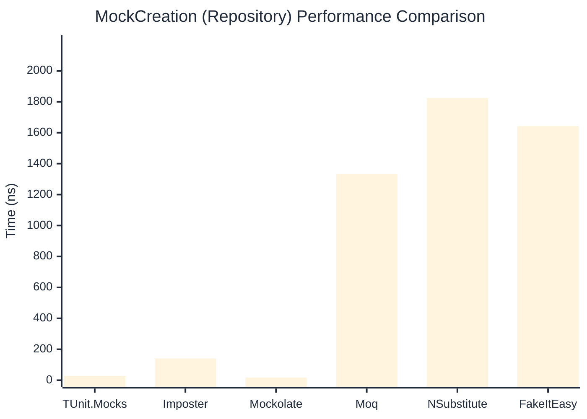

# MockCreation Benchmark

> Mock instance creation performance — comparing **TUnit.Mocks** (source-generated) against runtime proxy-based mocking libraries.

:::info Last Updated
This benchmark was automatically generated on **2026-09-01** from the latest CI run.

**Environment:** Ubuntu Latest • .NET SDK 10.0.400
:::

## 📊 Results

Mock instance creation performance:

| Library | Mean | Error | StdDev | Allocated |
|---------|------|-------|--------|-----------|
| **TUnit.Mocks** | 28.02 ns | 0.296 ns | 0.262 ns | 200 B |
| Imposter | 91.19 ns | 0.915 ns | 0.856 ns | 440 B |
| Mockolate | 17.05 ns | 0.235 ns | 0.220 ns | 160 B |
| Moq | 1,498.58 ns | 16.479 ns | 15.414 ns | 2048 B |
| NSubstitute | 1,785.62 ns | 12.843 ns | 12.014 ns | 5000 B |
| FakeItEasy | 1,703.44 ns | 23.495 ns | 21.977 ns | 2715 B |

```mermaid
%%{init: {
  'theme':'base',
  'themeVariables': {
    'primaryColor': '#2563eb',
    'primaryTextColor': '#1f2937',
    'primaryBorderColor': '#1e40af',
    'lineColor': '#6b7280',
    'secondaryColor': '#7c3aed',
    'tertiaryColor': '#dc2626',
    'background': '#ffffff',
    'pie1': '#2563eb',
    'pie2': '#7c3aed',
    'pie3': '#dc2626',
    'pie4': '#f59e0b',
    'pie5': '#10b981',
    'pie6': '#06b6d4',
    'pie7': '#ec4899',
    'pie8': '#6366f1'
  }
}}%%
xychart-beta
  title "MockCreation Performance Comparison"
  x-axis ["TUnit.Mocks", "Imposter", "Mockolate", "Moq", "NSubstitute", "FakeItEasy"]
  y-axis "Time (ns)" 0 --> 2143
  bar [28.02, 91.19, 17.05, 1498.58, 1785.62, 1703.44]
```

---

### Repository

| Library | Mean | Error | StdDev | Allocated |
|---------|------|-------|--------|-----------|
| **TUnit.Mocks** | 28.45 ns | 0.377 ns | 0.352 ns | 200 B |
| Imposter | 140.91 ns | 0.803 ns | 0.712 ns | 696 B |
| Mockolate | 17.63 ns | 0.238 ns | 0.211 ns | 176 B |
| Moq | 1,331.57 ns | 9.218 ns | 8.622 ns | 1912 B |
| NSubstitute | 1,824.31 ns | 10.035 ns | 8.896 ns | 5000 B |
| FakeItEasy | 1,642.80 ns | 17.222 ns | 16.109 ns | 2715 B |

```mermaid
%%{init: {
  'theme':'base',
  'themeVariables': {
    'primaryColor': '#2563eb',
    'primaryTextColor': '#1f2937',
    'primaryBorderColor': '#1e40af',
    'lineColor': '#6b7280',
    'secondaryColor': '#7c3aed',
    'tertiaryColor': '#dc2626',
    'background': '#ffffff',
    'pie1': '#2563eb',
    'pie2': '#7c3aed',
    'pie3': '#dc2626',
    'pie4': '#f59e0b',
    'pie5': '#10b981',
    'pie6': '#06b6d4',
    'pie7': '#ec4899',
    'pie8': '#6366f1'
  }
}}%%
xychart-beta
  title "MockCreation (Repository) Performance Comparison"
  x-axis ["TUnit.Mocks", "Imposter", "Mockolate", "Moq", "NSubstitute", "FakeItEasy"]
  y-axis "Time (ns)" 0 --> 2190
  bar [28.45, 140.91, 17.63, 1331.57, 1824.31, 1642.8]
```

## 🎯 Key Insights

This benchmark compares **TUnit.Mocks** (source-generated) against runtime proxy-based mocking libraries for mock instance creation performance.

---

:::note Methodology
View the [mock benchmarks overview](/docs/benchmarks/mocks) for methodology details and environment information.
:::

*Last generated: 2026-09-01T02:34:33.391Z*
