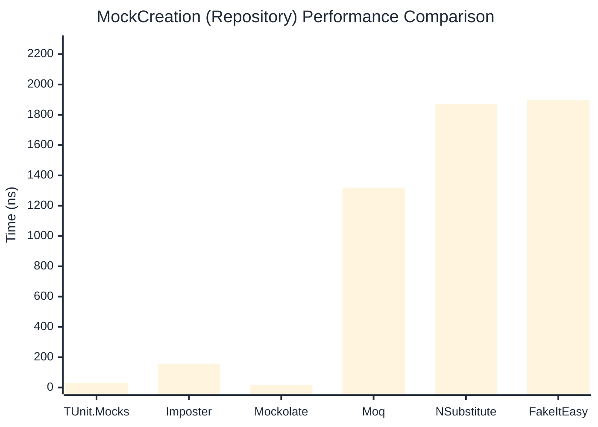

# MockCreation Benchmark

> Mock instance creation performance — comparing **TUnit.Mocks** (source-generated) against runtime proxy-based mocking libraries.

:::info Last Updated
This benchmark was automatically generated on **2026-08-14** from the latest CI run.

**Environment:** Ubuntu Latest • .NET SDK 10.0.400
:::

## 📊 Results

Mock instance creation performance:

| Library | Mean | Error | StdDev | Allocated |
|---------|------|-------|--------|-----------|
| **TUnit.Mocks** | 33.65 ns | 0.116 ns | 0.103 ns | 200 B |
| Imposter | 105.36 ns | 0.943 ns | 0.882 ns | 440 B |
| Mockolate | 19.91 ns | 0.167 ns | 0.148 ns | 160 B |
| Moq | 1,238.69 ns | 19.359 ns | 18.109 ns | 2048 B |
| NSubstitute | 1,790.32 ns | 31.290 ns | 29.269 ns | 5000 B |
| FakeItEasy | 1,772.04 ns | 35.277 ns | 60.850 ns | 2715 B |

```mermaid
%%{init: {
  'theme':'base',
  'themeVariables': {
    'primaryColor': '#2563eb',
    'primaryTextColor': '#1f2937',
    'primaryBorderColor': '#1e40af',
    'lineColor': '#6b7280',
    'secondaryColor': '#7c3aed',
    'tertiaryColor': '#dc2626',
    'background': '#ffffff',
    'pie1': '#2563eb',
    'pie2': '#7c3aed',
    'pie3': '#dc2626',
    'pie4': '#f59e0b',
    'pie5': '#10b981',
    'pie6': '#06b6d4',
    'pie7': '#ec4899',
    'pie8': '#6366f1'
  }
}}%%
xychart-beta
  title "MockCreation Performance Comparison"
  x-axis ["TUnit.Mocks", "Imposter", "Mockolate", "Moq", "NSubstitute", "FakeItEasy"]
  y-axis "Time (ns)" 0 --> 2149
  bar [33.65, 105.36, 19.91, 1238.69, 1790.32, 1772.04]
```

---

### Repository

| Library | Mean | Error | StdDev | Allocated |
|---------|------|-------|--------|-----------|
| **TUnit.Mocks** | 30.82 ns | 0.664 ns | 0.765 ns | 200 B |
| Imposter | 157.54 ns | 1.012 ns | 0.947 ns | 696 B |
| Mockolate | 18.45 ns | 0.152 ns | 0.135 ns | 176 B |
| Moq | 1,318.96 ns | 16.769 ns | 15.686 ns | 1912 B |
| NSubstitute | 1,872.39 ns | 26.909 ns | 25.171 ns | 5000 B |
| FakeItEasy | 1,898.57 ns | 36.613 ns | 54.801 ns | 2715 B |

```mermaid
%%{init: {
  'theme':'base',
  'themeVariables': {
    'primaryColor': '#2563eb',
    'primaryTextColor': '#1f2937',
    'primaryBorderColor': '#1e40af',
    'lineColor': '#6b7280',
    'secondaryColor': '#7c3aed',
    'tertiaryColor': '#dc2626',
    'background': '#ffffff',
    'pie1': '#2563eb',
    'pie2': '#7c3aed',
    'pie3': '#dc2626',
    'pie4': '#f59e0b',
    'pie5': '#10b981',
    'pie6': '#06b6d4',
    'pie7': '#ec4899',
    'pie8': '#6366f1'
  }
}}%%
xychart-beta
  title "MockCreation (Repository) Performance Comparison"
  x-axis ["TUnit.Mocks", "Imposter", "Mockolate", "Moq", "NSubstitute", "FakeItEasy"]
  y-axis "Time (ns)" 0 --> 2279
  bar [30.82, 157.54, 18.45, 1318.96, 1872.39, 1898.57]
```

## 🎯 Key Insights

This benchmark compares **TUnit.Mocks** (source-generated) against runtime proxy-based mocking libraries for mock instance creation performance.

---

:::note Methodology
View the [mock benchmarks overview](/docs/benchmarks/mocks) for methodology details and environment information.
:::

*Last generated: 2026-08-14T03:10:39.371Z*
