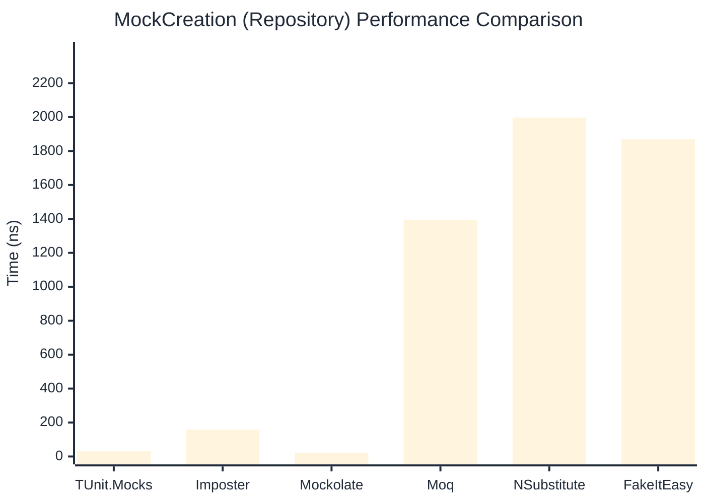

# MockCreation Benchmark

> Mock instance creation performance — comparing **TUnit.Mocks** (source-generated) against runtime proxy-based mocking libraries.

:::info Last Updated
This benchmark was automatically generated on **2026-08-31** from the latest CI run.

**Environment:** Ubuntu Latest • .NET SDK 10.0.400
:::

## 📊 Results

Mock instance creation performance:

| Library | Mean | Error | StdDev | Allocated |
|---------|------|-------|--------|-----------|
| **TUnit.Mocks** | 31.97 ns | 0.518 ns | 0.484 ns | 200 B |
| Imposter | 99.43 ns | 1.400 ns | 1.309 ns | 440 B |
| Mockolate | 19.97 ns | 0.463 ns | 0.454 ns | 160 B |
| Moq | 1,424.09 ns | 20.932 ns | 19.580 ns | 2048 B |
| NSubstitute | 1,964.82 ns | 19.442 ns | 18.186 ns | 5000 B |
| FakeItEasy | 1,845.82 ns | 29.419 ns | 27.519 ns | 2715 B |

```mermaid
%%{init: {
  'theme':'base',
  'themeVariables': {
    'primaryColor': '#2563eb',
    'primaryTextColor': '#1f2937',
    'primaryBorderColor': '#1e40af',
    'lineColor': '#6b7280',
    'secondaryColor': '#7c3aed',
    'tertiaryColor': '#dc2626',
    'background': '#ffffff',
    'pie1': '#2563eb',
    'pie2': '#7c3aed',
    'pie3': '#dc2626',
    'pie4': '#f59e0b',
    'pie5': '#10b981',
    'pie6': '#06b6d4',
    'pie7': '#ec4899',
    'pie8': '#6366f1'
  }
}}%%
xychart-beta
  title "MockCreation Performance Comparison"
  x-axis ["TUnit.Mocks", "Imposter", "Mockolate", "Moq", "NSubstitute", "FakeItEasy"]
  y-axis "Time (ns)" 0 --> 2358
  bar [31.97, 99.43, 19.97, 1424.09, 1964.82, 1845.82]
```

---

### Repository

| Library | Mean | Error | StdDev | Allocated |
|---------|------|-------|--------|-----------|
| **TUnit.Mocks** | 31.76 ns | 0.569 ns | 0.532 ns | 200 B |
| Imposter | 158.42 ns | 0.696 ns | 0.617 ns | 696 B |
| Mockolate | 20.63 ns | 0.477 ns | 0.446 ns | 176 B |
| Moq | 1,393.56 ns | 6.644 ns | 6.214 ns | 1912 B |
| NSubstitute | 1,997.15 ns | 6.568 ns | 5.822 ns | 5000 B |
| FakeItEasy | 1,870.83 ns | 31.917 ns | 36.755 ns | 2715 B |

```mermaid
%%{init: {
  'theme':'base',
  'themeVariables': {
    'primaryColor': '#2563eb',
    'primaryTextColor': '#1f2937',
    'primaryBorderColor': '#1e40af',
    'lineColor': '#6b7280',
    'secondaryColor': '#7c3aed',
    'tertiaryColor': '#dc2626',
    'background': '#ffffff',
    'pie1': '#2563eb',
    'pie2': '#7c3aed',
    'pie3': '#dc2626',
    'pie4': '#f59e0b',
    'pie5': '#10b981',
    'pie6': '#06b6d4',
    'pie7': '#ec4899',
    'pie8': '#6366f1'
  }
}}%%
xychart-beta
  title "MockCreation (Repository) Performance Comparison"
  x-axis ["TUnit.Mocks", "Imposter", "Mockolate", "Moq", "NSubstitute", "FakeItEasy"]
  y-axis "Time (ns)" 0 --> 2397
  bar [31.76, 158.42, 20.63, 1393.56, 1997.15, 1870.83]
```

## 🎯 Key Insights

This benchmark compares **TUnit.Mocks** (source-generated) against runtime proxy-based mocking libraries for mock instance creation performance.

---

:::note Methodology
View the [mock benchmarks overview](/docs/benchmarks/mocks) for methodology details and environment information.
:::

*Last generated: 2026-08-31T02:34:36.043Z*
