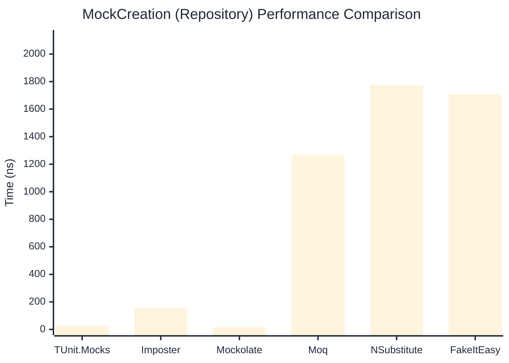

# MockCreation Benchmark

> Mock instance creation performance — comparing **TUnit.Mocks** (source-generated) against runtime proxy-based mocking libraries.

:::info Last Updated
This benchmark was automatically generated on **2026-09-02** from the latest CI run.

**Environment:** Ubuntu Latest • .NET SDK 10.0.400
:::

## 📊 Results

Mock instance creation performance:

| Library | Mean | Error | StdDev | Allocated |
|---------|------|-------|--------|-----------|
| **TUnit.Mocks** | 29.71 ns | 0.084 ns | 0.074 ns | 200 B |
| Imposter | 100.44 ns | 0.364 ns | 0.304 ns | 440 B |
| Mockolate | 18.98 ns | 0.150 ns | 0.125 ns | 160 B |
| Moq | 1,248.86 ns | 21.344 ns | 19.965 ns | 2048 B |
| NSubstitute | 1,767.87 ns | 30.429 ns | 28.463 ns | 5000 B |
| FakeItEasy | 1,676.49 ns | 21.547 ns | 17.993 ns | 2715 B |

```mermaid
%%{init: {
  'theme':'base',
  'themeVariables': {
    'primaryColor': '#2563eb',
    'primaryTextColor': '#1f2937',
    'primaryBorderColor': '#1e40af',
    'lineColor': '#6b7280',
    'secondaryColor': '#7c3aed',
    'tertiaryColor': '#dc2626',
    'background': '#ffffff',
    'pie1': '#2563eb',
    'pie2': '#7c3aed',
    'pie3': '#dc2626',
    'pie4': '#f59e0b',
    'pie5': '#10b981',
    'pie6': '#06b6d4',
    'pie7': '#ec4899',
    'pie8': '#6366f1'
  }
}}%%
xychart-beta
  title "MockCreation Performance Comparison"
  x-axis ["TUnit.Mocks", "Imposter", "Mockolate", "Moq", "NSubstitute", "FakeItEasy"]
  y-axis "Time (ns)" 0 --> 2122
  bar [29.71, 100.44, 18.98, 1248.86, 1767.87, 1676.49]
```

---

### Repository

| Library | Mean | Error | StdDev | Allocated |
|---------|------|-------|--------|-----------|
| **TUnit.Mocks** | 30.25 ns | 0.145 ns | 0.121 ns | 200 B |
| Imposter | 158.07 ns | 0.778 ns | 0.689 ns | 696 B |
| Mockolate | 17.98 ns | 0.047 ns | 0.039 ns | 176 B |
| Moq | 1,268.01 ns | 7.375 ns | 6.899 ns | 1912 B |
| NSubstitute | 1,776.28 ns | 18.300 ns | 16.222 ns | 5000 B |
| FakeItEasy | 1,708.13 ns | 28.914 ns | 25.631 ns | 2715 B |

```mermaid
%%{init: {
  'theme':'base',
  'themeVariables': {
    'primaryColor': '#2563eb',
    'primaryTextColor': '#1f2937',
    'primaryBorderColor': '#1e40af',
    'lineColor': '#6b7280',
    'secondaryColor': '#7c3aed',
    'tertiaryColor': '#dc2626',
    'background': '#ffffff',
    'pie1': '#2563eb',
    'pie2': '#7c3aed',
    'pie3': '#dc2626',
    'pie4': '#f59e0b',
    'pie5': '#10b981',
    'pie6': '#06b6d4',
    'pie7': '#ec4899',
    'pie8': '#6366f1'
  }
}}%%
xychart-beta
  title "MockCreation (Repository) Performance Comparison"
  x-axis ["TUnit.Mocks", "Imposter", "Mockolate", "Moq", "NSubstitute", "FakeItEasy"]
  y-axis "Time (ns)" 0 --> 2132
  bar [30.25, 158.07, 17.98, 1268.01, 1776.28, 1708.13]
```

## 🎯 Key Insights

This benchmark compares **TUnit.Mocks** (source-generated) against runtime proxy-based mocking libraries for mock instance creation performance.

---

:::note Methodology
View the [mock benchmarks overview](/docs/benchmarks/mocks) for methodology details and environment information.
:::

*Last generated: 2026-09-02T02:49:53.672Z*
