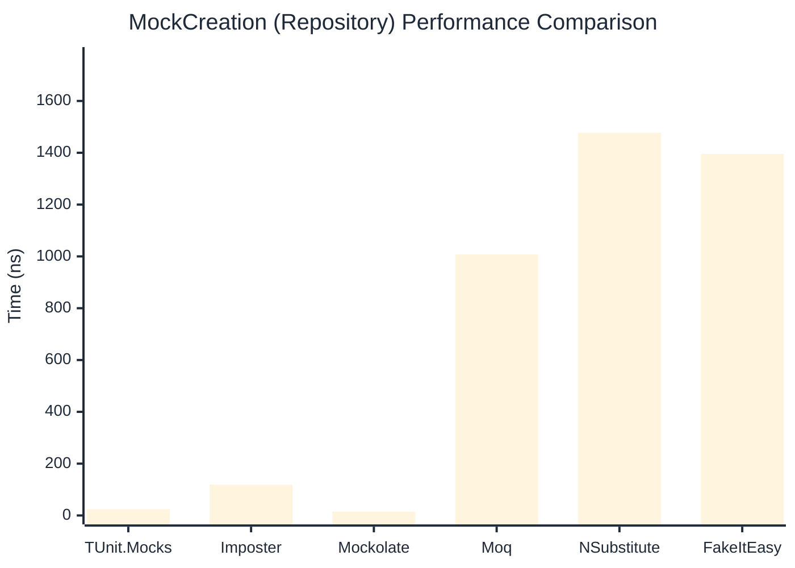

# MockCreation Benchmark

> Mock instance creation performance — comparing **TUnit.Mocks** (source-generated) against runtime proxy-based mocking libraries.

:::info Last Updated
This benchmark was automatically generated on **2026-09-14** from the latest CI run.

**Environment:** Ubuntu Latest • .NET SDK 10.0.401
:::

## 📊 Results

Mock instance creation performance:

| Library | Mean | Error | StdDev | Allocated |
|---------|------|-------|--------|-----------|
| **TUnit.Mocks** | 22.16 ns | 0.107 ns | 0.095 ns | 200 B |
| Imposter | 82.36 ns | 1.165 ns | 1.090 ns | 440 B |
| Mockolate | 13.60 ns | 0.267 ns | 0.250 ns | 160 B |
| Moq | 970.03 ns | 18.503 ns | 17.308 ns | 2048 B |
| NSubstitute | 1,306.95 ns | 9.736 ns | 8.130 ns | 5000 B |
| FakeItEasy | 1,268.64 ns | 7.785 ns | 6.901 ns | 2715 B |

```mermaid
%%{init: {
  'theme':'base',
  'themeVariables': {
    'primaryColor': '#2563eb',
    'primaryTextColor': '#1f2937',
    'primaryBorderColor': '#1e40af',
    'lineColor': '#6b7280',
    'secondaryColor': '#7c3aed',
    'tertiaryColor': '#dc2626',
    'background': '#ffffff',
    'pie1': '#2563eb',
    'pie2': '#7c3aed',
    'pie3': '#dc2626',
    'pie4': '#f59e0b',
    'pie5': '#10b981',
    'pie6': '#06b6d4',
    'pie7': '#ec4899',
    'pie8': '#6366f1'
  }
}}%%
xychart-beta
  title "MockCreation Performance Comparison"
  x-axis ["TUnit.Mocks", "Imposter", "Mockolate", "Moq", "NSubstitute", "FakeItEasy"]
  y-axis "Time (ns)" 0 --> 1569
  bar [22.16, 82.36, 13.6, 970.03, 1306.95, 1268.64]
```

---

### Repository

| Library | Mean | Error | StdDev | Allocated |
|---------|------|-------|--------|-----------|
| **TUnit.Mocks** | 24.18 ns | 0.517 ns | 0.531 ns | 200 B |
| Imposter | 118.65 ns | 0.470 ns | 0.417 ns | 696 B |
| Mockolate | 14.59 ns | 0.141 ns | 0.132 ns | 176 B |
| Moq | 1,008.08 ns | 12.792 ns | 11.966 ns | 1912 B |
| NSubstitute | 1,477.13 ns | 13.008 ns | 12.168 ns | 5000 B |
| FakeItEasy | 1,395.24 ns | 15.356 ns | 13.613 ns | 2715 B |

```mermaid
%%{init: {
  'theme':'base',
  'themeVariables': {
    'primaryColor': '#2563eb',
    'primaryTextColor': '#1f2937',
    'primaryBorderColor': '#1e40af',
    'lineColor': '#6b7280',
    'secondaryColor': '#7c3aed',
    'tertiaryColor': '#dc2626',
    'background': '#ffffff',
    'pie1': '#2563eb',
    'pie2': '#7c3aed',
    'pie3': '#dc2626',
    'pie4': '#f59e0b',
    'pie5': '#10b981',
    'pie6': '#06b6d4',
    'pie7': '#ec4899',
    'pie8': '#6366f1'
  }
}}%%
xychart-beta
  title "MockCreation (Repository) Performance Comparison"
  x-axis ["TUnit.Mocks", "Imposter", "Mockolate", "Moq", "NSubstitute", "FakeItEasy"]
  y-axis "Time (ns)" 0 --> 1773
  bar [24.18, 118.65, 14.59, 1008.08, 1477.13, 1395.24]
```

## 🎯 Key Insights

This benchmark compares **TUnit.Mocks** (source-generated) against runtime proxy-based mocking libraries for mock instance creation performance.

---

:::note Methodology
View the [mock benchmarks overview](/docs/benchmarks/mocks) for methodology details and environment information.
:::

*Last generated: 2026-09-14T02:37:23.172Z*
