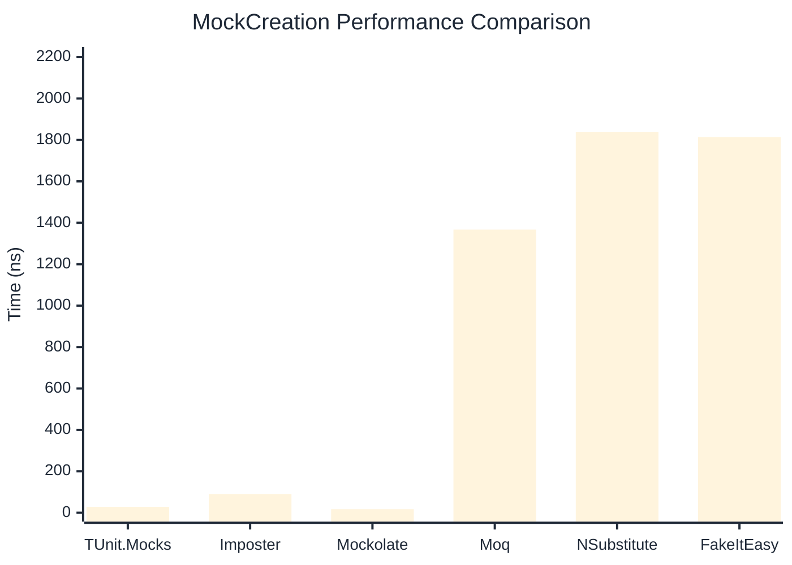

# MockCreation Benchmark

> Mock instance creation performance — comparing **TUnit.Mocks** (source-generated) against runtime proxy-based mocking libraries.

:::info Last Updated
This benchmark was automatically generated on **2026-07-29** from the latest CI run.

**Environment:** Ubuntu Latest • .NET SDK 10.0.302
:::

## 📊 Results

Mock instance creation performance:

| Library | Mean | Error | StdDev | Allocated |
|---------|------|-------|--------|-----------|
| **TUnit.Mocks** | 28.55 ns | 0.525 ns | 0.491 ns | 200 B |
| Imposter | 90.33 ns | 1.108 ns | 1.036 ns | 440 B |
| Mockolate | 17.08 ns | 0.193 ns | 0.171 ns | 160 B |
| Moq | 1,367.02 ns | 20.623 ns | 19.291 ns | 2048 B |
| NSubstitute | 1,837.69 ns | 13.085 ns | 12.240 ns | 5000 B |
| FakeItEasy | 1,813.97 ns | 30.315 ns | 26.874 ns | 2715 B |

```mermaid
%%{init: {
  'theme':'base',
  'themeVariables': {
    'primaryColor': '#2563eb',
    'primaryTextColor': '#1f2937',
    'primaryBorderColor': '#1e40af',
    'lineColor': '#6b7280',
    'secondaryColor': '#7c3aed',
    'tertiaryColor': '#dc2626',
    'background': '#ffffff',
    'pie1': '#2563eb',
    'pie2': '#7c3aed',
    'pie3': '#dc2626',
    'pie4': '#f59e0b',
    'pie5': '#10b981',
    'pie6': '#06b6d4',
    'pie7': '#ec4899',
    'pie8': '#6366f1'
  }
}}%%
xychart-beta
  title "MockCreation Performance Comparison"
  x-axis ["TUnit.Mocks", "Imposter", "Mockolate", "Moq", "NSubstitute", "FakeItEasy"]
  y-axis "Time (ns)" 0 --> 2206
  bar [28.55, 90.33, 17.08, 1367.02, 1837.69, 1813.97]
```

---

### Repository

| Library | Mean | Error | StdDev | Allocated |
|---------|------|-------|--------|-----------|
| **TUnit.Mocks** | 28.16 ns | 0.280 ns | 0.234 ns | 200 B |
| Imposter | 143.75 ns | 1.712 ns | 1.602 ns | 696 B |
| Mockolate | 17.39 ns | 0.126 ns | 0.118 ns | 176 B |
| Moq | 1,309.12 ns | 6.210 ns | 5.505 ns | 1912 B |
| NSubstitute | 1,793.31 ns | 33.002 ns | 30.870 ns | 5000 B |
| FakeItEasy | 1,825.92 ns | 19.457 ns | 18.200 ns | 2715 B |

```mermaid
%%{init: {
  'theme':'base',
  'themeVariables': {
    'primaryColor': '#2563eb',
    'primaryTextColor': '#1f2937',
    'primaryBorderColor': '#1e40af',
    'lineColor': '#6b7280',
    'secondaryColor': '#7c3aed',
    'tertiaryColor': '#dc2626',
    'background': '#ffffff',
    'pie1': '#2563eb',
    'pie2': '#7c3aed',
    'pie3': '#dc2626',
    'pie4': '#f59e0b',
    'pie5': '#10b981',
    'pie6': '#06b6d4',
    'pie7': '#ec4899',
    'pie8': '#6366f1'
  }
}}%%
xychart-beta
  title "MockCreation (Repository) Performance Comparison"
  x-axis ["TUnit.Mocks", "Imposter", "Mockolate", "Moq", "NSubstitute", "FakeItEasy"]
  y-axis "Time (ns)" 0 --> 2192
  bar [28.16, 143.75, 17.39, 1309.12, 1793.31, 1825.92]
```

## 🎯 Key Insights

This benchmark compares **TUnit.Mocks** (source-generated) against runtime proxy-based mocking libraries for mock instance creation performance.

---

:::note Methodology
View the [mock benchmarks overview](/docs/benchmarks/mocks) for methodology details and environment information.
:::

*Last generated: 2026-07-29T03:20:13.661Z*
