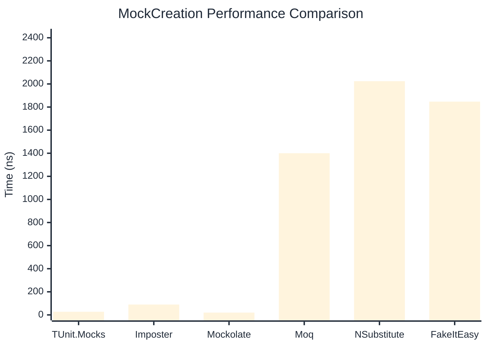

# MockCreation Benchmark

> Mock instance creation performance — comparing **TUnit.Mocks** (source-generated) against runtime proxy-based mocking libraries.

:::info Last Updated
This benchmark was automatically generated on **2026-09-25** from the latest CI run.

**Environment:** Ubuntu Latest • .NET SDK 10.0.401
:::

## 📊 Results

Mock instance creation performance:

| Library | Mean | Error | StdDev | Allocated |
|---------|------|-------|--------|-----------|
| **TUnit.Mocks** | 27.21 ns | 0.481 ns | 0.450 ns | 200 B |
| Imposter | 89.82 ns | 1.783 ns | 3.122 ns | 440 B |
| Mockolate | 20.14 ns | 0.480 ns | 1.414 ns | 160 B |
| Moq | 1,400.23 ns | 23.155 ns | 21.659 ns | 2048 B |
| NSubstitute | 2,024.18 ns | 31.360 ns | 29.334 ns | 5000 B |
| FakeItEasy | 1,847.00 ns | 36.751 ns | 63.394 ns | 2715 B |

```mermaid
%%{init: {
  'theme':'base',
  'themeVariables': {
    'primaryColor': '#2563eb',
    'primaryTextColor': '#1f2937',
    'primaryBorderColor': '#1e40af',
    'lineColor': '#6b7280',
    'secondaryColor': '#7c3aed',
    'tertiaryColor': '#dc2626',
    'background': '#ffffff',
    'pie1': '#2563eb',
    'pie2': '#7c3aed',
    'pie3': '#dc2626',
    'pie4': '#f59e0b',
    'pie5': '#10b981',
    'pie6': '#06b6d4',
    'pie7': '#ec4899',
    'pie8': '#6366f1'
  }
}}%%
xychart-beta
  title "MockCreation Performance Comparison"
  x-axis ["TUnit.Mocks", "Imposter", "Mockolate", "Moq", "NSubstitute", "FakeItEasy"]
  y-axis "Time (ns)" 0 --> 2430
  bar [27.21, 89.82, 20.14, 1400.23, 2024.18, 1847]
```

---

### Repository

| Library | Mean | Error | StdDev | Allocated |
|---------|------|-------|--------|-----------|
| **TUnit.Mocks** | 34.54 ns | 0.465 ns | 0.435 ns | 200 B |
| Imposter | 160.36 ns | 2.777 ns | 2.598 ns | 696 B |
| Mockolate | 21.42 ns | 0.468 ns | 0.521 ns | 176 B |
| Moq | 1,469.06 ns | 6.388 ns | 5.976 ns | 1912 B |
| NSubstitute | 2,019.63 ns | 21.024 ns | 19.666 ns | 5000 B |
| FakeItEasy | 1,838.63 ns | 36.323 ns | 56.551 ns | 2715 B |

```mermaid
%%{init: {
  'theme':'base',
  'themeVariables': {
    'primaryColor': '#2563eb',
    'primaryTextColor': '#1f2937',
    'primaryBorderColor': '#1e40af',
    'lineColor': '#6b7280',
    'secondaryColor': '#7c3aed',
    'tertiaryColor': '#dc2626',
    'background': '#ffffff',
    'pie1': '#2563eb',
    'pie2': '#7c3aed',
    'pie3': '#dc2626',
    'pie4': '#f59e0b',
    'pie5': '#10b981',
    'pie6': '#06b6d4',
    'pie7': '#ec4899',
    'pie8': '#6366f1'
  }
}}%%
xychart-beta
  title "MockCreation (Repository) Performance Comparison"
  x-axis ["TUnit.Mocks", "Imposter", "Mockolate", "Moq", "NSubstitute", "FakeItEasy"]
  y-axis "Time (ns)" 0 --> 2424
  bar [34.54, 160.36, 21.42, 1469.06, 2019.63, 1838.63]
```

## 🎯 Key Insights

This benchmark compares **TUnit.Mocks** (source-generated) against runtime proxy-based mocking libraries for mock instance creation performance.

---

:::note Methodology
View the [mock benchmarks overview](/docs/benchmarks/mocks) for methodology details and environment information.
:::

*Last generated: 2026-09-25T02:32:28.119Z*
