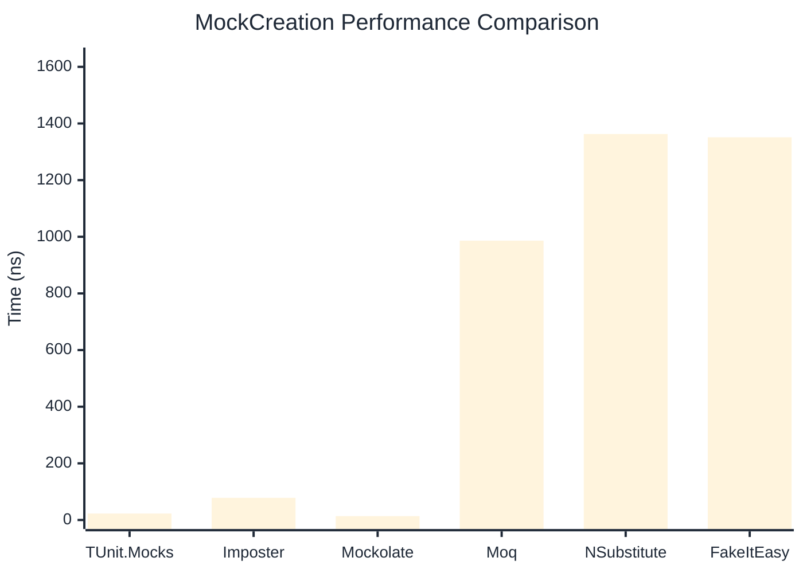
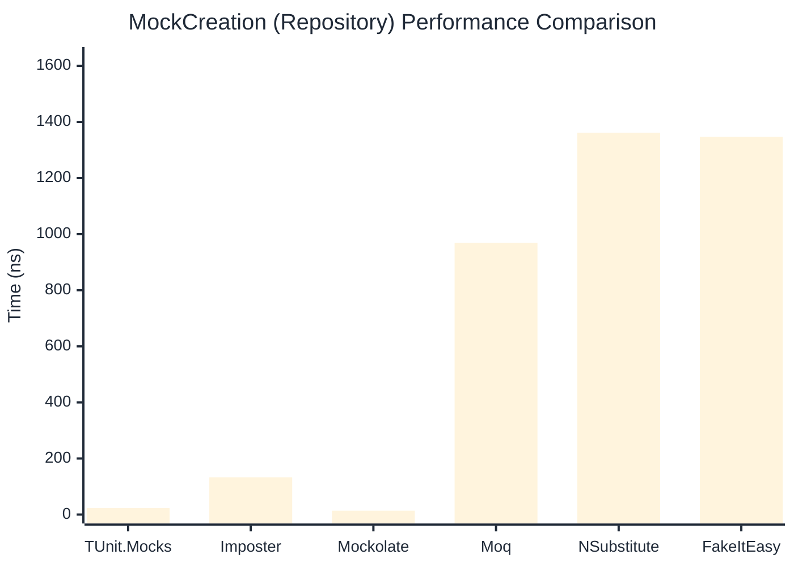

# MockCreation Benchmark

> Mock instance creation performance — comparing **TUnit.Mocks** (source-generated) against runtime proxy-based mocking libraries.

:::info Last Updated
This benchmark was automatically generated on **2026-07-26** from the latest CI run.

**Environment:** Ubuntu Latest • .NET SDK 10.0.302
:::

## 📊 Results

Mock instance creation performance:

| Library | Mean | Error | StdDev | Allocated |
|---------|------|-------|--------|-----------|
| **TUnit.Mocks** | 22.85 ns | 0.118 ns | 0.099 ns | 200 B |
| Imposter | 78.26 ns | 0.493 ns | 0.461 ns | 440 B |
| Mockolate | 13.68 ns | 0.031 ns | 0.024 ns | 160 B |
| Moq | 986.34 ns | 14.873 ns | 13.912 ns | 2048 B |
| NSubstitute | 1,362.78 ns | 10.468 ns | 9.792 ns | 5000 B |
| FakeItEasy | 1,351.27 ns | 1.834 ns | 1.531 ns | 2715 B |

```mermaid
%%{init: {
  'theme':'base',
  'themeVariables': {
    'primaryColor': '#2563eb',
    'primaryTextColor': '#1f2937',
    'primaryBorderColor': '#1e40af',
    'lineColor': '#6b7280',
    'secondaryColor': '#7c3aed',
    'tertiaryColor': '#dc2626',
    'background': '#ffffff',
    'pie1': '#2563eb',
    'pie2': '#7c3aed',
    'pie3': '#dc2626',
    'pie4': '#f59e0b',
    'pie5': '#10b981',
    'pie6': '#06b6d4',
    'pie7': '#ec4899',
    'pie8': '#6366f1'
  }
}}%%
xychart-beta
  title "MockCreation Performance Comparison"
  x-axis ["TUnit.Mocks", "Imposter", "Mockolate", "Moq", "NSubstitute", "FakeItEasy"]
  y-axis "Time (ns)" 0 --> 1636
  bar [22.85, 78.26, 13.68, 986.34, 1362.78, 1351.27]
```

---

### Repository

| Library | Mean | Error | StdDev | Allocated |
|---------|------|-------|--------|-----------|
| **TUnit.Mocks** | 23.11 ns | 0.246 ns | 0.230 ns | 200 B |
| Imposter | 132.73 ns | 2.695 ns | 2.996 ns | 696 B |
| Mockolate | 13.79 ns | 0.065 ns | 0.057 ns | 176 B |
| Moq | 968.72 ns | 4.626 ns | 4.327 ns | 1912 B |
| NSubstitute | 1,361.72 ns | 9.770 ns | 9.138 ns | 5000 B |
| FakeItEasy | 1,346.99 ns | 25.766 ns | 26.460 ns | 2715 B |

```mermaid
%%{init: {
  'theme':'base',
  'themeVariables': {
    'primaryColor': '#2563eb',
    'primaryTextColor': '#1f2937',
    'primaryBorderColor': '#1e40af',
    'lineColor': '#6b7280',
    'secondaryColor': '#7c3aed',
    'tertiaryColor': '#dc2626',
    'background': '#ffffff',
    'pie1': '#2563eb',
    'pie2': '#7c3aed',
    'pie3': '#dc2626',
    'pie4': '#f59e0b',
    'pie5': '#10b981',
    'pie6': '#06b6d4',
    'pie7': '#ec4899',
    'pie8': '#6366f1'
  }
}}%%
xychart-beta
  title "MockCreation (Repository) Performance Comparison"
  x-axis ["TUnit.Mocks", "Imposter", "Mockolate", "Moq", "NSubstitute", "FakeItEasy"]
  y-axis "Time (ns)" 0 --> 1635
  bar [23.11, 132.73, 13.79, 968.72, 1361.72, 1346.99]
```

## 🎯 Key Insights

This benchmark compares **TUnit.Mocks** (source-generated) against runtime proxy-based mocking libraries for mock instance creation performance.

---

:::note Methodology
View the [mock benchmarks overview](/docs/benchmarks/mocks) for methodology details and environment information.
:::

*Last generated: 2026-07-26T03:33:46.478Z*
