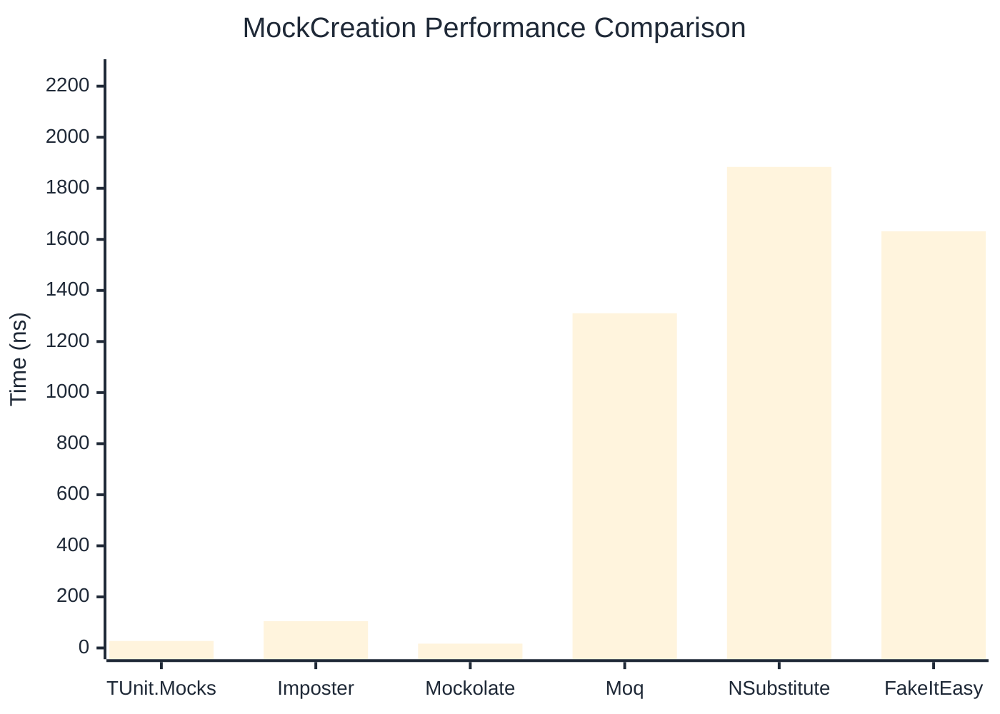

# MockCreation Benchmark

> Mock instance creation performance — comparing **TUnit.Mocks** (source-generated) against runtime proxy-based mocking libraries.

:::info Last Updated
This benchmark was automatically generated on **2026-09-26** from the latest CI run.

**Environment:** Ubuntu Latest • .NET SDK 10.0.401
:::

## 📊 Results

Mock instance creation performance:

| Library | Mean | Error | StdDev | Allocated |
|---------|------|-------|--------|-----------|
| **TUnit.Mocks** | 27.43 ns | 0.581 ns | 1.312 ns | 200 B |
| Imposter | 104.70 ns | 2.100 ns | 2.500 ns | 440 B |
| Mockolate | 16.92 ns | 0.189 ns | 0.168 ns | 160 B |
| Moq | 1,310.85 ns | 22.385 ns | 20.939 ns | 2048 B |
| NSubstitute | 1,883.81 ns | 19.129 ns | 17.893 ns | 5000 B |
| FakeItEasy | 1,631.44 ns | 9.238 ns | 8.641 ns | 2715 B |

```mermaid
%%{init: {
  'theme':'base',
  'themeVariables': {
    'primaryColor': '#2563eb',
    'primaryTextColor': '#1f2937',
    'primaryBorderColor': '#1e40af',
    'lineColor': '#6b7280',
    'secondaryColor': '#7c3aed',
    'tertiaryColor': '#dc2626',
    'background': '#ffffff',
    'pie1': '#2563eb',
    'pie2': '#7c3aed',
    'pie3': '#dc2626',
    'pie4': '#f59e0b',
    'pie5': '#10b981',
    'pie6': '#06b6d4',
    'pie7': '#ec4899',
    'pie8': '#6366f1'
  }
}}%%
xychart-beta
  title "MockCreation Performance Comparison"
  x-axis ["TUnit.Mocks", "Imposter", "Mockolate", "Moq", "NSubstitute", "FakeItEasy"]
  y-axis "Time (ns)" 0 --> 2261
  bar [27.43, 104.7, 16.92, 1310.85, 1883.81, 1631.44]
```

---

### Repository

| Library | Mean | Error | StdDev | Allocated |
|---------|------|-------|--------|-----------|
| **TUnit.Mocks** | 27.49 ns | 0.544 ns | 0.454 ns | 200 B |
| Imposter | 136.84 ns | 2.780 ns | 2.974 ns | 696 B |
| Mockolate | 17.31 ns | 0.356 ns | 0.487 ns | 176 B |
| Moq | 1,283.64 ns | 10.515 ns | 9.836 ns | 1912 B |
| NSubstitute | 1,725.41 ns | 11.192 ns | 9.921 ns | 5000 B |
| FakeItEasy | 1,650.67 ns | 32.569 ns | 61.172 ns | 2715 B |

```mermaid
%%{init: {
  'theme':'base',
  'themeVariables': {
    'primaryColor': '#2563eb',
    'primaryTextColor': '#1f2937',
    'primaryBorderColor': '#1e40af',
    'lineColor': '#6b7280',
    'secondaryColor': '#7c3aed',
    'tertiaryColor': '#dc2626',
    'background': '#ffffff',
    'pie1': '#2563eb',
    'pie2': '#7c3aed',
    'pie3': '#dc2626',
    'pie4': '#f59e0b',
    'pie5': '#10b981',
    'pie6': '#06b6d4',
    'pie7': '#ec4899',
    'pie8': '#6366f1'
  }
}}%%
xychart-beta
  title "MockCreation (Repository) Performance Comparison"
  x-axis ["TUnit.Mocks", "Imposter", "Mockolate", "Moq", "NSubstitute", "FakeItEasy"]
  y-axis "Time (ns)" 0 --> 2071
  bar [27.49, 136.84, 17.31, 1283.64, 1725.41, 1650.67]
```

## 🎯 Key Insights

This benchmark compares **TUnit.Mocks** (source-generated) against runtime proxy-based mocking libraries for mock instance creation performance.

---

:::note Methodology
View the [mock benchmarks overview](/docs/benchmarks/mocks) for methodology details and environment information.
:::

*Last generated: 2026-09-26T02:32:00.095Z*
