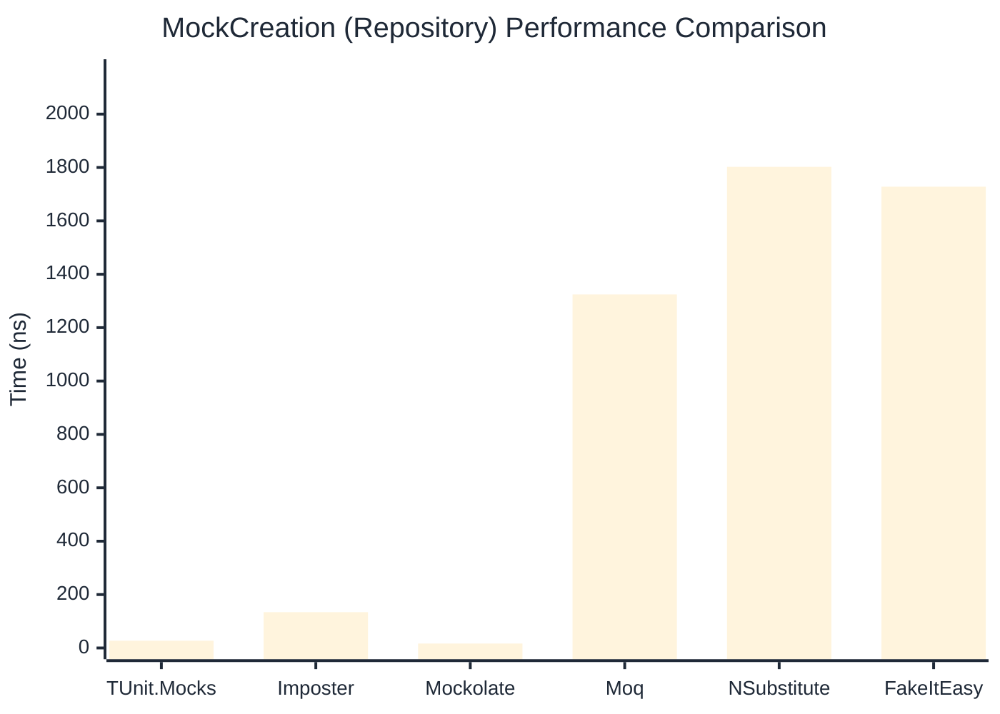

# MockCreation Benchmark

> Mock instance creation performance — comparing **TUnit.Mocks** (source-generated) against runtime proxy-based mocking libraries.

:::info Last Updated
This benchmark was automatically generated on **2026-10-10** from the latest CI run.

**Environment:** Ubuntu Latest • .NET SDK 10.0.401
:::

## 📊 Results

Mock instance creation performance:

| Library | Mean | Error | StdDev | Allocated |
|---------|------|-------|--------|-----------|
| **TUnit.Mocks** | 26.53 ns | 0.073 ns | 0.065 ns | 200 B |
| Imposter | 86.87 ns | 0.460 ns | 0.430 ns | 432 B |
| Mockolate | 16.84 ns | 0.244 ns | 0.229 ns | 160 B |
| Moq | 1,405.92 ns | 18.659 ns | 17.454 ns | 2048 B |
| NSubstitute | 1,841.61 ns | 13.440 ns | 12.572 ns | 5000 B |
| FakeItEasy | 1,679.42 ns | 9.512 ns | 8.432 ns | 2715 B |

```mermaid
%%{init: {
  'theme':'base',
  'themeVariables': {
    'primaryColor': '#2563eb',
    'primaryTextColor': '#1f2937',
    'primaryBorderColor': '#1e40af',
    'lineColor': '#6b7280',
    'secondaryColor': '#7c3aed',
    'tertiaryColor': '#dc2626',
    'background': '#ffffff',
    'pie1': '#2563eb',
    'pie2': '#7c3aed',
    'pie3': '#dc2626',
    'pie4': '#f59e0b',
    'pie5': '#10b981',
    'pie6': '#06b6d4',
    'pie7': '#ec4899',
    'pie8': '#6366f1'
  }
}}%%
xychart-beta
  title "MockCreation Performance Comparison"
  x-axis ["TUnit.Mocks", "Imposter", "Mockolate", "Moq", "NSubstitute", "FakeItEasy"]
  y-axis "Time (ns)" 0 --> 2210
  bar [26.53, 86.87, 16.84, 1405.92, 1841.61, 1679.42]
```

---

### Repository

| Library | Mean | Error | StdDev | Allocated |
|---------|------|-------|--------|-----------|
| **TUnit.Mocks** | 27.01 ns | 0.337 ns | 0.315 ns | 200 B |
| Imposter | 134.08 ns | 0.910 ns | 0.851 ns | 688 B |
| Mockolate | 16.54 ns | 0.105 ns | 0.098 ns | 176 B |
| Moq | 1,324.31 ns | 15.504 ns | 14.502 ns | 1912 B |
| NSubstitute | 1,802.45 ns | 10.390 ns | 9.719 ns | 5000 B |
| FakeItEasy | 1,728.12 ns | 29.795 ns | 35.468 ns | 2715 B |

```mermaid
%%{init: {
  'theme':'base',
  'themeVariables': {
    'primaryColor': '#2563eb',
    'primaryTextColor': '#1f2937',
    'primaryBorderColor': '#1e40af',
    'lineColor': '#6b7280',
    'secondaryColor': '#7c3aed',
    'tertiaryColor': '#dc2626',
    'background': '#ffffff',
    'pie1': '#2563eb',
    'pie2': '#7c3aed',
    'pie3': '#dc2626',
    'pie4': '#f59e0b',
    'pie5': '#10b981',
    'pie6': '#06b6d4',
    'pie7': '#ec4899',
    'pie8': '#6366f1'
  }
}}%%
xychart-beta
  title "MockCreation (Repository) Performance Comparison"
  x-axis ["TUnit.Mocks", "Imposter", "Mockolate", "Moq", "NSubstitute", "FakeItEasy"]
  y-axis "Time (ns)" 0 --> 2163
  bar [27.01, 134.08, 16.54, 1324.31, 1802.45, 1728.12]
```

## 🎯 Key Insights

This benchmark compares **TUnit.Mocks** (source-generated) against runtime proxy-based mocking libraries for mock instance creation performance.

---

:::note Methodology
View the [mock benchmarks overview](/docs/benchmarks/mocks) for methodology details and environment information.
:::

*Last generated: 2026-10-10T02:40:36.038Z*
