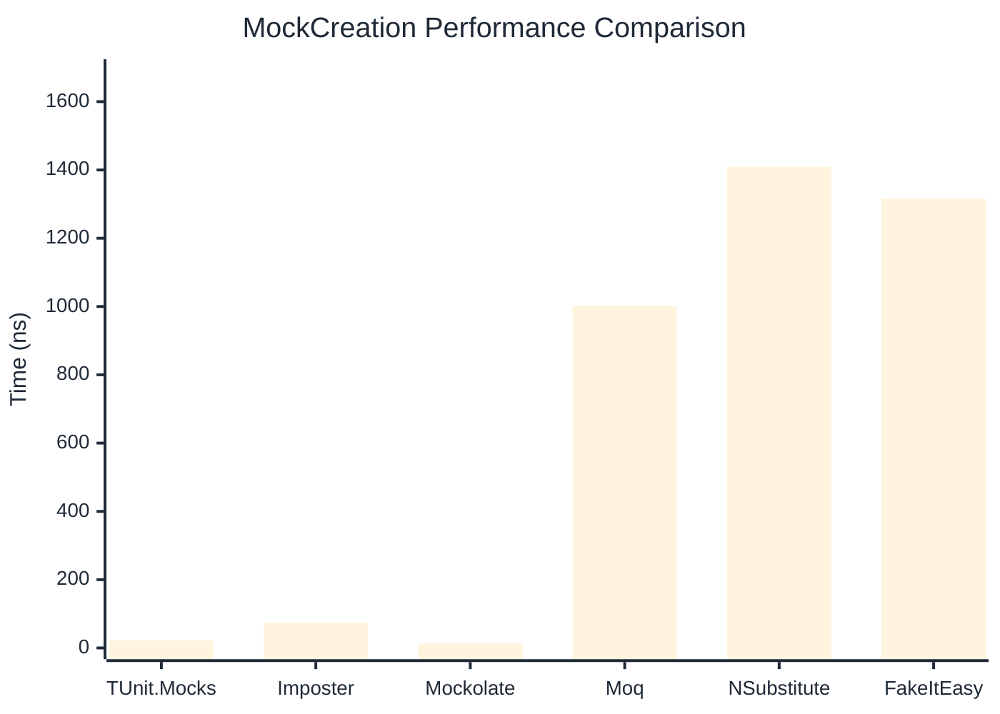
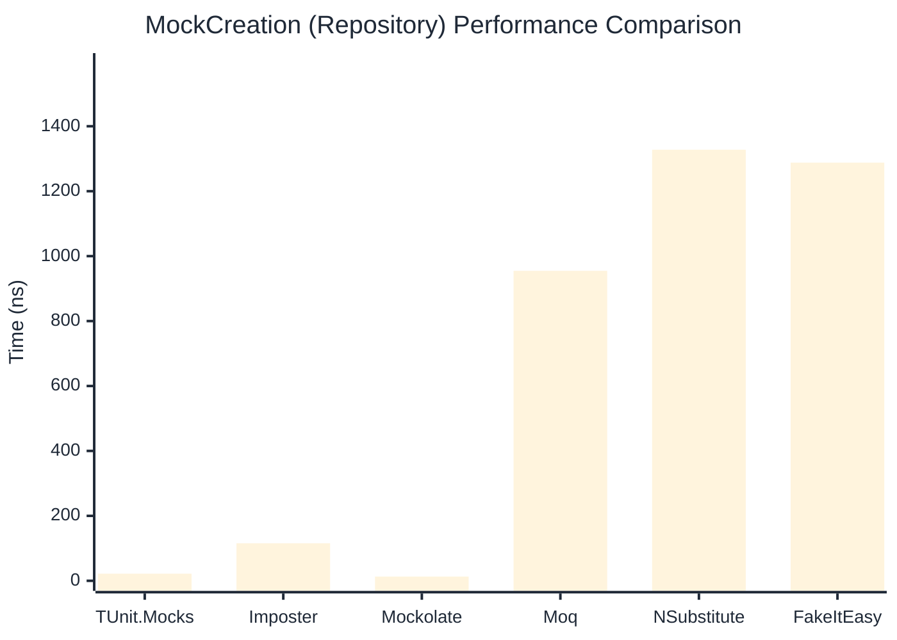

# MockCreation Benchmark

> Mock instance creation performance — comparing **TUnit.Mocks** (source-generated) against runtime proxy-based mocking libraries.

:::info Last Updated
This benchmark was automatically generated on **2026-09-29** from the latest CI run.

**Environment:** Ubuntu Latest • .NET SDK 10.0.401
:::

## 📊 Results

Mock instance creation performance:

| Library | Mean | Error | StdDev | Allocated |
|---------|------|-------|--------|-----------|
| **TUnit.Mocks** | 22.14 ns | 0.119 ns | 0.106 ns | 200 B |
| Imposter | 74.33 ns | 0.595 ns | 0.556 ns | 440 B |
| Mockolate | 13.34 ns | 0.155 ns | 0.138 ns | 160 B |
| Moq | 1,001.91 ns | 17.281 ns | 16.165 ns | 2048 B |
| NSubstitute | 1,409.14 ns | 26.504 ns | 28.359 ns | 5000 B |
| FakeItEasy | 1,315.68 ns | 25.989 ns | 58.128 ns | 2715 B |

```mermaid
%%{init: {
  'theme':'base',
  'themeVariables': {
    'primaryColor': '#2563eb',
    'primaryTextColor': '#1f2937',
    'primaryBorderColor': '#1e40af',
    'lineColor': '#6b7280',
    'secondaryColor': '#7c3aed',
    'tertiaryColor': '#dc2626',
    'background': '#ffffff',
    'pie1': '#2563eb',
    'pie2': '#7c3aed',
    'pie3': '#dc2626',
    'pie4': '#f59e0b',
    'pie5': '#10b981',
    'pie6': '#06b6d4',
    'pie7': '#ec4899',
    'pie8': '#6366f1'
  }
}}%%
xychart-beta
  title "MockCreation Performance Comparison"
  x-axis ["TUnit.Mocks", "Imposter", "Mockolate", "Moq", "NSubstitute", "FakeItEasy"]
  y-axis "Time (ns)" 0 --> 1691
  bar [22.14, 74.33, 13.34, 1001.91, 1409.14, 1315.68]
```

---

### Repository

| Library | Mean | Error | StdDev | Allocated |
|---------|------|-------|--------|-----------|
| **TUnit.Mocks** | 21.88 ns | 0.089 ns | 0.083 ns | 200 B |
| Imposter | 115.55 ns | 0.211 ns | 0.176 ns | 696 B |
| Mockolate | 13.11 ns | 0.105 ns | 0.087 ns | 176 B |
| Moq | 954.74 ns | 8.128 ns | 7.205 ns | 1912 B |
| NSubstitute | 1,327.79 ns | 23.492 ns | 21.974 ns | 5000 B |
| FakeItEasy | 1,287.94 ns | 22.427 ns | 20.978 ns | 2715 B |

```mermaid
%%{init: {
  'theme':'base',
  'themeVariables': {
    'primaryColor': '#2563eb',
    'primaryTextColor': '#1f2937',
    'primaryBorderColor': '#1e40af',
    'lineColor': '#6b7280',
    'secondaryColor': '#7c3aed',
    'tertiaryColor': '#dc2626',
    'background': '#ffffff',
    'pie1': '#2563eb',
    'pie2': '#7c3aed',
    'pie3': '#dc2626',
    'pie4': '#f59e0b',
    'pie5': '#10b981',
    'pie6': '#06b6d4',
    'pie7': '#ec4899',
    'pie8': '#6366f1'
  }
}}%%
xychart-beta
  title "MockCreation (Repository) Performance Comparison"
  x-axis ["TUnit.Mocks", "Imposter", "Mockolate", "Moq", "NSubstitute", "FakeItEasy"]
  y-axis "Time (ns)" 0 --> 1594
  bar [21.88, 115.55, 13.11, 954.74, 1327.79, 1287.94]
```

## 🎯 Key Insights

This benchmark compares **TUnit.Mocks** (source-generated) against runtime proxy-based mocking libraries for mock instance creation performance.

---

:::note Methodology
View the [mock benchmarks overview](/docs/benchmarks/mocks) for methodology details and environment information.
:::

*Last generated: 2026-09-29T02:35:19.410Z*
