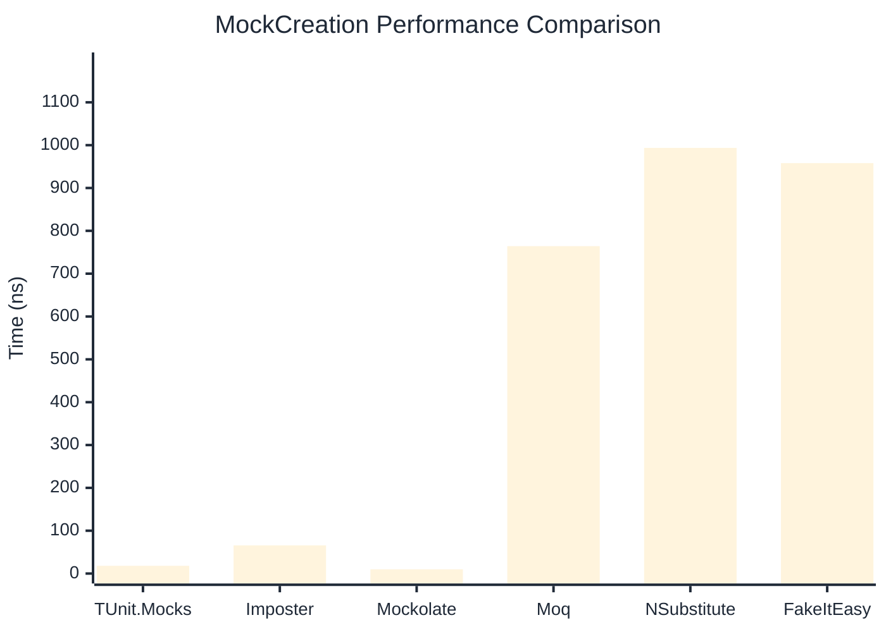

# MockCreation Benchmark

> Mock instance creation performance — comparing **TUnit.Mocks** (source-generated) against runtime proxy-based mocking libraries.

:::info Last Updated
This benchmark was automatically generated on **2026-10-05** from the latest CI run.

**Environment:** Ubuntu Latest • .NET SDK 10.0.401
:::

## 📊 Results

Mock instance creation performance:

| Library | Mean | Error | StdDev | Allocated |
|---------|------|-------|--------|-----------|
| **TUnit.Mocks** | 18.132 ns | 0.1603 ns | 0.1339 ns | 200 B |
| Imposter | 65.742 ns | 2.1872 ns | 6.4490 ns | 440 B |
| Mockolate | 9.959 ns | 0.2304 ns | 0.2561 ns | 160 B |
| Moq | 764.295 ns | 14.5472 ns | 12.8957 ns | 2048 B |
| NSubstitute | 993.670 ns | 15.1693 ns | 13.4472 ns | 5000 B |
| FakeItEasy | 958.064 ns | 17.4188 ns | 30.5076 ns | 2715 B |

```mermaid
%%{init: {
  'theme':'base',
  'themeVariables': {
    'primaryColor': '#2563eb',
    'primaryTextColor': '#1f2937',
    'primaryBorderColor': '#1e40af',
    'lineColor': '#6b7280',
    'secondaryColor': '#7c3aed',
    'tertiaryColor': '#dc2626',
    'background': '#ffffff',
    'pie1': '#2563eb',
    'pie2': '#7c3aed',
    'pie3': '#dc2626',
    'pie4': '#f59e0b',
    'pie5': '#10b981',
    'pie6': '#06b6d4',
    'pie7': '#ec4899',
    'pie8': '#6366f1'
  }
}}%%
xychart-beta
  title "MockCreation Performance Comparison"
  x-axis ["TUnit.Mocks", "Imposter", "Mockolate", "Moq", "NSubstitute", "FakeItEasy"]
  y-axis "Time (ns)" 0 --> 1193
  bar [18.132, 65.742, 9.959, 764.295, 993.67, 958.064]
```

---

### Repository

| Library | Mean | Error | StdDev | Allocated |
|---------|------|-------|--------|-----------|
| **TUnit.Mocks** | 17.239 ns | 0.3870 ns | 0.3801 ns | 200 B |
| Imposter | 96.826 ns | 0.8207 ns | 0.7276 ns | 696 B |
| Mockolate | 10.583 ns | 0.2377 ns | 0.2107 ns | 176 B |
| Moq | 774.138 ns | 14.7618 ns | 13.0859 ns | 1912 B |
| NSubstitute | 1,041.628 ns | 20.0502 ns | 20.5901 ns | 5000 B |
| FakeItEasy | 1,003.743 ns | 19.3129 ns | 33.3138 ns | 2715 B |

```mermaid
%%{init: {
  'theme':'base',
  'themeVariables': {
    'primaryColor': '#2563eb',
    'primaryTextColor': '#1f2937',
    'primaryBorderColor': '#1e40af',
    'lineColor': '#6b7280',
    'secondaryColor': '#7c3aed',
    'tertiaryColor': '#dc2626',
    'background': '#ffffff',
    'pie1': '#2563eb',
    'pie2': '#7c3aed',
    'pie3': '#dc2626',
    'pie4': '#f59e0b',
    'pie5': '#10b981',
    'pie6': '#06b6d4',
    'pie7': '#ec4899',
    'pie8': '#6366f1'
  }
}}%%
xychart-beta
  title "MockCreation (Repository) Performance Comparison"
  x-axis ["TUnit.Mocks", "Imposter", "Mockolate", "Moq", "NSubstitute", "FakeItEasy"]
  y-axis "Time (ns)" 0 --> 1250
  bar [17.239, 96.826, 10.583, 774.138, 1041.628, 1003.743]
```

## 🎯 Key Insights

This benchmark compares **TUnit.Mocks** (source-generated) against runtime proxy-based mocking libraries for mock instance creation performance.

---

:::note Methodology
View the [mock benchmarks overview](/docs/benchmarks/mocks) for methodology details and environment information.
:::

*Last generated: 2026-10-05T02:45:14.260Z*
