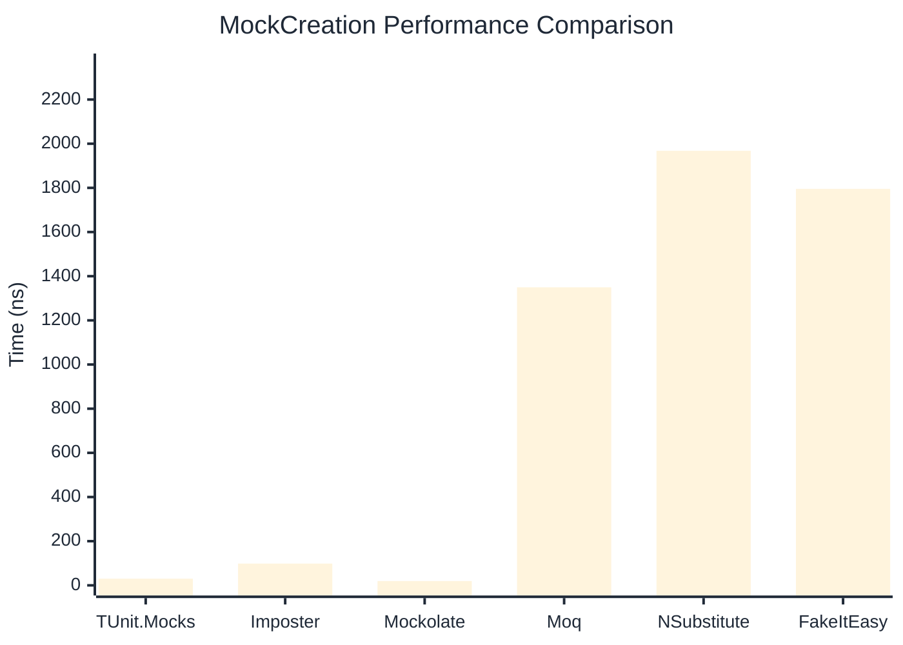
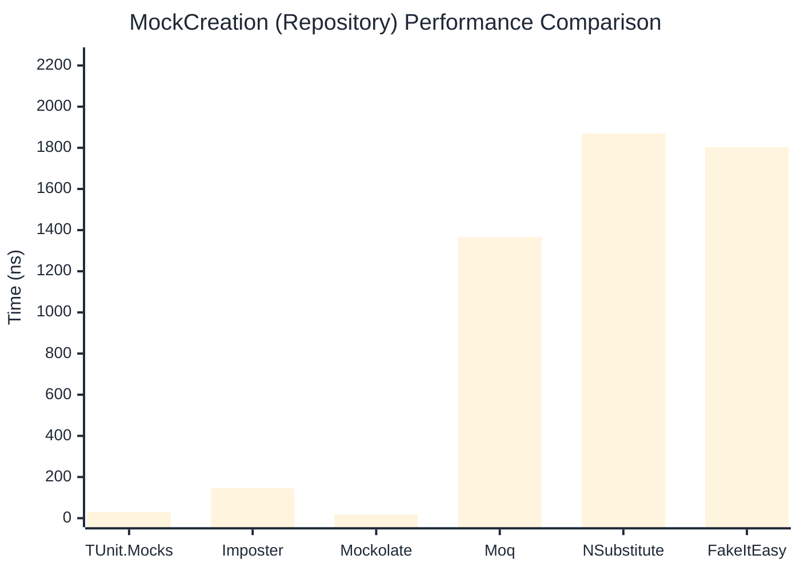

# MockCreation Benchmark

> Mock instance creation performance — comparing **TUnit.Mocks** (source-generated) against runtime proxy-based mocking libraries.

:::info Last Updated
This benchmark was automatically generated on **2026-10-06** from the latest CI run.

**Environment:** Ubuntu Latest • .NET SDK 10.0.401
:::

## 📊 Results

Mock instance creation performance:

| Library | Mean | Error | StdDev | Allocated |
|---------|------|-------|--------|-----------|
| **TUnit.Mocks** | 30.20 ns | 0.588 ns | 0.522 ns | 200 B |
| Imposter | 98.53 ns | 1.352 ns | 1.265 ns | 440 B |
| Mockolate | 19.51 ns | 0.434 ns | 0.464 ns | 160 B |
| Moq | 1,349.61 ns | 24.012 ns | 23.583 ns | 2048 B |
| NSubstitute | 1,967.90 ns | 35.489 ns | 33.197 ns | 5000 B |
| FakeItEasy | 1,795.48 ns | 27.294 ns | 25.531 ns | 2715 B |

```mermaid
%%{init: {
  'theme':'base',
  'themeVariables': {
    'primaryColor': '#2563eb',
    'primaryTextColor': '#1f2937',
    'primaryBorderColor': '#1e40af',
    'lineColor': '#6b7280',
    'secondaryColor': '#7c3aed',
    'tertiaryColor': '#dc2626',
    'background': '#ffffff',
    'pie1': '#2563eb',
    'pie2': '#7c3aed',
    'pie3': '#dc2626',
    'pie4': '#f59e0b',
    'pie5': '#10b981',
    'pie6': '#06b6d4',
    'pie7': '#ec4899',
    'pie8': '#6366f1'
  }
}}%%
xychart-beta
  title "MockCreation Performance Comparison"
  x-axis ["TUnit.Mocks", "Imposter", "Mockolate", "Moq", "NSubstitute", "FakeItEasy"]
  y-axis "Time (ns)" 0 --> 2362
  bar [30.2, 98.53, 19.51, 1349.61, 1967.9, 1795.48]
```

---

### Repository

| Library | Mean | Error | StdDev | Allocated |
|---------|------|-------|--------|-----------|
| **TUnit.Mocks** | 30.21 ns | 0.494 ns | 0.438 ns | 200 B |
| Imposter | 146.84 ns | 2.655 ns | 2.484 ns | 696 B |
| Mockolate | 19.06 ns | 0.440 ns | 0.451 ns | 176 B |
| Moq | 1,366.00 ns | 8.814 ns | 7.360 ns | 1912 B |
| NSubstitute | 1,869.53 ns | 34.132 ns | 31.927 ns | 5000 B |
| FakeItEasy | 1,802.65 ns | 27.811 ns | 24.654 ns | 2715 B |

```mermaid
%%{init: {
  'theme':'base',
  'themeVariables': {
    'primaryColor': '#2563eb',
    'primaryTextColor': '#1f2937',
    'primaryBorderColor': '#1e40af',
    'lineColor': '#6b7280',
    'secondaryColor': '#7c3aed',
    'tertiaryColor': '#dc2626',
    'background': '#ffffff',
    'pie1': '#2563eb',
    'pie2': '#7c3aed',
    'pie3': '#dc2626',
    'pie4': '#f59e0b',
    'pie5': '#10b981',
    'pie6': '#06b6d4',
    'pie7': '#ec4899',
    'pie8': '#6366f1'
  }
}}%%
xychart-beta
  title "MockCreation (Repository) Performance Comparison"
  x-axis ["TUnit.Mocks", "Imposter", "Mockolate", "Moq", "NSubstitute", "FakeItEasy"]
  y-axis "Time (ns)" 0 --> 2244
  bar [30.21, 146.84, 19.06, 1366, 1869.53, 1802.65]
```

## 🎯 Key Insights

This benchmark compares **TUnit.Mocks** (source-generated) against runtime proxy-based mocking libraries for mock instance creation performance.

---

:::note Methodology
View the [mock benchmarks overview](/docs/benchmarks/mocks) for methodology details and environment information.
:::

*Last generated: 2026-10-06T02:37:20.591Z*
