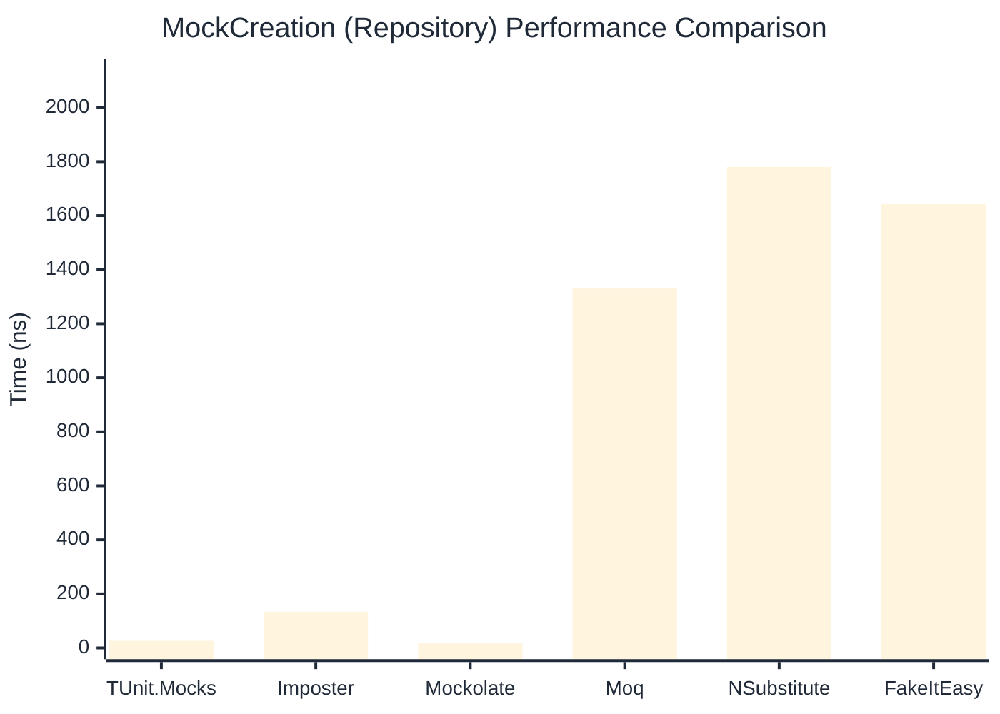

# MockCreation Benchmark

> Mock instance creation performance — comparing **TUnit.Mocks** (source-generated) against runtime proxy-based mocking libraries.

:::info Last Updated
This benchmark was automatically generated on **2026-10-04** from the latest CI run.

**Environment:** Ubuntu Latest • .NET SDK 10.0.401
:::

## 📊 Results

Mock instance creation performance:

| Library | Mean | Error | StdDev | Allocated |
|---------|------|-------|--------|-----------|
| **TUnit.Mocks** | 26.18 ns | 0.275 ns | 0.257 ns | 200 B |
| Imposter | 86.28 ns | 0.395 ns | 0.370 ns | 440 B |
| Mockolate | 16.37 ns | 0.097 ns | 0.091 ns | 160 B |
| Moq | 1,271.08 ns | 16.037 ns | 15.001 ns | 2048 B |
| NSubstitute | 1,719.32 ns | 11.138 ns | 9.873 ns | 5000 B |
| FakeItEasy | 1,607.13 ns | 21.650 ns | 19.192 ns | 2715 B |

```mermaid
%%{init: {
  'theme':'base',
  'themeVariables': {
    'primaryColor': '#2563eb',
    'primaryTextColor': '#1f2937',
    'primaryBorderColor': '#1e40af',
    'lineColor': '#6b7280',
    'secondaryColor': '#7c3aed',
    'tertiaryColor': '#dc2626',
    'background': '#ffffff',
    'pie1': '#2563eb',
    'pie2': '#7c3aed',
    'pie3': '#dc2626',
    'pie4': '#f59e0b',
    'pie5': '#10b981',
    'pie6': '#06b6d4',
    'pie7': '#ec4899',
    'pie8': '#6366f1'
  }
}}%%
xychart-beta
  title "MockCreation Performance Comparison"
  x-axis ["TUnit.Mocks", "Imposter", "Mockolate", "Moq", "NSubstitute", "FakeItEasy"]
  y-axis "Time (ns)" 0 --> 2064
  bar [26.18, 86.28, 16.37, 1271.08, 1719.32, 1607.13]
```

---

### Repository

| Library | Mean | Error | StdDev | Allocated |
|---------|------|-------|--------|-----------|
| **TUnit.Mocks** | 26.34 ns | 0.326 ns | 0.305 ns | 200 B |
| Imposter | 134.26 ns | 2.291 ns | 2.031 ns | 696 B |
| Mockolate | 16.98 ns | 0.280 ns | 0.218 ns | 176 B |
| Moq | 1,329.92 ns | 13.974 ns | 13.071 ns | 1912 B |
| NSubstitute | 1,780.26 ns | 18.731 ns | 15.641 ns | 5000 B |
| FakeItEasy | 1,643.00 ns | 18.592 ns | 16.481 ns | 2715 B |

```mermaid
%%{init: {
  'theme':'base',
  'themeVariables': {
    'primaryColor': '#2563eb',
    'primaryTextColor': '#1f2937',
    'primaryBorderColor': '#1e40af',
    'lineColor': '#6b7280',
    'secondaryColor': '#7c3aed',
    'tertiaryColor': '#dc2626',
    'background': '#ffffff',
    'pie1': '#2563eb',
    'pie2': '#7c3aed',
    'pie3': '#dc2626',
    'pie4': '#f59e0b',
    'pie5': '#10b981',
    'pie6': '#06b6d4',
    'pie7': '#ec4899',
    'pie8': '#6366f1'
  }
}}%%
xychart-beta
  title "MockCreation (Repository) Performance Comparison"
  x-axis ["TUnit.Mocks", "Imposter", "Mockolate", "Moq", "NSubstitute", "FakeItEasy"]
  y-axis "Time (ns)" 0 --> 2137
  bar [26.34, 134.26, 16.98, 1329.92, 1780.26, 1643]
```

## 🎯 Key Insights

This benchmark compares **TUnit.Mocks** (source-generated) against runtime proxy-based mocking libraries for mock instance creation performance.

---

:::note Methodology
View the [mock benchmarks overview](/docs/benchmarks/mocks) for methodology details and environment information.
:::

*Last generated: 2026-10-04T03:10:54.658Z*
