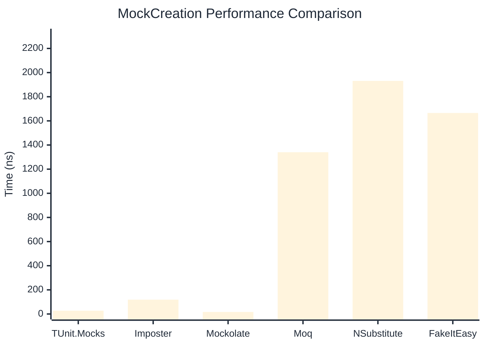
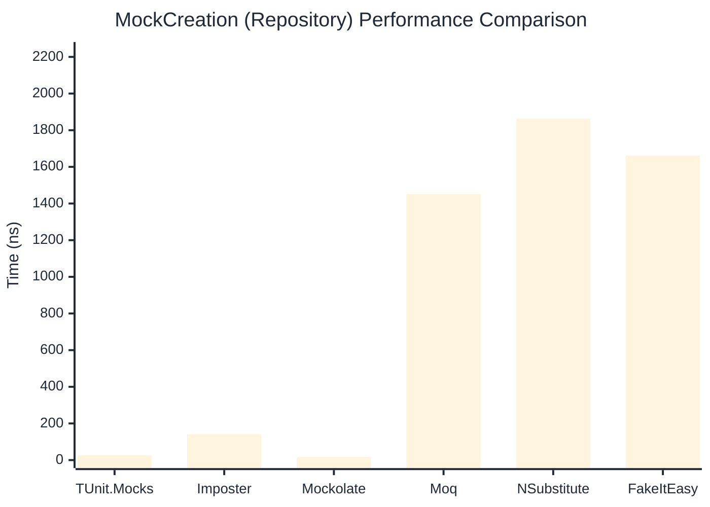

# MockCreation Benchmark

> Mock instance creation performance — comparing **TUnit.Mocks** (source-generated) against runtime proxy-based mocking libraries.

:::info Last Updated
This benchmark was automatically generated on **2026-10-01** from the latest CI run.

**Environment:** Ubuntu Latest • .NET SDK 10.0.401
:::

## 📊 Results

Mock instance creation performance:

| Library | Mean | Error | StdDev | Allocated |
|---------|------|-------|--------|-----------|
| **TUnit.Mocks** | 27.46 ns | 0.217 ns | 0.192 ns | 200 B |
| Imposter | 118.83 ns | 0.719 ns | 0.601 ns | 440 B |
| Mockolate | 17.01 ns | 0.244 ns | 0.229 ns | 160 B |
| Moq | 1,340.32 ns | 21.753 ns | 20.348 ns | 2048 B |
| NSubstitute | 1,931.06 ns | 11.105 ns | 10.387 ns | 5000 B |
| FakeItEasy | 1,665.47 ns | 10.871 ns | 10.169 ns | 2715 B |

```mermaid
%%{init: {
  'theme':'base',
  'themeVariables': {
    'primaryColor': '#2563eb',
    'primaryTextColor': '#1f2937',
    'primaryBorderColor': '#1e40af',
    'lineColor': '#6b7280',
    'secondaryColor': '#7c3aed',
    'tertiaryColor': '#dc2626',
    'background': '#ffffff',
    'pie1': '#2563eb',
    'pie2': '#7c3aed',
    'pie3': '#dc2626',
    'pie4': '#f59e0b',
    'pie5': '#10b981',
    'pie6': '#06b6d4',
    'pie7': '#ec4899',
    'pie8': '#6366f1'
  }
}}%%
xychart-beta
  title "MockCreation Performance Comparison"
  x-axis ["TUnit.Mocks", "Imposter", "Mockolate", "Moq", "NSubstitute", "FakeItEasy"]
  y-axis "Time (ns)" 0 --> 2318
  bar [27.46, 118.83, 17.01, 1340.32, 1931.06, 1665.47]
```

---

### Repository

| Library | Mean | Error | StdDev | Allocated |
|---------|------|-------|--------|-----------|
| **TUnit.Mocks** | 27.14 ns | 0.169 ns | 0.150 ns | 200 B |
| Imposter | 141.52 ns | 0.546 ns | 0.484 ns | 696 B |
| Mockolate | 16.96 ns | 0.123 ns | 0.109 ns | 176 B |
| Moq | 1,451.78 ns | 7.249 ns | 6.781 ns | 1912 B |
| NSubstitute | 1,863.71 ns | 7.864 ns | 6.971 ns | 5000 B |
| FakeItEasy | 1,661.92 ns | 9.450 ns | 8.839 ns | 2715 B |

```mermaid
%%{init: {
  'theme':'base',
  'themeVariables': {
    'primaryColor': '#2563eb',
    'primaryTextColor': '#1f2937',
    'primaryBorderColor': '#1e40af',
    'lineColor': '#6b7280',
    'secondaryColor': '#7c3aed',
    'tertiaryColor': '#dc2626',
    'background': '#ffffff',
    'pie1': '#2563eb',
    'pie2': '#7c3aed',
    'pie3': '#dc2626',
    'pie4': '#f59e0b',
    'pie5': '#10b981',
    'pie6': '#06b6d4',
    'pie7': '#ec4899',
    'pie8': '#6366f1'
  }
}}%%
xychart-beta
  title "MockCreation (Repository) Performance Comparison"
  x-axis ["TUnit.Mocks", "Imposter", "Mockolate", "Moq", "NSubstitute", "FakeItEasy"]
  y-axis "Time (ns)" 0 --> 2237
  bar [27.14, 141.52, 16.96, 1451.78, 1863.71, 1661.92]
```

## 🎯 Key Insights

This benchmark compares **TUnit.Mocks** (source-generated) against runtime proxy-based mocking libraries for mock instance creation performance.

---

:::note Methodology
View the [mock benchmarks overview](/docs/benchmarks/mocks) for methodology details and environment information.
:::

*Last generated: 2026-10-01T02:49:56.169Z*
