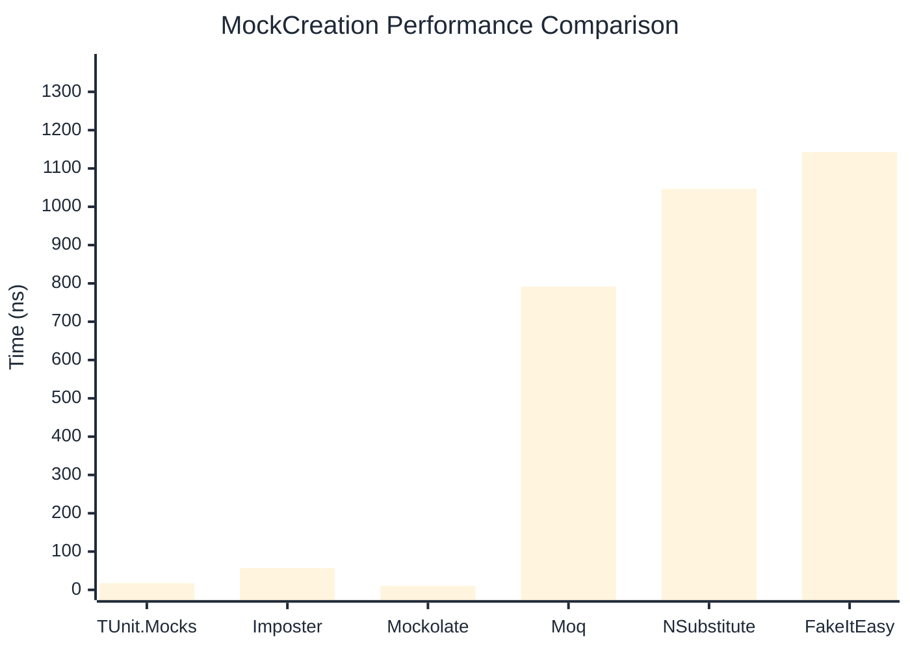

# MockCreation Benchmark

> Mock instance creation performance — comparing **TUnit.Mocks** (source-generated) against runtime proxy-based mocking libraries.

:::info Last Updated
This benchmark was automatically generated on **2026-10-09** from the latest CI run.

**Environment:** Ubuntu Latest • .NET SDK 10.0.401
:::

## 📊 Results

Mock instance creation performance:

| Library | Mean | Error | StdDev | Allocated |
|---------|------|-------|--------|-----------|
| **TUnit.Mocks** | 17.47 ns | 0.358 ns | 0.412 ns | 200 B |
| Imposter | 56.62 ns | 1.024 ns | 0.855 ns | 432 B |
| Mockolate | 10.41 ns | 0.246 ns | 0.218 ns | 160 B |
| Moq | 791.56 ns | 5.805 ns | 5.146 ns | 2048 B |
| NSubstitute | 1,046.98 ns | 13.736 ns | 12.849 ns | 5000 B |
| FakeItEasy | 1,142.52 ns | 22.517 ns | 34.386 ns | 2715 B |

```mermaid
%%{init: {
  'theme':'base',
  'themeVariables': {
    'primaryColor': '#2563eb',
    'primaryTextColor': '#1f2937',
    'primaryBorderColor': '#1e40af',
    'lineColor': '#6b7280',
    'secondaryColor': '#7c3aed',
    'tertiaryColor': '#dc2626',
    'background': '#ffffff',
    'pie1': '#2563eb',
    'pie2': '#7c3aed',
    'pie3': '#dc2626',
    'pie4': '#f59e0b',
    'pie5': '#10b981',
    'pie6': '#06b6d4',
    'pie7': '#ec4899',
    'pie8': '#6366f1'
  }
}}%%
xychart-beta
  title "MockCreation Performance Comparison"
  x-axis ["TUnit.Mocks", "Imposter", "Mockolate", "Moq", "NSubstitute", "FakeItEasy"]
  y-axis "Time (ns)" 0 --> 1372
  bar [17.47, 56.62, 10.41, 791.56, 1046.98, 1142.52]
```

---

### Repository

| Library | Mean | Error | StdDev | Allocated |
|---------|------|-------|--------|-----------|
| **TUnit.Mocks** | 19.33 ns | 0.391 ns | 0.347 ns | 200 B |
| Imposter | 97.99 ns | 1.641 ns | 1.455 ns | 688 B |
| Mockolate | 12.48 ns | 0.237 ns | 0.222 ns | 176 B |
| Moq | 768.09 ns | 3.624 ns | 2.829 ns | 1912 B |
| NSubstitute | 1,085.35 ns | 12.233 ns | 11.442 ns | 5000 B |
| FakeItEasy | 1,021.53 ns | 19.731 ns | 55.003 ns | 2715 B |

```mermaid
%%{init: {
  'theme':'base',
  'themeVariables': {
    'primaryColor': '#2563eb',
    'primaryTextColor': '#1f2937',
    'primaryBorderColor': '#1e40af',
    'lineColor': '#6b7280',
    'secondaryColor': '#7c3aed',
    'tertiaryColor': '#dc2626',
    'background': '#ffffff',
    'pie1': '#2563eb',
    'pie2': '#7c3aed',
    'pie3': '#dc2626',
    'pie4': '#f59e0b',
    'pie5': '#10b981',
    'pie6': '#06b6d4',
    'pie7': '#ec4899',
    'pie8': '#6366f1'
  }
}}%%
xychart-beta
  title "MockCreation (Repository) Performance Comparison"
  x-axis ["TUnit.Mocks", "Imposter", "Mockolate", "Moq", "NSubstitute", "FakeItEasy"]
  y-axis "Time (ns)" 0 --> 1303
  bar [19.33, 97.99, 12.48, 768.09, 1085.35, 1021.53]
```

## 🎯 Key Insights

This benchmark compares **TUnit.Mocks** (source-generated) against runtime proxy-based mocking libraries for mock instance creation performance.

---

:::note Methodology
View the [mock benchmarks overview](/docs/benchmarks/mocks) for methodology details and environment information.
:::

*Last generated: 2026-10-09T02:42:26.464Z*
