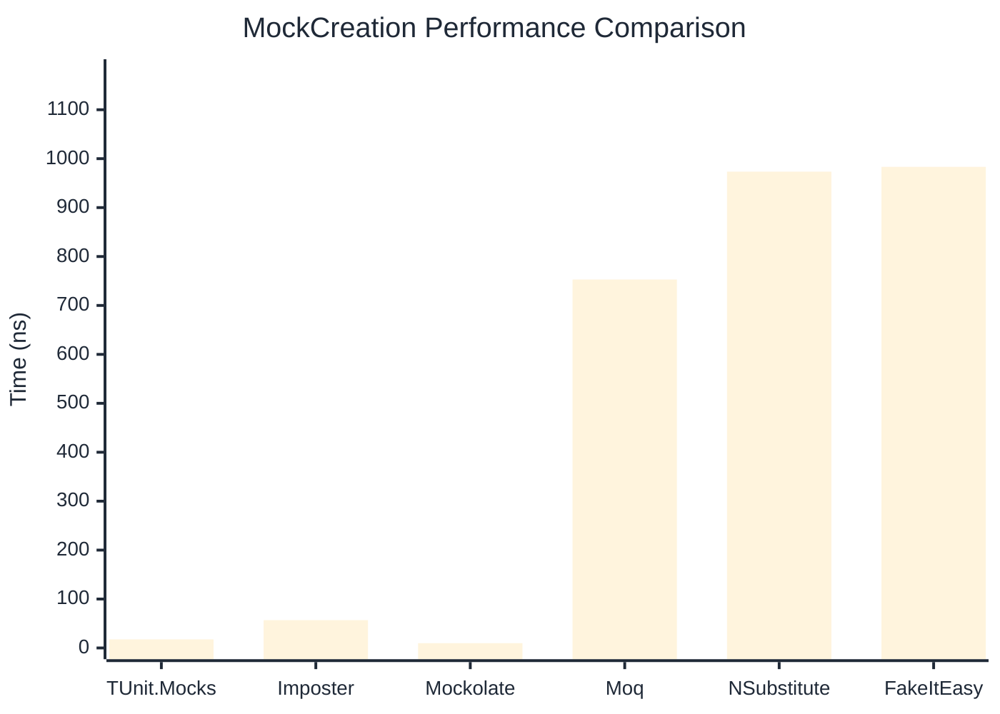
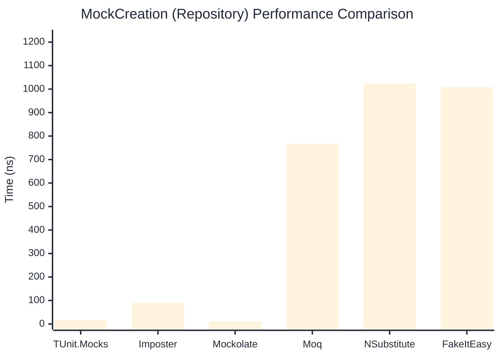

# MockCreation Benchmark

> Mock instance creation performance — comparing **TUnit.Mocks** (source-generated) against runtime proxy-based mocking libraries.

:::info Last Updated
This benchmark was automatically generated on **2026-10-03** from the latest CI run.

**Environment:** Ubuntu Latest • .NET SDK 10.0.401
:::

## 📊 Results

Mock instance creation performance:

| Library | Mean | Error | StdDev | Allocated |
|---------|------|-------|--------|-----------|
| **TUnit.Mocks** | 17.532 ns | 0.3719 ns | 0.5334 ns | 200 B |
| Imposter | 56.826 ns | 1.1755 ns | 1.5285 ns | 440 B |
| Mockolate | 9.803 ns | 0.2011 ns | 0.1570 ns | 160 B |
| Moq | 753.014 ns | 14.6518 ns | 19.0514 ns | 2048 B |
| NSubstitute | 973.426 ns | 18.8305 ns | 20.9300 ns | 5000 B |
| FakeItEasy | 983.285 ns | 19.5874 ns | 29.9120 ns | 2715 B |

```mermaid
%%{init: {
  'theme':'base',
  'themeVariables': {
    'primaryColor': '#2563eb',
    'primaryTextColor': '#1f2937',
    'primaryBorderColor': '#1e40af',
    'lineColor': '#6b7280',
    'secondaryColor': '#7c3aed',
    'tertiaryColor': '#dc2626',
    'background': '#ffffff',
    'pie1': '#2563eb',
    'pie2': '#7c3aed',
    'pie3': '#dc2626',
    'pie4': '#f59e0b',
    'pie5': '#10b981',
    'pie6': '#06b6d4',
    'pie7': '#ec4899',
    'pie8': '#6366f1'
  }
}}%%
xychart-beta
  title "MockCreation Performance Comparison"
  x-axis ["TUnit.Mocks", "Imposter", "Mockolate", "Moq", "NSubstitute", "FakeItEasy"]
  y-axis "Time (ns)" 0 --> 1180
  bar [17.532, 56.826, 9.803, 753.014, 973.426, 983.285]
```

---

### Repository

| Library | Mean | Error | StdDev | Allocated |
|---------|------|-------|--------|-----------|
| **TUnit.Mocks** | 16.732 ns | 0.3272 ns | 0.3360 ns | 200 B |
| Imposter | 89.863 ns | 1.8061 ns | 2.7581 ns | 696 B |
| Mockolate | 10.321 ns | 0.2244 ns | 0.3623 ns | 176 B |
| Moq | 767.825 ns | 10.0638 ns | 8.4038 ns | 1912 B |
| NSubstitute | 1,023.728 ns | 19.6299 ns | 19.2792 ns | 5000 B |
| FakeItEasy | 1,007.630 ns | 20.1113 ns | 16.7938 ns | 2715 B |

```mermaid
%%{init: {
  'theme':'base',
  'themeVariables': {
    'primaryColor': '#2563eb',
    'primaryTextColor': '#1f2937',
    'primaryBorderColor': '#1e40af',
    'lineColor': '#6b7280',
    'secondaryColor': '#7c3aed',
    'tertiaryColor': '#dc2626',
    'background': '#ffffff',
    'pie1': '#2563eb',
    'pie2': '#7c3aed',
    'pie3': '#dc2626',
    'pie4': '#f59e0b',
    'pie5': '#10b981',
    'pie6': '#06b6d4',
    'pie7': '#ec4899',
    'pie8': '#6366f1'
  }
}}%%
xychart-beta
  title "MockCreation (Repository) Performance Comparison"
  x-axis ["TUnit.Mocks", "Imposter", "Mockolate", "Moq", "NSubstitute", "FakeItEasy"]
  y-axis "Time (ns)" 0 --> 1229
  bar [16.732, 89.863, 10.321, 767.825, 1023.728, 1007.63]
```

## 🎯 Key Insights

This benchmark compares **TUnit.Mocks** (source-generated) against runtime proxy-based mocking libraries for mock instance creation performance.

---

:::note Methodology
View the [mock benchmarks overview](/docs/benchmarks/mocks) for methodology details and environment information.
:::

*Last generated: 2026-10-03T02:34:47.768Z*
