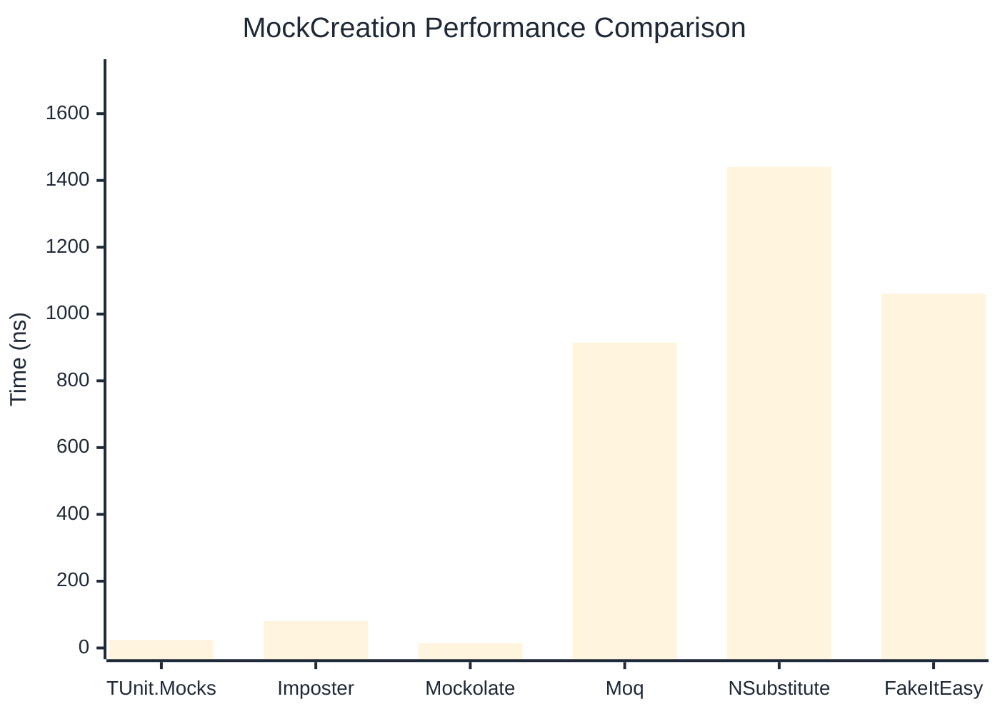
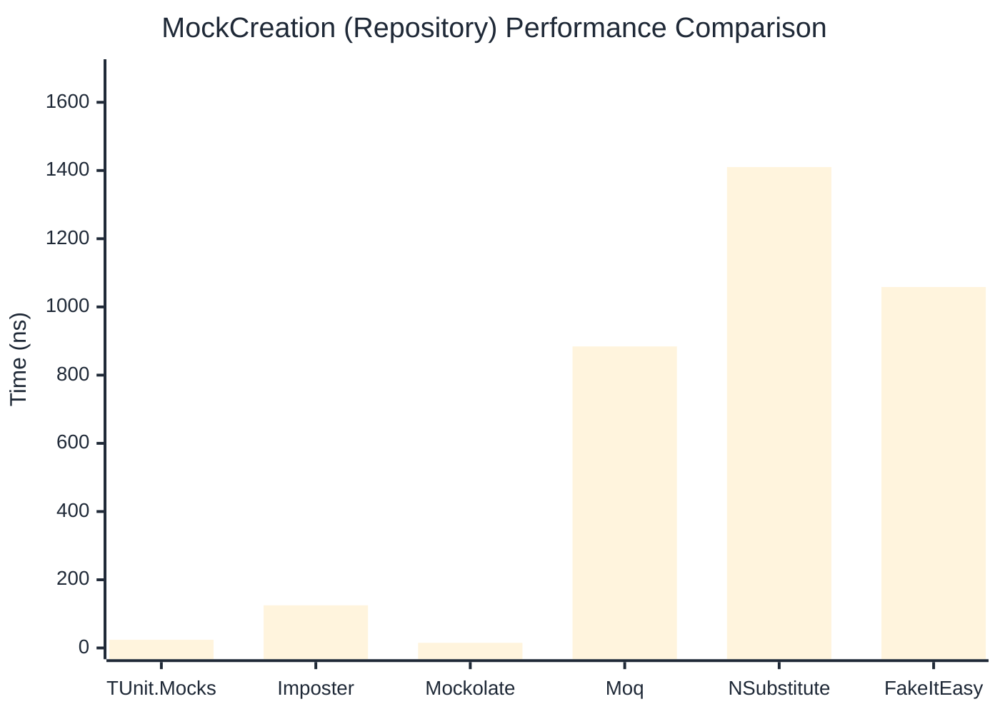

# MockCreation Benchmark

> Mock instance creation performance — comparing **TUnit.Mocks** (source-generated) against runtime proxy-based mocking libraries.

:::info Last Updated
This benchmark was automatically generated on **2026-10-02** from the latest CI run.

**Environment:** Ubuntu Latest • .NET SDK 10.0.401
:::

## 📊 Results

Mock instance creation performance:

| Library | Mean | Error | StdDev | Allocated |
|---------|------|-------|--------|-----------|
| **TUnit.Mocks** | 24.11 ns | 0.196 ns | 0.184 ns | 200 B |
| Imposter | 80.42 ns | 0.444 ns | 0.415 ns | 440 B |
| Mockolate | 14.32 ns | 0.047 ns | 0.037 ns | 160 B |
| Moq | 914.36 ns | 6.706 ns | 5.945 ns | 2048 B |
| NSubstitute | 1,440.69 ns | 6.060 ns | 5.372 ns | 5000 B |
| FakeItEasy | 1,060.93 ns | 8.427 ns | 6.579 ns | 2709 B |

```mermaid
%%{init: {
  'theme':'base',
  'themeVariables': {
    'primaryColor': '#2563eb',
    'primaryTextColor': '#1f2937',
    'primaryBorderColor': '#1e40af',
    'lineColor': '#6b7280',
    'secondaryColor': '#7c3aed',
    'tertiaryColor': '#dc2626',
    'background': '#ffffff',
    'pie1': '#2563eb',
    'pie2': '#7c3aed',
    'pie3': '#dc2626',
    'pie4': '#f59e0b',
    'pie5': '#10b981',
    'pie6': '#06b6d4',
    'pie7': '#ec4899',
    'pie8': '#6366f1'
  }
}}%%
xychart-beta
  title "MockCreation Performance Comparison"
  x-axis ["TUnit.Mocks", "Imposter", "Mockolate", "Moq", "NSubstitute", "FakeItEasy"]
  y-axis "Time (ns)" 0 --> 1729
  bar [24.11, 80.42, 14.32, 914.36, 1440.69, 1060.93]
```

---

### Repository

| Library | Mean | Error | StdDev | Allocated |
|---------|------|-------|--------|-----------|
| **TUnit.Mocks** | 23.90 ns | 0.111 ns | 0.099 ns | 200 B |
| Imposter | 124.96 ns | 0.230 ns | 0.204 ns | 696 B |
| Mockolate | 15.09 ns | 0.152 ns | 0.142 ns | 176 B |
| Moq | 884.15 ns | 6.728 ns | 6.293 ns | 1912 B |
| NSubstitute | 1,410.13 ns | 11.502 ns | 10.759 ns | 5000 B |
| FakeItEasy | 1,058.33 ns | 6.693 ns | 6.261 ns | 2709 B |

```mermaid
%%{init: {
  'theme':'base',
  'themeVariables': {
    'primaryColor': '#2563eb',
    'primaryTextColor': '#1f2937',
    'primaryBorderColor': '#1e40af',
    'lineColor': '#6b7280',
    'secondaryColor': '#7c3aed',
    'tertiaryColor': '#dc2626',
    'background': '#ffffff',
    'pie1': '#2563eb',
    'pie2': '#7c3aed',
    'pie3': '#dc2626',
    'pie4': '#f59e0b',
    'pie5': '#10b981',
    'pie6': '#06b6d4',
    'pie7': '#ec4899',
    'pie8': '#6366f1'
  }
}}%%
xychart-beta
  title "MockCreation (Repository) Performance Comparison"
  x-axis ["TUnit.Mocks", "Imposter", "Mockolate", "Moq", "NSubstitute", "FakeItEasy"]
  y-axis "Time (ns)" 0 --> 1693
  bar [23.9, 124.96, 15.09, 884.15, 1410.13, 1058.33]
```

## 🎯 Key Insights

This benchmark compares **TUnit.Mocks** (source-generated) against runtime proxy-based mocking libraries for mock instance creation performance.

---

:::note Methodology
View the [mock benchmarks overview](/docs/benchmarks/mocks) for methodology details and environment information.
:::

*Last generated: 2026-10-02T02:44:13.542Z*
