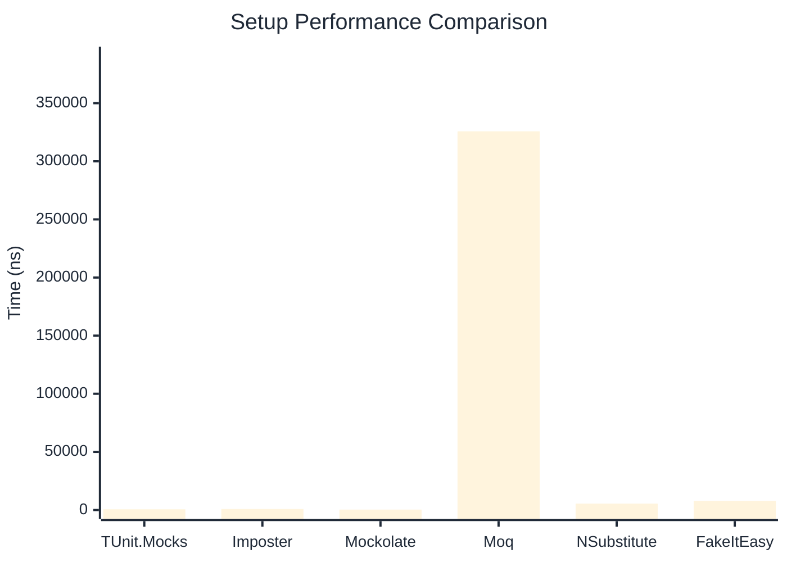

# Setup Benchmark

> Mock behavior configuration (returns, matchers) — comparing **TUnit.Mocks** (source-generated) against runtime proxy-based mocking libraries.

:::info Last Updated
This benchmark was automatically generated on **2026-06-10** from the latest CI run.

**Environment:** Ubuntu Latest • .NET SDK 10.0.301
:::

## 📊 Results

Mock behavior configuration (returns, matchers):

| Library | Mean | Error | StdDev | Allocated |
|---------|------|-------|--------|-----------|
| **TUnit.Mocks** | 600.5 ns | 8.62 ns | 8.06 ns | 2.34 KB |
| Imposter | 862.0 ns | 17.14 ns | 18.34 ns | 6.12 KB |
| Mockolate | 373.3 ns | 4.74 ns | 4.43 ns | 1.65 KB |
| Moq | 325,796.5 ns | 2,311.24 ns | 2,161.94 ns | 28.67 KB |
| NSubstitute | 5,540.7 ns | 28.45 ns | 25.22 ns | 9.01 KB |
| FakeItEasy | 7,847.2 ns | 42.33 ns | 39.59 ns | 10.46 KB |

---

### Multiple

| Library | Mean | Error | StdDev | Allocated |
|---------|------|-------|--------|-----------|
| **TUnit.Mocks** | 913.9 ns | 10.96 ns | 10.25 ns | 3.14 KB |
| Imposter | 1,501.3 ns | 29.22 ns | 28.70 ns | 10.59 KB |
| Mockolate | 601.7 ns | 11.94 ns | 12.26 ns | 2.6 KB |
| Moq | 85,739.4 ns | 1,174.93 ns | 1,099.03 ns | 16.53 KB |
| NSubstitute | 11,410.4 ns | 109.48 ns | 102.41 ns | 20.31 KB |
| FakeItEasy | 7,198.8 ns | 32.47 ns | 30.37 ns | 11.72 KB |

## 🎯 Key Insights

This benchmark compares **TUnit.Mocks** (source-generated) against runtime proxy-based mocking libraries for mock behavior configuration (returns, matchers).

---

:::note Methodology
View the [mock benchmarks overview](/docs/benchmarks/mocks) for methodology details and environment information.
:::

*Last generated: 2026-06-10T03:28:13.506Z*
