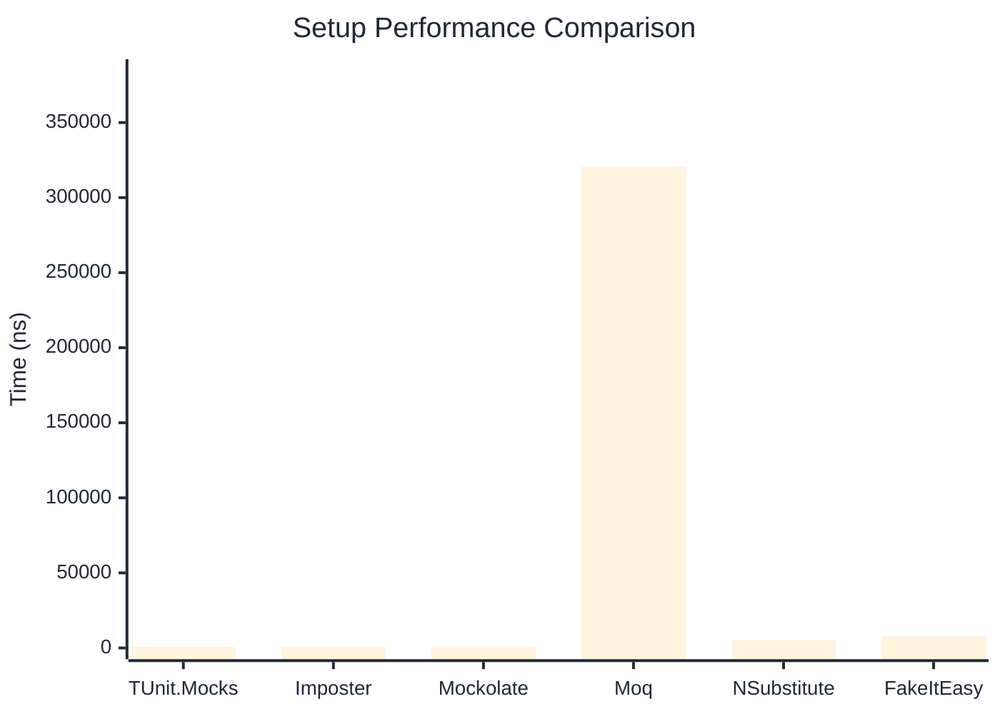

# Setup Benchmark

> Mock behavior configuration (returns, matchers) — comparing **TUnit.Mocks** (source-generated) against runtime proxy-based mocking libraries.

:::info Last Updated
This benchmark was automatically generated on **2026-06-16** from the latest CI run.

**Environment:** Ubuntu Latest • .NET SDK 10.0.301
:::

## 📊 Results

Mock behavior configuration (returns, matchers):

| Library | Mean | Error | StdDev | Allocated |
|---------|------|-------|--------|-----------|
| **TUnit.Mocks** | 588.4 ns | 7.52 ns | 7.03 ns | 2.34 KB |
| Imposter | 828.5 ns | 15.21 ns | 13.48 ns | 6.12 KB |
| Mockolate | 371.1 ns | 7.10 ns | 8.18 ns | 1.65 KB |
| Moq | 320,511.4 ns | 4,119.21 ns | 3,853.11 ns | 28.7 KB |
| NSubstitute | 5,389.5 ns | 27.53 ns | 25.75 ns | 9.01 KB |
| FakeItEasy | 7,696.3 ns | 64.86 ns | 57.50 ns | 10.46 KB |

---

### Multiple

| Library | Mean | Error | StdDev | Allocated |
|---------|------|-------|--------|-----------|
| **TUnit.Mocks** | 879.3 ns | 14.32 ns | 11.96 ns | 3.15 KB |
| Imposter | 1,447.5 ns | 26.62 ns | 34.61 ns | 10.59 KB |
| Mockolate | 607.8 ns | 11.99 ns | 18.31 ns | 2.6 KB |
| Moq | 84,047.0 ns | 1,156.28 ns | 1,081.58 ns | 16.53 KB |
| NSubstitute | 11,746.2 ns | 113.94 ns | 106.58 ns | 20.31 KB |
| FakeItEasy | 7,231.9 ns | 76.62 ns | 71.67 ns | 11.72 KB |

## 🎯 Key Insights

This benchmark compares **TUnit.Mocks** (source-generated) against runtime proxy-based mocking libraries for mock behavior configuration (returns, matchers).

---

:::note Methodology
View the [mock benchmarks overview](/docs/benchmarks/mocks) for methodology details and environment information.
:::

*Last generated: 2026-06-16T03:29:20.737Z*
