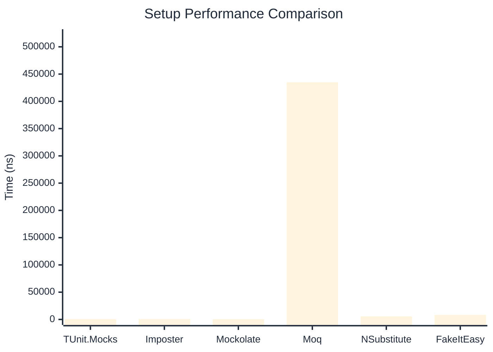

# Setup Benchmark

> Mock behavior configuration (returns, matchers) — comparing **TUnit.Mocks** (source-generated) against runtime proxy-based mocking libraries.

:::info Last Updated
This benchmark was automatically generated on **2026-06-08** from the latest CI run.

**Environment:** Ubuntu Latest • .NET SDK 10.0.300
:::

## 📊 Results

Mock behavior configuration (returns, matchers):

| Library | Mean | Error | StdDev | Allocated |
|---------|------|-------|--------|-----------|
| **TUnit.Mocks** | 575.1 ns | 2.31 ns | 2.16 ns | 2.34 KB |
| Imposter | 832.6 ns | 9.84 ns | 8.72 ns | 6.12 KB |
| Mockolate | 336.8 ns | 2.51 ns | 2.34 ns | 1.65 KB |
| Moq | 435,048.9 ns | 3,151.40 ns | 2,947.82 ns | 28.52 KB |
| NSubstitute | 5,396.9 ns | 30.72 ns | 25.66 ns | 9.01 KB |
| FakeItEasy | 8,277.1 ns | 25.61 ns | 22.70 ns | 10.45 KB |

---

### Multiple

| Library | Mean | Error | StdDev | Allocated |
|---------|------|-------|--------|-----------|
| **TUnit.Mocks** | 769.9 ns | 5.76 ns | 5.38 ns | 3.14 KB |
| Imposter | 1,385.8 ns | 3.91 ns | 3.46 ns | 10.59 KB |
| Mockolate | 561.2 ns | 3.61 ns | 3.20 ns | 2.6 KB |
| Moq | 117,826.0 ns | 1,008.67 ns | 894.16 ns | 16.53 KB |
| NSubstitute | 11,797.7 ns | 122.94 ns | 108.99 ns | 20.31 KB |
| FakeItEasy | 7,672.9 ns | 68.95 ns | 61.12 ns | 11.71 KB |

## 🎯 Key Insights

This benchmark compares **TUnit.Mocks** (source-generated) against runtime proxy-based mocking libraries for mock behavior configuration (returns, matchers).

---

:::note Methodology
View the [mock benchmarks overview](/docs/benchmarks/mocks) for methodology details and environment information.
:::

*Last generated: 2026-06-08T03:30:49.435Z*
