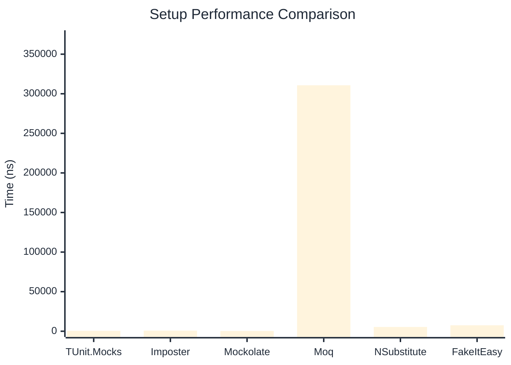

# Setup Benchmark

> Mock behavior configuration (returns, matchers) — comparing **TUnit.Mocks** (source-generated) against runtime proxy-based mocking libraries.

:::info Last Updated
This benchmark was automatically generated on **2026-07-02** from the latest CI run.

**Environment:** Ubuntu Latest • .NET SDK 10.0.301
:::

## 📊 Results

Mock behavior configuration (returns, matchers):

| Library | Mean | Error | StdDev | Allocated |
|---------|------|-------|--------|-----------|
| **TUnit.Mocks** | 558.8 ns | 3.74 ns | 3.50 ns | 2.34 KB |
| Imposter | 800.9 ns | 14.42 ns | 12.78 ns | 6.12 KB |
| Mockolate | 368.1 ns | 7.22 ns | 10.12 ns | 1.41 KB |
| Moq | 310,723.5 ns | 1,621.56 ns | 1,516.81 ns | 28.52 KB |
| NSubstitute | 5,404.6 ns | 98.59 ns | 92.22 ns | 9.01 KB |
| FakeItEasy | 7,517.5 ns | 51.77 ns | 43.23 ns | 10.45 KB |

---

### Multiple

| Library | Mean | Error | StdDev | Allocated |
|---------|------|-------|--------|-----------|
| **TUnit.Mocks** | 854.2 ns | 12.05 ns | 11.28 ns | 3.15 KB |
| Imposter | 1,443.8 ns | 24.85 ns | 23.25 ns | 10.59 KB |
| Mockolate | 645.5 ns | 6.57 ns | 5.82 ns | 2.35 KB |
| Moq | 90,378.2 ns | 664.61 ns | 621.68 ns | 16.53 KB |
| NSubstitute | 11,615.3 ns | 117.39 ns | 104.06 ns | 20.5 KB |
| FakeItEasy | 7,293.4 ns | 82.47 ns | 77.15 ns | 11.71 KB |

## 🎯 Key Insights

This benchmark compares **TUnit.Mocks** (source-generated) against runtime proxy-based mocking libraries for mock behavior configuration (returns, matchers).

---

:::note Methodology
View the [mock benchmarks overview](/docs/benchmarks/mocks) for methodology details and environment information.
:::

*Last generated: 2026-07-02T03:26:25.775Z*
