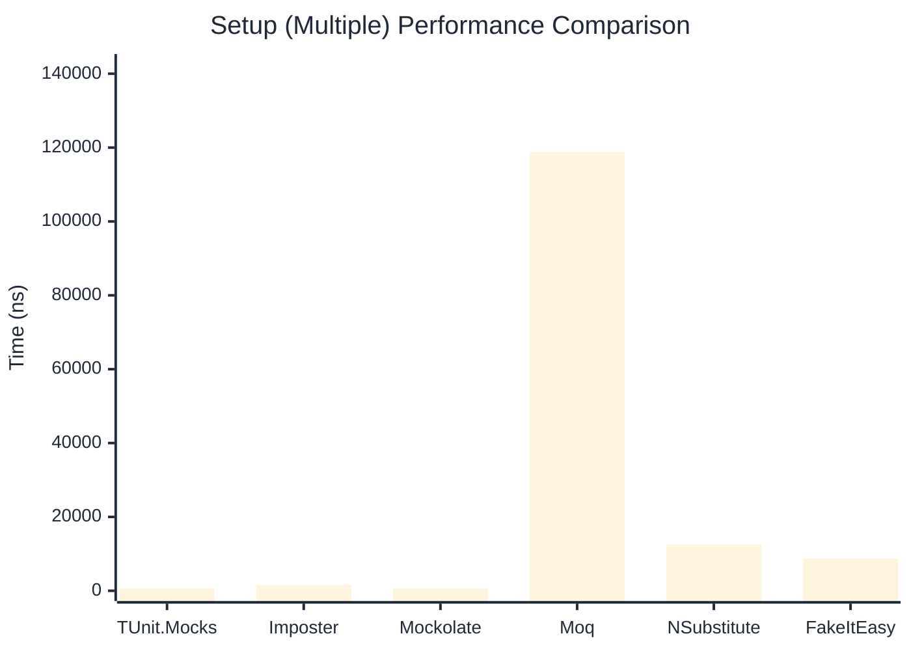

# Setup Benchmark

:::info Last Updated
This benchmark was automatically generated on **2026-05-17** from the latest CI run.

**Environment:** Ubuntu Latest • .NET SDK 10.0.300
:::

## 📊 Results

Mock behavior configuration (returns, matchers):

| Library | Mean | Error | StdDev | Allocated |
|---------|------|-------|--------|-----------|
| **TUnit.Mocks** | 483.4 ns | 7.83 ns | 7.32 ns | 2.01 KB |
| Imposter | 1,109.2 ns | 9.86 ns | 9.22 ns | 6.12 KB |
| Mockolate | 397.3 ns | 6.82 ns | 6.38 ns | 1.65 KB |
| Moq | 437,461.8 ns | 1,752.65 ns | 1,639.43 ns | 28.52 KB |
| NSubstitute | 6,176.5 ns | 68.68 ns | 57.35 ns | 9.01 KB |
| FakeItEasy | 8,924.4 ns | 50.38 ns | 47.12 ns | 10.45 KB |

---

### Multiple

| Library | Mean | Error | StdDev | Allocated |
|---------|------|-------|--------|-----------|
| **TUnit.Mocks** | 693.2 ns | 9.23 ns | 8.64 ns | 2.59 KB |
| Imposter | 1,625.1 ns | 12.98 ns | 12.14 ns | 10.59 KB |
| Mockolate | 639.6 ns | 5.47 ns | 5.12 ns | 2.6 KB |
| Moq | 118,778.9 ns | 722.97 ns | 640.90 ns | 16.64 KB |
| NSubstitute | 12,510.0 ns | 56.91 ns | 50.45 ns | 20.31 KB |
| FakeItEasy | 8,753.8 ns | 59.21 ns | 49.44 ns | 11.82 KB |

## 🎯 Key Insights

This benchmark compares **TUnit.Mocks** (source-generated) against runtime proxy-based mocking libraries for mock behavior configuration (returns, matchers).

---

:::note Methodology
View the [mock benchmarks overview](/docs/benchmarks/mocks) for methodology details and environment information.
:::

*Last generated: 2026-05-17T03:31:33.295Z*
