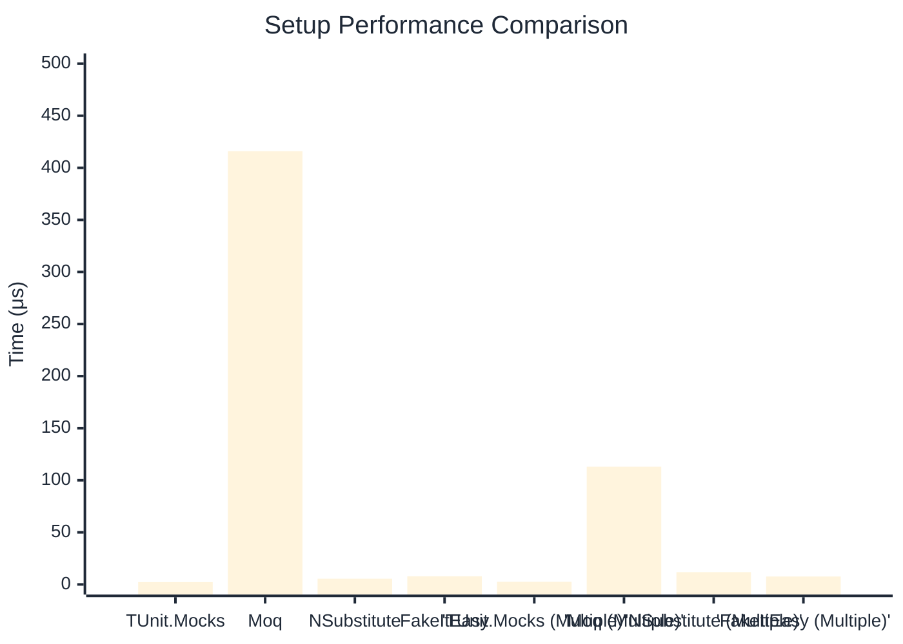

# Setup Benchmark

:::info Last Updated
This benchmark was automatically generated on **2026-03-28** from the latest CI run.

**Environment:** Ubuntu Latest • .NET SDK 10.0.201
:::

## 📊 Results

Mock behavior configuration (returns, matchers):

| Method | Mean | Error | StdDev | Allocated |
|--------|------|-------|--------|-----------|
| **TUnit.Mocks** | 2.264 μs | 0.0451 μs | 0.1141 μs | 6.7 KB |
| Moq | 415.965 μs | 3.6847 μs | 3.4467 μs | 28.52 KB |
| NSubstitute | 5.508 μs | 0.0464 μs | 0.0434 μs | 9.06 KB |
| FakeItEasy | 7.835 μs | 0.0264 μs | 0.0220 μs | 10.45 KB |
| **'TUnit.Mocks (Multiple)'** | 2.533 μs | 0.0240 μs | 0.0225 μs | 7.79 KB |
| 'Moq (Multiple)' | 113.073 μs | 0.5738 μs | 0.5086 μs | 16.53 KB |
| 'NSubstitute (Multiple)' | 11.794 μs | 0.1676 μs | 0.1568 μs | 20.31 KB |
| 'FakeItEasy (Multiple)' | 7.600 μs | 0.0713 μs | 0.0667 μs | 11.71 KB |

## 📈 Visual Comparison

## 🎯 Key Insights

This benchmark compares **TUnit.Mocks** (source-generated) against runtime proxy-based mocking libraries for mock behavior configuration (returns, matchers).

---

:::note Methodology
View the [mock benchmarks overview](/docs/benchmarks/mocks) for methodology details and environment information.
:::

*Last generated: 2026-03-28T22:34:52.304Z*
